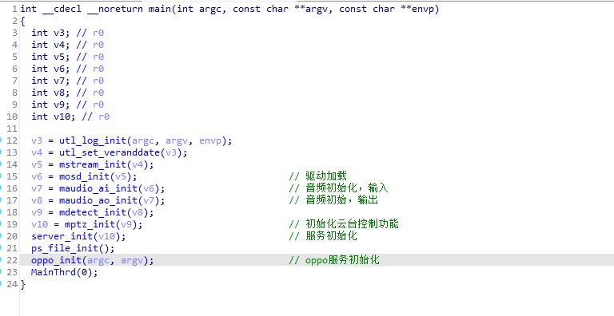
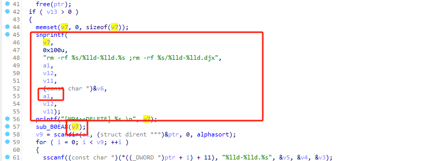
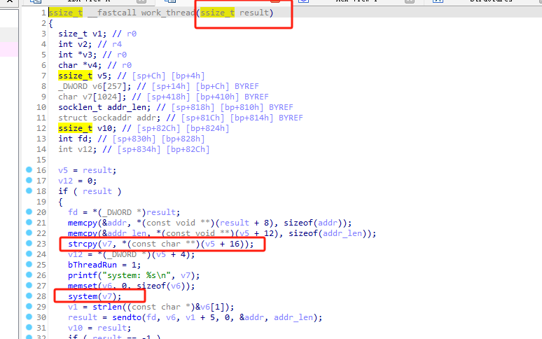
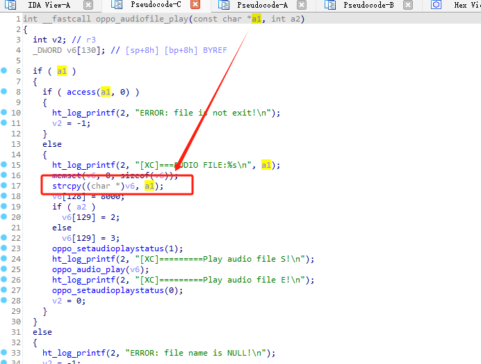

# Blicca

架构：ELF 32-bit LSB executable, ARM, EABI5


---
启动项分析

位于squashfs-root-1中的etc/init.d/rcs  .只挂载了设备和目录，并未启动程序。


restart.sh脚本启动了qsctrl这个进程，可能是初始化主进程
```
#! /bin/sh

while true
do
ps  | grep "qsctrl" | grep -v "grep"
if [ "$?" -eq 1 ]
then
echo 3 > /proc/sys/vm/drop_caches
./qsctrl restart &
echo "process has been restarted!"
else
echo "process already started!"
fi
sleep 15
done
```



是用这个程序初始化的

---

没什么思路，先看一波危险函数
sysem只有两个，都被写死了。
popen 发现一个可控点


向上溯源


来自a1

由这里的上级函数传递进来的 ，继续向上溯源 


很明显，这里是一个挂载的存储设备，应该是我们存储设备的名字，然后这里可以造成命令执行。


---

# 命令执行
bashrc.sh
```
#! /bin/sh


#在TF卡加载程序，目前用于方便IPC出厂检测
if [ -b /dev/mmcblk0p1 ] ; then
	mount -t exfat -o umask=077 /dev/mmcblk0p1 /mnt/sdcard
	if [ -f /mnt/sdcard/sharetronic_check/wpa_supplicant.sh ] && [ ! -f /mnt/sdcard/sharetronic_check/ota_appfs.bin ] &&\
	   [ ! -f /mnt/sdcard/sharetronic_check/key_led_mtd_test ] ; then
		echo "===================== enter check mode ===================="
		/mnt/sdcard/sharetronic_check/wpa_supplicant.sh 
		exit
	fi
fi


```

这里备注：在TF卡加载程序，目前用于方便IPC出厂检测

摄像头有个存储卡，只要存储卡中的数据符合这个判断if [ -f /mnt/sdcard/sharetronic_check/wpa_supplicant.sh ] && [ ! -f /mnt/sdcard/sharetronic_check/ota_appfs.bin ] &&\
	   [ ! -f /mnt/sdcard/sharetronic_check/key_led_mtd_test ] ; then
	   
就会执行存储卡的脚本。


---


# 命令执行
mysystem程序中


v5+16由上级传入


参数为v10,
v10是一个int数组，每个整型对应4字节。
v10+16等于是v[4]，也是数据来自于v8

v8来自于文件传输入fd接受的数据 ， 所以只要能控制给mySystem的输入，可以造成命令执行 。


 从 fd = socket(2, 2, 0);，第二个参数为2，代表这个是要给udp.
这里是udp，端口为8911，我们直接用nc给这个端口发包，就能命令执行。


```
- **`socket(AF_INET, SOCK_STREAM, 0)`**: 创建一个 IPv4 的 TCP 套接字。
- **`socket(AF_INET, SOCK_DGRAM, 0)`**: 创建一个 IPv4 的 UDP 套接字。
- **`socket(AF_INET6, SOCK_STREAM, 0)`**: 创建一个 IPv6 的 TCP 套接字。
- **`socket(AF_PACKET, SOCK_RAW, htons(ETH_P_ALL))`**: 创建一个用于抓取所有网络协议的原始套接字。
-
```


----


这里最开始误以为有个栈溢出，后面没有




怀疑这里由栈溢出 ，但仔细一看，这里大小是溢出不了的输入最多为0x200u=512    而v6是dword v6[130]  ,也就是520字节

从功能点来看，这里应该是指定播放了一个音频，是从过参数a1传递过来的 。从函数中，我们可以看出来，这里a1是一个音频文件的名字 

这里需要继续找上级调用，具体是摄像头哪个点传递参数过来的。

发现播放的a1很多都被写死了 ，如下 
 oppo_audiofile_play("/tmp/appfs/progs/voice/cn_oppo/25_dev_reboot_start.wav", 1);
 

只有这里 oppo_voicememo_play(const char *a1)是没写死的 ，但是二级制程序中，已经没有上级调用了。   这里从翻译来看，应该是语音备忘录 

这个a1是语音备忘录音频的名字。


---


