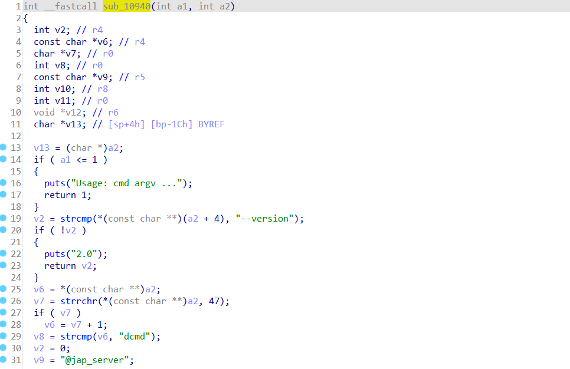
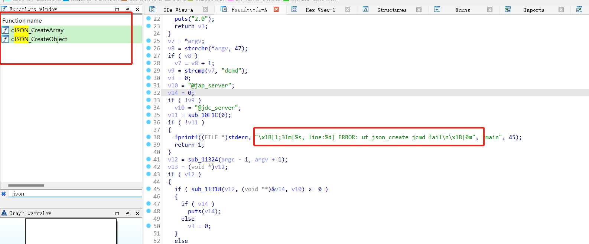
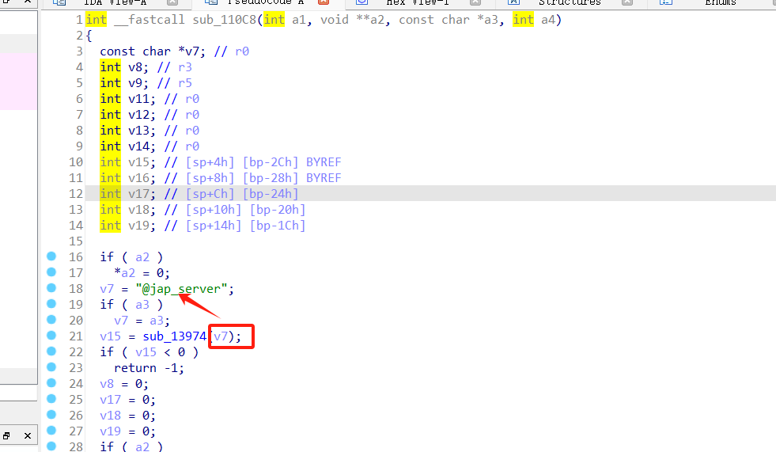

# tenda_cp7

tenda_cp7摄像头
固件下载地址：
https://www.tenda.com.cn/download/detail-3808.html


解压出来一大堆文件，一时间无从下手

发现了一个squashfs-root和cpio-root,  一时间不知道分析哪个。


先分析squashfs-root吧

这个摄像头架构信息
32-bit LSB executable, ARM


因为没什么思路，我先搜一下sock字符串，看哪些程序存在外部访问和可控点。

找到了cmd和ntptime两个程序

---

# cmd


从start()函数跟进sub_10940()


看到这个函数提示用法，基本确定就是主函数了。



结合以上两个点，我推测他是用json格式，从外部传入数据的。


我定位了下sock函数引用点
```
int __fastcall sub_13974(const char *a1)
{
  int v2; // r4
  size_t v3; // r6
  __int16 v5; // [sp+8h] [bp-88h] BYREF
  char v6[110]; // [sp+Ah] [bp-86h] BYREF

  if ( sub_13AA0() <= 1 )
  {
    fprintf(
      (FILE *)stderr,
      "\x1B[1;31m[%s, line:%d] ERROR: local socket name fail: %s\n\x1B[0m",
      "ut_socket_open_local_client",
      220,
      a1);
    return -1;
  }
  v2 = socket();
  if ( v2 >= 0 )
  {
    v5 = 1;
    strcpy(v6, a1);
    v6[0] = 0;
    v3 = strlen(a1) + 2;
    if ( sub_138D4(v2, 1) < 0 )
    {
      fprintf(
        (FILE *)stderr,
        "\x1B[1;31m[%s, line:%d] ERROR: ut_socket_set_nonblock fail\n\x1B[0m",
        "ut_socket_open_local_client",
        241);
      sub_13544(v2);
      v2 = -1;
    }
    else if ( connect(v2, &v5, v3) < 0 )
    {
      sub_13544(v2);
      v2 = -1;
    }
    return v2;
  }
  fprintf(
    (FILE *)stderr,
    "\x1B[1;31m[%s, line:%d] ERROR: open local socket fail: %s\n\x1B[0m",
    "ut_socket_open_local_client",
    227,
    a1);
  return v2;
}
```
函数 sub_13974 的主要目的是尝试与给定路径（a1）的本地套接字建立连接，如果成功，则返回一个用于通信的文件描述符；如果失败，则返回 -1。

继续看上级调用

发现a1是@jap_server
当套接字路径以 @ 开头时，表示使用的是抽象命名空间。这种情况下，套接字不会在文件系统中创建实际的文件，而是只存在于内核中。这种方式在某些 Linux 系统中支持，特别适用于不希望在文件系统中留下痕迹的通信。

如果这个函数 sub_13974 尝试连接到一个名为 @jap_server 的套接字，那么在其他位置肯定需要有相应的代码来创建这个套接字，否则客户端将无法成功连接


那这就很明显了，这个套接字应该是由ntptime创建的，并通过这个内核中的套接字传递信息给cmd程序。

---
# ntptime
ntptime 是与时间同步相关的工具程序，它通常与 Network Time Protocol (NTP) 服务有关，用于管理和同步系统时间。


```
int __fastcall sub_137F0(const char *a1)
{
  int v2; // r4
  size_t v3; // r6
  __int16 v5; // [sp+8h] [bp-88h] BYREF
  char v6[110]; // [sp+Ah] [bp-86h] BYREF

  if ( sub_13A48(a1) <= 1 )
  {
    fprintf(
      (FILE *)stderr,
      "\x1B[1;31m[%s, line:%d] ERROR: local socket name fail: %s\n\x1B[0m",
      "ut_socket_open_local_client",
      220,
      a1);
    return -1;
  }
  v2 = socket(1, 1, 0);
  if ( v2 >= 0 )
  {
    v5 = 1;
    strcpy(v6, a1);
    v6[0] = 0;
    v3 = strlen(a1) + 2;
    if ( sub_13750(v2, 1) < 0 )
    {
      fprintf(
        (FILE *)stderr,
        "\x1B[1;31m[%s, line:%d] ERROR: ut_socket_set_nonblock fail\n\x1B[0m",
        "ut_socket_open_local_client",
        241);
      sub_12EE8(v2);
      v2 = -1;
    }
    else if ( connect(v2, &v5, v3) < 0 )
    {
      sub_12EE8(v2);
      v2 = -1;
    }
    return v2;
  }
  fprintf(
    (FILE *)stderr,
    "\x1B[1;31m[%s, line:%d] ERROR: open local socket fail: %s\n\x1B[0m",
    "ut_socket_open_local_client",
    227,
    a1);
  return v2;
}
```


---


