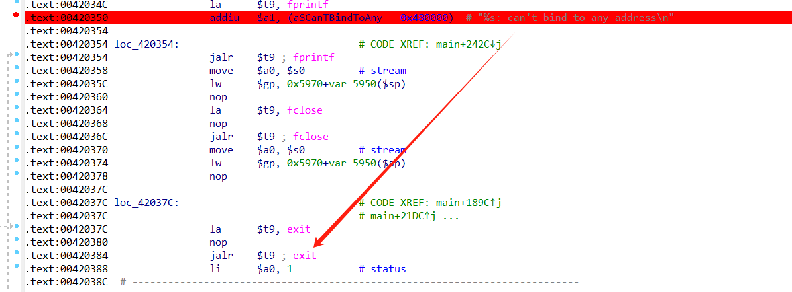
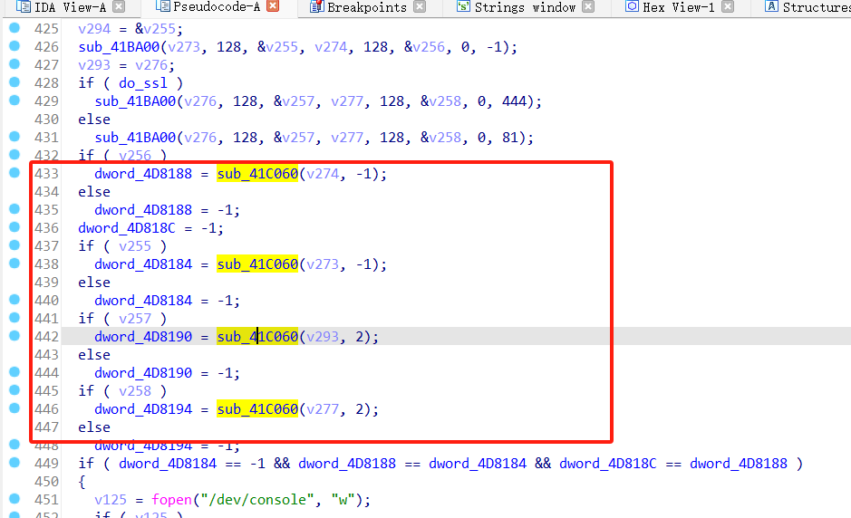
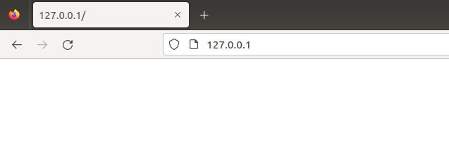
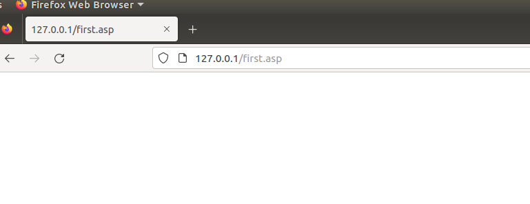
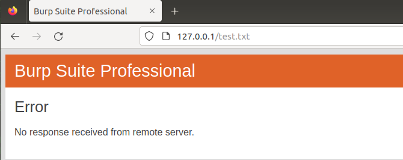
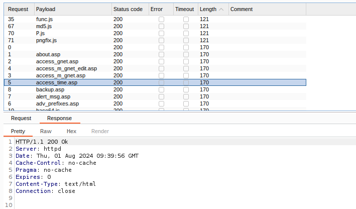

# RV110w

固件品牌：cisco
固件信息：binwalk -Me RV110W_FW_1.2.2.5.bin


# 信息收集
## 架构信息


mips-32-little
## web服务


服务应该是httpd起的

## firmwalker-pro
```
sudo ./firmwalker-pro-max.sh '/home/iot/Desktop/cisco/RV110w/squashfs-root'  > ~/Desktop/firmwalker.txt
```


---


## qemu-user模拟 


尝试用firmAE起不来，只有自己分析了。


查看启动流程

rc.d中 ，看到都是ipsec启动的信息。找不到我想要的httpd字符串，同时也没找到httpd相关的启动脚本


这里猜测可能脚本先启动了./sbin/rc ，然后rc程序启动httpd。
我们分析一下rc。


果然，程序是在rc中，来起httpd服务。

```
int start_httpd()
{

     。。。。。。。。。。。。。。。。。。
    。。。。。。。。。。。。。。。。。。
  v0 = (const char *)nvram_get("find_lang");    // 获取语言设置
  if ( v0 && !strcmp(v0, "1") )                 // 根据语言设置web目录
    strcpy(v15, "/tmp/www");
  else
    strcpy(v15, "/www");
  v1 = fopen("/dev/console", "w");              // 输出启动信息到控制台
  v2 = v1;
  if ( v1 )
  {
    fprintf(v1, "[HTTPD Starting on %s]\n", v15);
    fclose(v2);
  }
  if ( is_exist("/var/run/httpd.pid") )         // 检查 /var/run/httpd.pid 文件是否存在，如果存在则说明 HTTPD 已经在运行。
                                                // 否则，切换到 v15 目录，并调用 eval() 启动 HTTPD。
  {
    v3 = 0;
  }
  else
  {
    chdir(v15);                                 // 切换工作目录
    v14[1] = dword_5099D4;                      // v[14]=0
    v14[0] = (int)"httpd";
    v3 = eval(v14, ">/dev/console", 0, 0);      // 执行httpd   并将输出在控制台显示
                                                // 执行效果类似于httpd 0 >/dev/console
                                                // 
    chdir("/");
  }
  if ( !is_exist("/data/cert.pem") || !is_exist("/data/key.pem") )// 检查和生成证书
  {
    v19[1] = (int)"-n";
    v19[0] = (int)"ca_manage";
    v19[3] = dword_5099CC;
    v19[2] = (int)"new";
    eval(v19, ">/dev/console", 0, 0);
  }
  if ( !is_exist("/tmp/cert.pem") || !is_exist("/tmp/key.pem") )
  {
    。。。。。。。。。。。。。。。。。。
    。。。。。。。。。。。。。。。。。。
  }
  nomad_qkvpn_valid();
  v4 = (const char *)nvram_get("https_enable"); // https相关
  if ( !v4 || !strcmp(v4, "0") )
  {
  
    。。。。。。。。。。。。。。。。。。
    。。。。。。。。。。。。。。。。。。
    
```


所以根据这个函数启动httpd的过程，我们也来尝试启动。
```
1.新建/tmp/www目录
2.切换工作目录到/tmp/www
3.httpd 0 >/dev/console
```


```
cp $(which qemu-mipsel-static) ./
chmod 777 qemu-mipsel-static

sudo chroot . ./qemu-mipsel-static ./usr/sbin/httpd

```


创建目录/dev/nvram
```
touch ./dev/nvram
```

发现还有别的错误。

ida分析一下。

查询bind:  和Address already in use


发现httpd中并没有这个字符串，应该是调用了libc.so.0的某个函数，发生了错误。
我们动态调试看看 。
```
sudo chroot . ./qemu-mipsel-static -g 9999 ./usr/sbin/httpd


```


00420350

loc_420354

loc_42037C
跳到这里程序就退出了


我们定位下00420350这个位置



从这里一路执行下来就退出了。

根本原因还是因为Address already in use。
这是调用某个别的库的函数的时候打印的，因为httpd中没有这个字符串。
我们继续动态调试，向上寻找


最后发现是调用这个函数的时候，打印的Address already in use

刚好打印四次
进入sub_41c060


错误发生在这里， 调用perror("bind")就会打印Address already in use


```
int bind(int sockfd, const struct sockaddr *addr, socklen_t addrlen);

```

bind()
a0=0x00000006
a1=0x7FFF9E44
a2=0x0000001C
bind（6，*0x7FFF9E44,28）

```
0x7FFF9E44地址中是如下结构体
struct sockaddr_in addr;
addr.sin_family = AF_INET;          // 地址族
addr.sin_port = htons(80);          // 端口号 (HTTP)
addr.sin_addr.s_addr = inet_addr("0.0.0.0"); // IP 地址


MEMORY:7FFF9E44 .byte  0xA    // 地址族 (AF_INET)   表示ipv4
MEMORY:7FFF9E45 .byte    0    // 地址族补充字节
MEMORY:7FFF9E46 .byte    0    // 端口号的低位字节
MEMORY:7FFF9E47 .byte 0x50   // 端口号的高位字节 ('P')       端口80
MEMORY:7FFF9E48 .byte    0    // IP 地址的第一个字节         ip 0.0.0.0
MEMORY:7FFF9E49 .byte    0    // IP 地址的第二个字节
MEMORY:7FFF9E4A .byte    0    // IP 地址的第三个字节
MEMORY:7FFF9E4B .byte    0    // IP 地址的第四个字节
MEMORY:7FFF9E4C .byte    0    // 填充字节


```


```
netstat -tulpn | grep :80

netstat 命令用于显示网络连接、路由表、接口统计、伪装连接以及多播成员。以下是 netstat -tulpn 命令中每个参数的含义：
-t：显示 TCP 连接。
-u：显示 UDP 连接。
-l：显示监听中的套接字（Listening sockets）。
-p：显示使用每个套接字的进程 ID（PID）和进程名称。需要 root 权限才能查看非本用户进程的信息。
-n：以数字形式显示地址和端口号，而不是尝试解析服务名称和主机名
```

发现本地端口0.0.0.0:80 ，已经被占用了，怪不得一直报错。


```
sudo chroot . ./qemu-mipsel-static  ./usr/sbin/httpd
第一遍执行成功了
第二遍显示地址已经被使用
```


发现已经在监听0.0.0.0:80端口了。

**那这里其实第一次就能打开服务，只是我最开始执行httpd 占用了端口**

访问web试试


如果我访问127.0.0.1/index.html他会自动跳转到http://127.0.0.1/first.asp




我自己试了试，发现test.asp 可以访问，而txt类型会报错。这应该是服务器没有处理txt后缀的程序逻辑吧。



爆破穷尽了一下 ，都没有回显，状态码都是200.


访问其中的html文件，也是状态码200，但就是无法正常访问。
**猜测可能是因为环境问题**
接下试试系统级模拟吧。


---

# qemu-system


mips-32-little


```
# 0、经过收集信息后可知，该固件的架构为mipsel
# 1、配置ubuntu网卡：
$ sudo tunctl -t tap0
$ sudo ifconfig tap0 192.168.0.1/24 up
# 2、启动qemu-system：
$  sudo qemu-system-mipsel -M malta -kernel vmlinux-3.2.0-4-4kc-malta -hda debian_wheezy_mipsel_standard.qcow2 -append "root=/dev/sda1 console=tty0" -nographic -net nic -net tap,ifname=tap0,script=no,downscript=no

# 3、scp -r ./squashfs-root/   root@192.168.0.2:/tmp/
# 4、挂载：mount -o bind /dev ./squashfs-root/dev && mount -t proc /proc ./squashfs-root/proc
# 5. chroot ./squashfs-root sh
```


```
1.新建/tmp/www目录
2.切换工作目录到/tmp/www
3.httpd 0 >/dev/console
```


显示缺少这个设备。
我们先新建一个
```
touch nvram
```
再次运行


服务已经起了，访问一下。


最后访问情况发现和用户级模拟一样。

都是200的状态码，但是页面都没有任何内容。


---


头疼，十分头疼。

感觉没啥进展，但今天一直在动调，也算是进步了。

慢慢来

---

破案了，这里web就是模拟不起来。我原先一直以为能模拟起来
    


---


之前一直grep -r "*cgi"  ，命令用错了。没找到cgi，导致自己一直在想hook 服务，正常访问。
崔老师提醒我，直接访问guest_logout.cgi

因为这个漏洞涉及到交叉编译，我还并未掌握，所以留到下次学习后面的内容。

