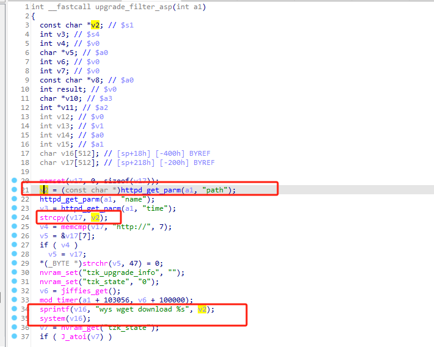
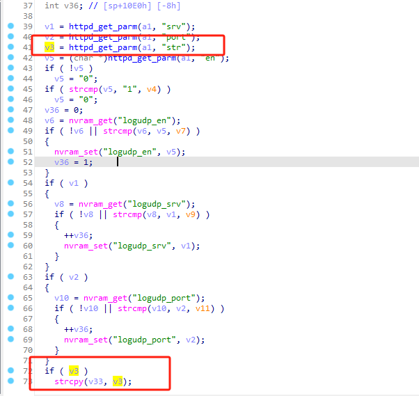
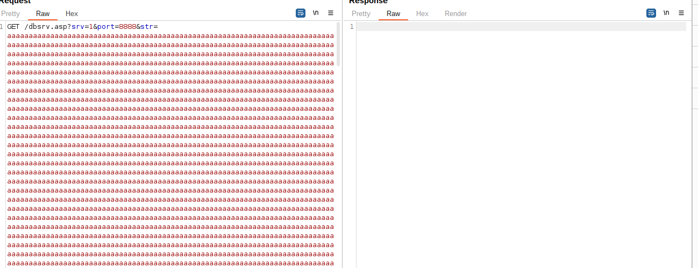
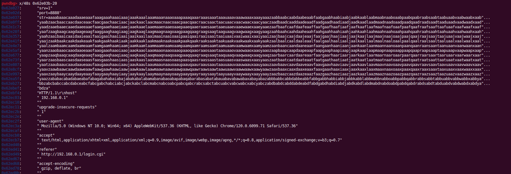
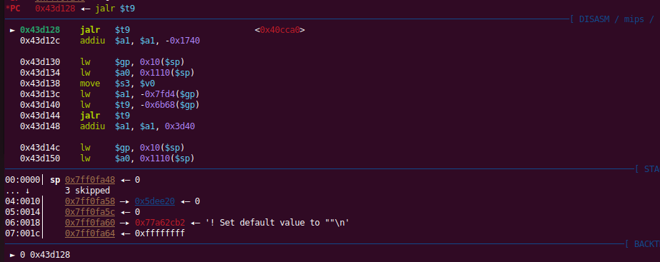
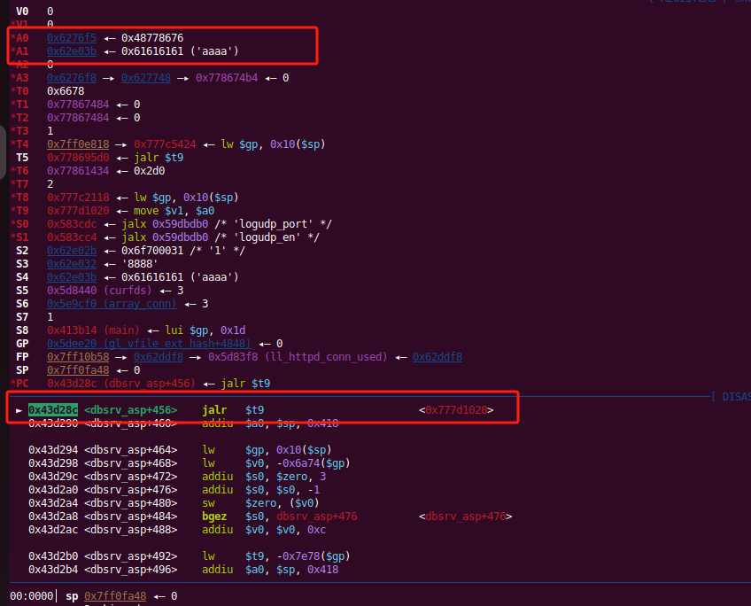

# DI8100_danger_function


# strcpy 


溢出点1 


0x45f2b4


这个地方虽然有溢出，但是已经命令执行了，我们优先分析另一个溢出点。


溢出点2
0043D28C



```
int __fastcall dbsrv_asp(int a1)
{
 
  v1 = httpd_get_parm(a1, "srv");
  v2 = httpd_get_parm(a1, "port");
  v3 = httpd_get_parm(a1, "str");
  v5 = (char *)httpd_get_parm(a1, "en");

  if ( v3 )
    strcpy(v33, v3);
```

按照这个路由器的规则，应该是访问dbsrv.asp  然后get方式寻参


正常回显了
```
GET /dbsrv.asp?srv=1&port=8888&str=aaaa HTTP/1.1
Host: 192.168.0.1
User-Agent: Mozilla/5.0 (Windows NT 10.0; Win64; x64) AppleWebKit/537.36 (KHTML, like Gecko) Chrome/120.0.6099.71 Safari/537.36
Accept: */*
Referer: http://192.168.0.1/index.htm?_1722922335
Accept-Encoding: gzip, deflate, br
Accept-Language: en-US,en;q=0.9
Cookie: wys_userid=admin,wys_passwd=520E1BFD4CDE217D0A5824AE7EA60632
Connection: close


```


溢出试试 


进shell，查看jhttpd，也崩了。

接下动态调试来确定下偏移

 


开始动调

最开始，存在了a1结构体中





发包后进入危险函数 

strcpy

0043D28C
断点 




溢出点三


```
GET /dbsrv.asp?srv=1&port=8888&str=aaaa HTTP/1.1
Host: 192.168.0.1
User-Agent: Mozilla/5.0 (Windows NT 10.0; Win64; x64) AppleWebKit/537.36 (KHTML, like Gecko) Chrome/120.0.6099.71 Safari/537.36
Accept: */*
Referer: http://192.168.0.1/index.htm?_1722922335
Accept-Encoding: gzip, deflate, br
Accept-Language: en-US,en;q=0.9
Cookie: wys_userid=admin,wys_passwd=520E1BFD4CDE217D0A5824AE7EA60632
Connection: close
```