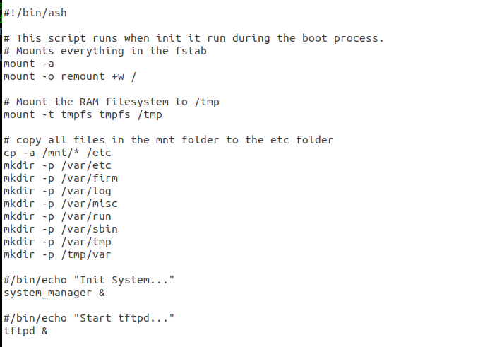
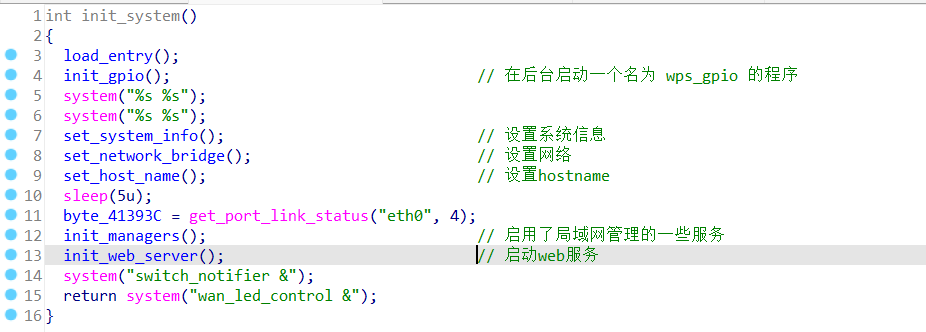
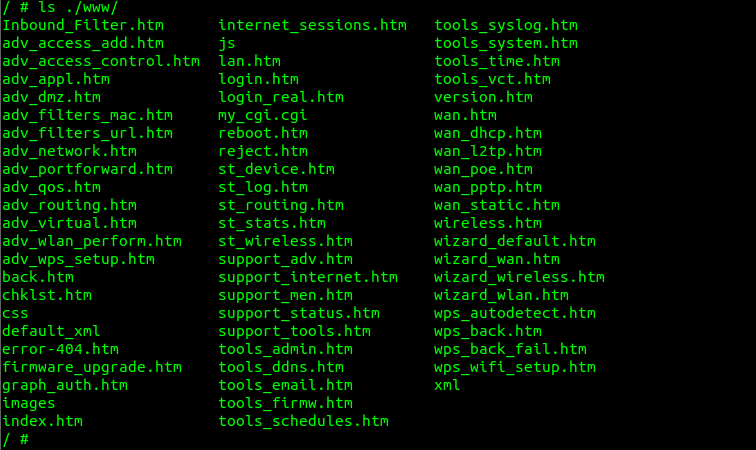
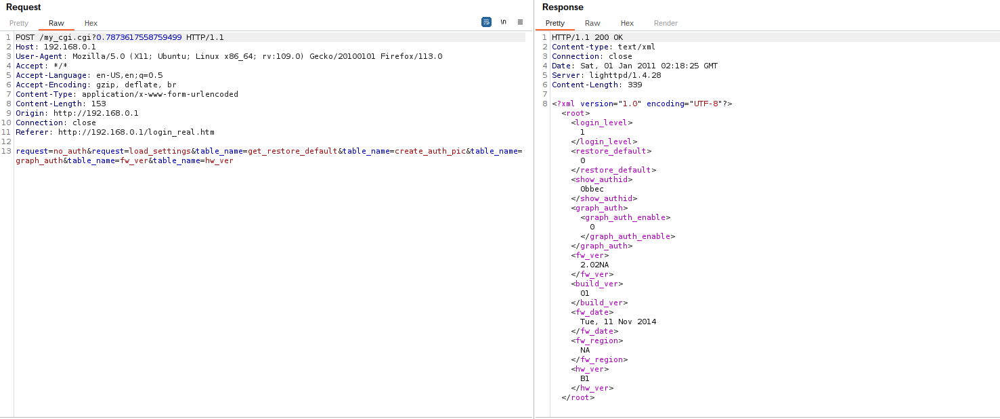
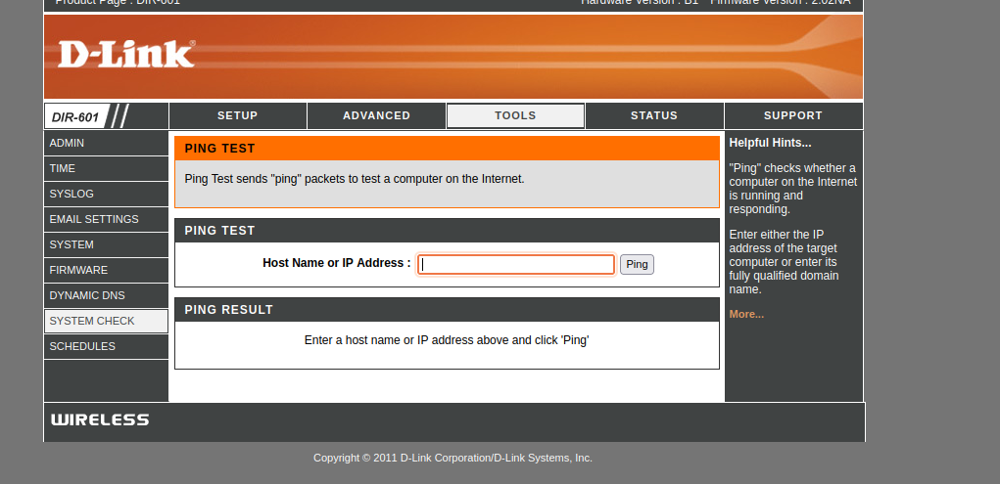
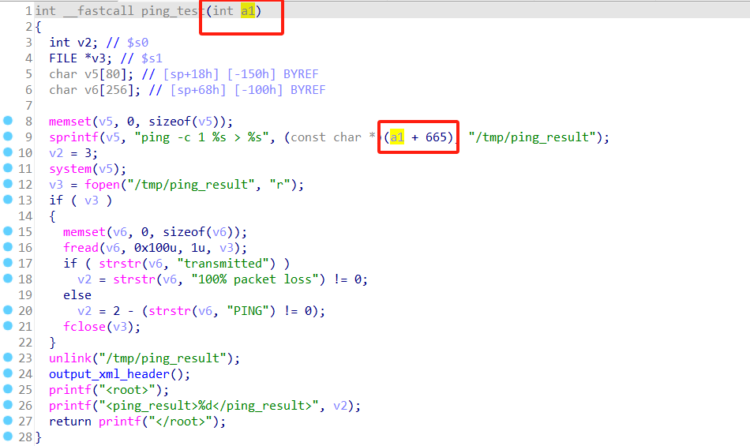

# dir601B1_leak_info_and_rce
信息收集
# binwalk
```
binwalk -Me DIR601B1_FW202NAb01.bin 
```

Squashfs filesystem
little endian

---

# FirmAE模拟
```
 sudo ./run.sh -d dlink '/home/iot/Desktop/D-link/dir601B1/DIR601B1_FW202NAb01.bin' 
 
```

# firmwalker-pro-max
## 服务类型


服务是lighttpd

## 用户密码
用户密码：


## 启动项



挂载后执行了 system_manager  和 tftpd.
## system_manager

放入ida中分析

```
int __cdecl main(int argc, const char **argv, const char **envp)
{
  __pid_t v3; // 声明一个变量 v3，用于存储进程 ID

  // 设置信号处理器
  signal(13, (__sighandler_t)1);                // 忽略 SIGPIPE 信号 (信号编号 13)
  signal(32, (__sighandler_t)sub_402AAC);       // 为 SIGUSR1 信号设置处理器 sub_402AAC
  signal(33, (__sighandler_t)sub_402AAC);       
  .....................
  .....................
  .....................
  signal(100, (__sighandler_t)sub_402AAC);      // 为用户定义信号设置处理器 sub_402AAC
  sigemptyset(&stru_413818);                    // 清空信号集 stru_413818

  // 获取当前进程的 PID
  v3 = getpid();                                
  // 创建 PID 文件
  create_pid_file(v3, "/var/run/system_manager.pid"); 

  // 初始化队列列表
  init_queue_list();                          

  // 初始化系统
  init_system();                               

  // 进入任务循环
  task_loop();                                 

  return 0;                                 
}

```
## 进入init_system


## init_web_server


其中system("sed -i 's/^#.*\"mod_404redirect\"/ \"mod_404redirect\"/g' /etc/lighttpd/modules.conf");对/etc/lighttpd/modules.conf做了操作，我们查看一下。

查看为空，应该是启动时才创建的。
-d 调试模式中可以查看 


---
## web目录

发现为空，不知道怎么回事。
进调试模式看看。

初始化后，就存在文件了，应该是初始化后释放的。
那我们打包一下，拿出来用我们的工具扫一下。
```
tar -cvf backup.tar *
```


可从前前端下载，也可以从FirmAE自带的传输下载。
用firmwalker-pro-max扫一下 

这里出现账号密码 我们查看一下这个文件，发现有个base64编码

结合抓包看看。

抓包查看后，注意到一个字符串no-auth

那这里很可能又未授权啊。
他明显是在读取一些表中的信息table_name用来传递表名。

果然只要修改表名，我们就能读取表中信息 。

最开始以为是拼接路劲读本地文件，但是没找到对应文件，最后在www/wizard_default.htm:找到一些对应的表名。
```
 'get_restore_default', 'wan_settings', 'wan_static', 'wan_pppoe', 'wan_pptp', 'wan_l2tp', 'wireless_settings', 'admin_user', 'time', 'fw_ver', 'hw_ver'
```
既然这里请求是交给my_cgi的，那我们再分析下my_cgi,


发现这里存在很多表名，我们把他们提取出来。
```
"none"
"no_auth"
"which_page"
"fw_ver"
"hw_ver"
"clear_edit_id"
"current_time"
"get_router_ip"
"statistic"
"dhcp_client"
"status_dhcp_client"
"get_log"
"system_up_time"
"connection_up_time"
"lan_info"
"wireless_info"
"wps_enable"
"wps_info"
"get_wlan_client_list"
"wan_info"
"get_internet_session_table"
"routing_table"
"inbound_filter_list"
"ddns_status"
"get_wlan_schedule"
"get_used_schedule"
"get_used_filter"
"email_info"
"wps_status"
"create_auth_pic"
"get_lang_info"
"default_ssid"
"get_default_wps_pin"
"wireless_enable"
"wifi_settings"
"get_wan_bandwidth"
"wan_type"
"igmp_member"
"get_restore_default"

```

改包后，发现这些都可以泄露信息


---

# ping


日常试试ping,是否有命令执行。
    
    
抓包提交到了my_cgi.ci
进去分析看看 


如果是ping_test就执行这个字符串。
    


应该又是权限问题，导致无法写入。

---

# 挖掘思路
我们很容易想到，这个函数叫execute_other_requests


既然execute_other_requests函数其中一个ping_test存在命令执行，
1.那么和他平行的login，load_settings等等，如果有参数拼接执行system(),就可能存在命令执行。

    都查看过后，其他有system()的函数参数都是写死的，或者来自配置文件加载，并未发现其他命令执行。

2.execute_other_requests平行的requests可能也存在命令执行
    
    （搜索后并未发现预想中的execute_requests这种函数）
   

---


