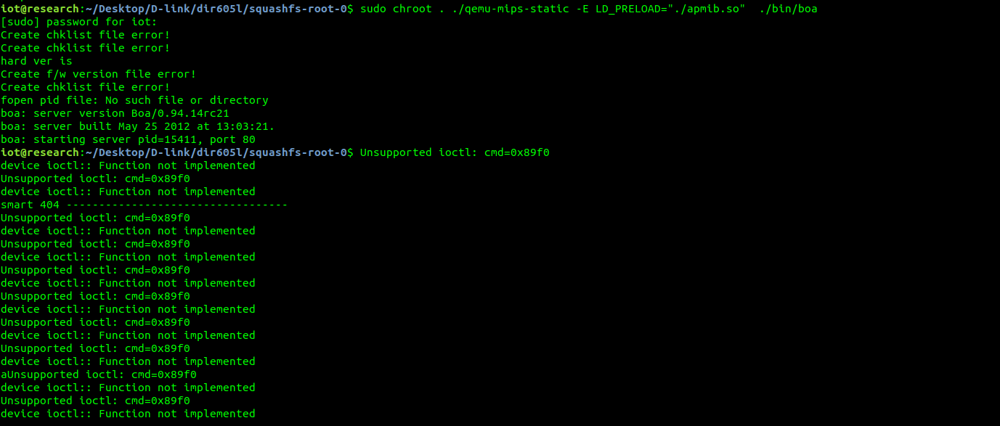
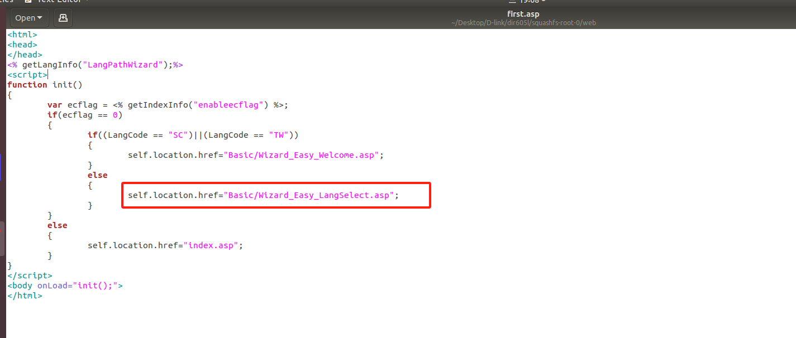
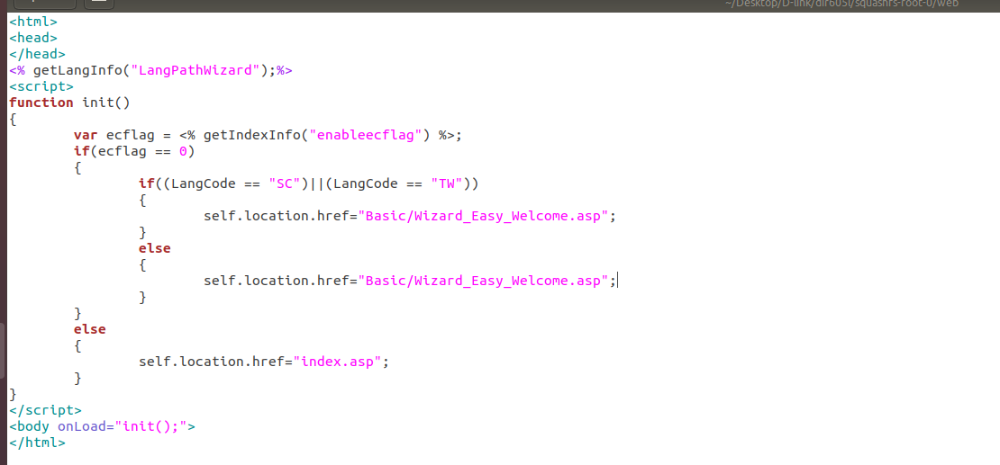
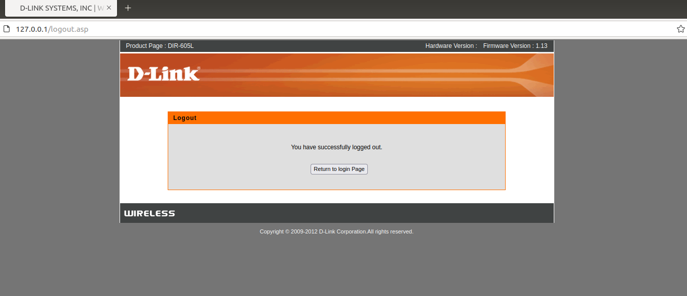

# dir605l_hook

固件下载地址：
https://support.dlink.com/resource/products/DIR-605L/REVA/DIR-605L_FIRMWARE_1.13.ZIP


# binwalk
```
 binwalk -Me DIR-605L_FIRMWARE_1.13.ZIP 
```

# 基础信息收集


# qemu用户级别模拟

```
cp $(which qemu-mips-static) ./qemu-mips-static
 sudo chroot . ./qemu-mips-static ./bin/boa
```


Initialize AP MIB failed!
显示段错误

我们用ida定位一下这里。


很明显，这里是因为apmib_init()函数返回值为0，所以会失败。


```
apmib_init() 函数的主要作用是初始化 APMIB 系统，确保设备配置参数可以被正确地加载、访问和修改。
在无线接入点或路由器的固件中，apmib_init() 通常在设备启动时被调用，确保所有配置参数在设备开始正常运行之前已经正确加载和初始化
```


## patch


但不知道怎么回事，无法直接修改命令为beqz。  难道是无法patch命令。接下来尝试hook

## hook

**LD_PRELOAD Hook 的工作机制**
```
LD_PRELOAD Hook 的工作机制
动态链接器：

当程序启动时，动态链接器（如 ld.so）负责解析和加载程序所需的共享库。
LD_PRELOAD 环境变量指定的共享库会被动态链接器优先加载，无论是程序自身的共享库还是系统共享库。
函数覆盖：

通过 LD_PRELOAD 预加载的共享库中的函数会覆盖其他库中相同名称的函数。
在你的例子中，apmib-ld.so 中的 apmib_init() 函数会覆盖原本应该被调用的 apmib_init()。

如果程序中调用的函数名没有与 apmib-ld.so 中的函数名称冲突，那么这些函数不会受到 LD_PRELOAD 的影响。
这些函数将继续由程序或系统中原始的动态链接器来加载和执行，而不会被 apmib-ld.so 中的函数所覆盖。
```


首先我们确定一下apmib_init()属于哪个库


确定是apmib.so

apmib.c
```
#include<stdio.h>
#include<stdlib.h>


int apmib_init(){
    return 1;
}

```


编写好hook.c后，使用mips-linux-gnu-gcc命令将该代码编译成so
```

mips-linux-gnu-gcc -Wall -fPIC -shared apmib.c -o apmib.so


该命令用于编译并生成一个共享库文件 `hook-ld.so`，适用于 MIPS 架构的 Linux 环境。让我们逐个解释每个参数的作用：

1. **`mips-linux-gnu-gcc`**:
   - 这是 GCC 编译器的交叉编译器版本，专门用于编译适用于 MIPS 架构的 Linux 二进制文件。
   - `mips-linux-gnu` 前缀表示目标架构和操作系统类型，即生成的代码将用于 MIPS 架构的 Linux 系统。

2. **`-Wall`**:
   - 启用所有常见的警告。`Wall` 表示 "all warnings"（所有警告），用于帮助开发者识别代码中的潜在问题和错误。

3. **`-fPIC`**:
   - 生成位置无关代码（Position Independent Code）。`PIC` 是 "Position Independent Code" 的缩写，这对于生成共享库是必需的，因为共享库在运行时可能会加载到内存的不同位置。

4. **`-shared`**:
   - 指定生成一个共享库（Shared Library）。共享库是一种在运行时可以被多个程序使用的库文件，通常具有 `.so`（shared object）扩展名。

5. **`hook.c`**:
   - 要编译的源文件的名称。在这个例子中，`hook.c` 是包含要编译成共享库的代码的 C 源文件。

6. **`-o hook-ld.so`**:
   - 指定输出文件的名称。`-o` 后面的 `hook-ld.so` 是编译后生成的共享库文件的名称。`.so` 扩展名表示这是一个共享对象文件。

### 总结

完整命令的含义是：使用 MIPS 架构的 GCC 编译器编译 `hook.c` 源文件，启用所有常见警告，生成位置无关代码，并将输出文件命名为 `hook-ld.so` 的共享库。这个共享库可以在 MIPS 架构的 Linux 系统上动态加载和使用。

```

执行看试试。
```
sudo chroot . ./qemu-mips-static -E LD_PRELOAD="./apmib.so"  ./bin/boa
```


hook成功了，并没有显示原来的错误，但发生了新的错误。

我们继续进ida看看Create chklist file error!定位错误位置。

本来以为是/tmp/DevInfo.txt和/tmp/chklst.txt目录的原因。
但mkdir创建后，依然未解决问题。

我们继续往下看，反正程序是在执行了这里之后才崩溃的。（但仔细想想，我怎么知道这之后他会在哪里崩溃，所以马上上手动调）

```
sudo chroot . ./qemu-mips-static -g 9999 -E LD_PRELOAD="./apmib.so"  ./bin/boa
```

Create chklist file error!
打印了两次，我们ida找这个字符串也刚好也有两个。所以我们在这个两个位置都下断点。

**有时候在伪代码下断点停不下来，最好在汇编处下断点。这里就是这种情况**

    


跳到第二个断点后，我们一步一步向下执行，看他是在哪个位置发生段错误的。


找到了，是因为apmib_get函数造成的段错误。所以我们需要hook这个函数。


  


还是存在于这个库。

那么接下里的问题 是，我们如何写这个hook呢？


首先这个函数的功能应该是根据第一个参数，将返回值赋给第二个地址。


## 重点一
我们分析下apmib.so ，看看他是什么样的 。
点进去后，发现十分的复杂 ，总共有四百多行。
函数的主要功能就是根据不同情况，给第二个参数地址赋值。
我们尝试简单hook一下，直接让apmib_get的第二个参数指针指向的值为0。


## 重点二


因为apmib_get的返回值存在v0,而v0寄存器如上，并未影响程序执行流。所以这里我们写的apmib_get函数 return 0和1应该都可以。


apmib.c
```
#include<stdio.h>
#include<stdlib.h>


int apmib_init(void){
    return 1;
}


int apmib_get(int a1, unsigned char *a2) {

    *a2 = 0;
    return 0;
}


```

```

#编译
mips-linux-gnu-gcc -Wall -fPIC -shared apmib.c -o apmib.so

#执行
sudo chroot . ./qemu-mips-static -E LD_PRELOAD="./apmib.so"  ./bin/boa
```



发现程序继续向下执行了，显示boa服务已经启动了。可见我们的hook方法是有效的。
但是依然在报错
device ioctl:: Function not implemented
Unsupported ioctl: cmd=0x89f0

---

这里因为程序一直在运行，我尝试访问了下127.0.0.1，发现服务确实启动了， 页面还发生了跳转，虽然跳转到最后的也页面显示无法连接。

http://127.0.0.1/index.html
http://127.0.0.1/first.asp
http://127.0.0.1/Basic/Wizard_Easy_LangSelect.asp  


访问了第三个页面后，程序崩溃了。

我们查看下Wizard_Easy_LangSelect.asp  ，看为什么程序崩溃了。
看名字很容易猜测，这就是一个选择语言的asp。


分析这个asp，发现表单 wz_form_pg_1 使用 POST 方法提交到 http://<% getInfo("goformIpAddr"); %>/goform/formEasySetupLangWizard

然后可能就是实现了语言的选择。

---

我们看看程序是如何从first.asp跳转到/Basic/Wizard_Easy_LangSelect.asp  的



这里既然我们进入/Basic/Wizard_Easy_LangSelect.asp会程序崩溃，那我们直接修改这个asp。让它怎么都走Basic/Wizard_Easy_Welcome.asp。


修改后，我们再来重启boa服务，然后访问127.0.0.1。



模拟成功了。