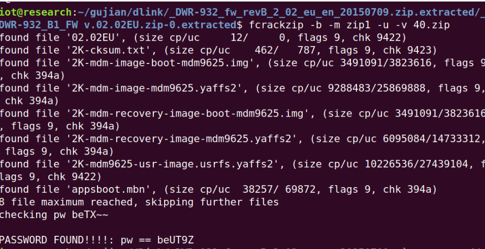

# DWR-932

固件：DWR-932_FW_REV_B-2_02_EU_EN_0709


用fcrackzip破解zip密码
```
fcrackzip -b -m zip1 -u -v 40.zip
```

密码为beUT9Z
用unzip解压后


去解压yaffs文件系统
```
binwalk -Me 2K-mdm-image-mdm9625.yaffs2 
```


开始分析

---


firmwalker跑一下，发现了很多passwd和conf等文件。
站在漏洞挖掘的思路，这些文件需要我们一个个去看。


得到一个账户和密码

解释下这个配置文件
这段配置是用于动态域名服务（Dynamic DNS, DDNS）的设置。动态域名服务允许用户将动态IP地址映射到一个固定的域名上，这样即使用户的IP地址发生变化，通过域名仍然可以访问到用户的设备或服务。这在家庭网络或移动设备中非常常见，因为这些网络的公网IP地址可能会经常变化。

配置文件中的各个参数意义如下：

--log_file /usr/inadyn_srv.log：指定日志文件存放的位置，用于记录服务运行时的日志信息。
forced_update_period 6000：设置强制更新周期，单位为秒。这里设置为6000秒，即每6000秒（约1小时46分40秒）强制更新一次域名解析。
username alex_hung：设置DDNS服务的用户名。
password 641021：设置DDNS服务的密码。
dyndns_system default@no-ip.com：指定使用的DDNS服务提供商，这里使用的是no-ip.com。
--alias test.no-ip.com：设置域名别名，这里设置的别名是test.no-ip.com。
iot@research:~/Desktop/dwr932/DWR-932_fw_rev：这部分看起来像是命令行路径，可能与配置文件的上下文有关，但在这个配置文件中没有明确的作用。
总的来说，这段配置用于设置路由器的DDNS功能，以便用户可以通过固定的域名访问到其动态IP地址的设备。


所以这里我们可以访问test.no-ip.com  ，并且用账户密码登录。


---

