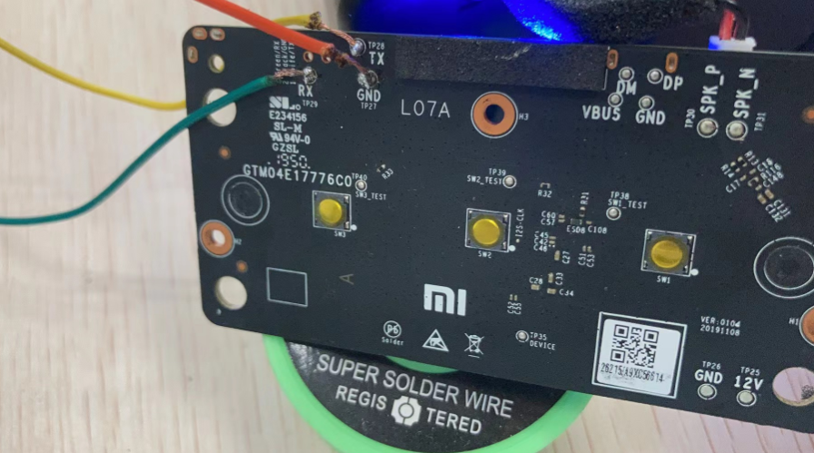
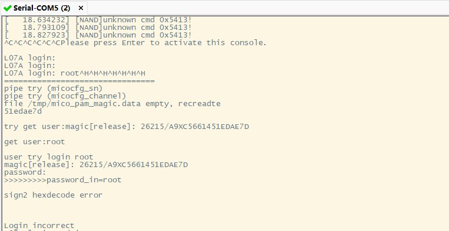
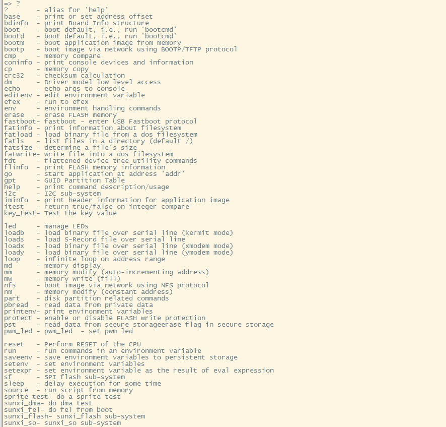
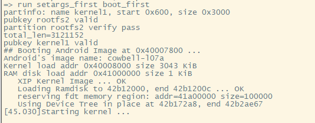
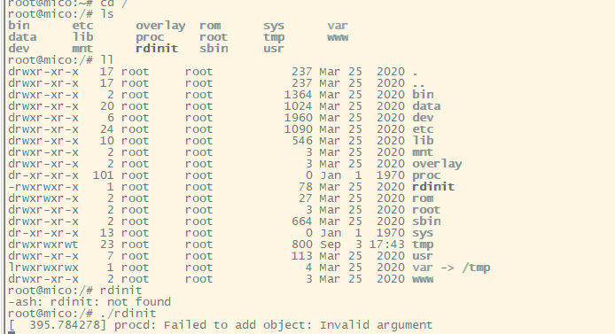
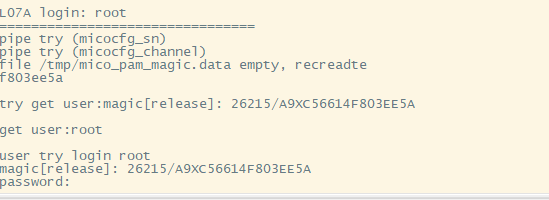

# redmi_audio

## redmi串口调试

redmi查看，pcb版上标注了tx,rx,GND，焊接进入uart调试




直接进入shell，有用户密码，无法进入shell


进入uboot看看

有很多命令，
这里我们注意setenv，cmdboot


流程如下：首先看printenv确定init=/sbin/init指定了启动路径，我们通过setenv修改为/bin/sh，然后执行run bootcmd之后就可以直接进入shell了。
```
=> printenv
boot_fastboot=fastboot
boot_first=sunxi_flash read 40007800 ${boot_partition_1};bootm 40007800
boot_partition_1=kernel1
boot_partition_2=kernel2
boot_second=sunxi_flash read 40007800 ${boot_partition_2};bootm 40007800
bootcmd=run setargs_second boot_second
bootdelay=0
console=ttyS0,115200
earlyprintk=sunxi-uart,0x05000000
fastboot_key_value_max=0x8
fastboot_key_value_min=0x2
fdtcontroladdr=42b172a8
first_root=/dev/nand0p3
gpt=1
init=/sbin/init
loglevel=1
partitions=env@nand0p1:kernel1@nand0p2:rootfs1@nand0p3:kernel2@nand0p4:rootfs2@nand0p5:misc@nand0p6:private@nand0p7:crashlog@nand0p8:UDISK@nand0p9
rdinit=/rdinit
recovery_key_value_max=0x13
recovery_key_value_min=0x10
rotpk_status=1
second_root=/dev/nand0p5
setargs_first=setenv bootargs earlyprintk=${earlyprintk} console=${console} root=${first_root} rootwait init=${init} rdinit=${rdinit} loglevel=${loglevel} partitions=${partitions} gpt=${gpt} rotpk_status=${rotpk_status}
setargs_second=setenv bootargs earlyprintk=${earlyprintk} console=${console} root=${second_root} rootwait init=${init} rdinit=${rdinit} loglevel=${loglevel} partitions=${partitions} gpt=${gpt} rotpk_status=${rotpk_status}

Environment size: 1208/131068 bytes
=> setenv init /bin/sh
=> saveenv 
Saving Environment to SUNXI_FLASH... Writing to env...
OK
=> printenv
boot_fastboot=fastboot
boot_first=sunxi_flash read 40007800 ${boot_partition_1};bootm 40007800
boot_partition_1=kernel1
boot_partition_2=kernel2
boot_second=sunxi_flash read 40007800 ${boot_partition_2};bootm 40007800
bootcmd=run setargs_second boot_second
bootdelay=0
console=ttyS0,115200
earlyprintk=sunxi-uart,0x05000000
fastboot_key_value_max=0x8
fastboot_key_value_min=0x2
fdtcontroladdr=42b172a8
first_root=/dev/nand0p3
gpt=1
init=/bin/sh
loglevel=1
partitions=env@nand0p1:kernel1@nand0p2:rootfs1@nand0p3:kernel2@nand0p4:rootfs2@nand0p5:misc@nand0p6:private@nand0p7:crashlog@nand0p8:UDISK@nand0p9
rdinit=/rdinit
recovery_key_value_max=0x13
recovery_key_value_min=0x10
rotpk_status=1
second_root=/dev/nand0p5
setargs_first=setenv bootargs earlyprintk=${earlyprintk} console=${console} root=${first_root} rootwait init=${init} rdinit=${rdinit} loglevel=${loglevel} partitions=${partitions} gpt=${gpt} rotpk_status=${rotpk_status}
setargs_second=setenv bootargs earlyprintk=${earlyprintk} console=${console} root=${second_root} rootwait init=${init} rdinit=${rdinit} loglevel=${loglevel} partitions=${partitions} gpt=${gpt} rotpk_status=${rotpk_status}

Environment size: 1205/131068 bytes
=> run bootcmd
partinfo: name kernel2, start 0x15600, size 0x3000
pubkey rootfs2 valid
partition rootfs2 verify pass
total_len=3135488
pubkey kernel2 valid
## Booting Android Image at 0x40007800 ...
```

注意：这saveenv会改变启动程序，saveenv请谨慎
但是这里进入shell后，是只读系统，然后程序也没有初始化，也没有网卡。


---


# shell passwd

首先这里用户名尝试下来，是root
```
LX01 login: root
================================
pipe try (micocfg_sn)
pipe try (micocfg_channel)
file /tmp/mico_pam_magic.data empty, recreadte
c09a4a8a

try get user:magic[release]: 18***/********C09A4A8A

get user:root

user try login root
magic[release]: 18***/********C09A4A8A
password:
>>>>>>>>>password_in=30313233343536

dsa verify sign len 14:30313233343536, magic(len 22) 18***/********C09A4A8A
dsa verify sign len 7, digest(len 22) 18***/********C09A4A8A
DSA_verify err error:0D07209B:lib(13):func(114):reason(155)!

dsa verify failed
Login incorrect

```

经过尝试
发现每次以此magic这里不一样
```
26215/A9XC566148FA67046
26215/A9XC566141B13D621
26215/A9XC56614EF793FF6
26215/A9XC566144B65332F
26215/A9XC5661496535452
26215/A9XC56614B963DD95
```

经过搜索，发现最新的固件中，登陆密码改为了DSA签名算法，使用私钥加密SN+随机字符串作为登陆密码, 输入后公钥解密, 验证。这种加密方式本身还是很难被攻破的。 

完后发现系统中有有两个启动分区，另一个启动分区中，是原来的加密算法，相对来说比较好破解。启动分区有两个是prinenv的时候看出来的，如下boot_second

```
=> printenv
boot_fastboot=fastboot
boot_first=sunxi_flash read 40007800 ${boot_partition_1};bootm 40007800
boot_partition_1=kernel1
boot_partition_2=kernel2
boot_second=sunxi_flash read 40007800 ${boot_partition_2};bootm 40007800
bootcmd=run setargs_second boot_second
bootdelay=0
```


uboot中切换启动分区
```
run setargs_first boot_first 

#恢复为2分区启动
run setargs_second boot_second 
```


找寻密码

```
# 1、先找到小爱音响SN码，通常在拆开后的底座里面。
# 例如：SN：26215/A9XC56614
# 2、root登录密码=md5(SN+通配字符串)取值的前14位
# 通配字符串：
    "5775B10D-15C0-7827-97B9-88EA07FCA97A",\
    "0168A6D-119A-F21A-DA58-980732F80A19",\
    "A20EDC68-62E5-70C6-76E8-75879721B8EC",\
    "B0168A6D-119A-F21A-DA58-980732F80A19",\
# 即：26215/A9XC56614A20EDC68-62E5-70C6-76E8-75879721B8EC
# 3、使用MD5在线加密工具 https://md5jiami.51240.com/
# 4、将2中的最终待加密代码经md5加密后得到如下32位小写加密信息：（只看32位，且一定小写）
# 取前14位：4380efd99626df即为root登陆密码
```

mi_passwd.py
```
#!/usr/bin/env python3
# coding:utf-8

from hashlib import md5

MAGIC_SALTS = [
    "5775B10D-15C0-7827-97B9-88EA07FCA97A",
    "0168A6D-119A-F21A-DA58-980732F80A19",
    "A20EDC68-62E5-70C6-76E8-75879721B8EC",
    "B0168A6D-119A-F21A-DA58-980732F80A19",
]
sn = "26215/A9XC56614"

# 遍历所有的MAGIC_SALTS并计算密码
for salt in MAGIC_SALTS:
    # 将SN和通配字符串组合并编码为字节类型
    sn_salt = (sn + salt).encode('utf-8')
    # 计算MD5哈希值
    md5_hash = md5(sn_salt).hexdigest()
    # 取前14位作为root密码
    root_password = md5_hash[:14]
    # 打印结果
    print(f"Using salt {salt}, the root password is: {root_password}")
```


经过尝试后发现密码为4380efd99626df


---


这里进入后，配网一直不成功，不知道是不是切换了切换启动分区的原因。
切换启动分区：
```
run setargs_second boot_second 
```
发现用原来的启动分区去启动就可以配网了。





```
run setargs_second boot_first
```
用第一个boot_first去启动，用setargs_second的环境变量去启动。  

然后这里就可以用原先的验证方式登陆后，就可以成功配网了。但是随后自动弹出shell，回到了uboot下，这时候，手机显示固件更新

# 这里出现了个意外
配网成功后，系统自动更新了，更新后的版本居然1.66.4


而我们原来的版本是1.80.4
我们是在24年9月3日自动更新的，但是更新到了更低的版本1.66.4，而不是最新版本。

这里版本发生了降级。

----


重新进入uboot,设置原来的启动方式
```
 setenv bootcmd run setargs_second boot_second
 
 run bootcmd
 
```


此时，启动分区，以及方式修改回来了

此时这个版本就是新版本1.80.4


---

试试用1的环境变量去起boot_second
 setenv bootcmd run setargs_first boot_second


```
=> setenv bootcmd run setargs_first boot_second
=> run bootcmd                                             
partinfo: name kernel2, start 0x15600, size 0x3000
pubkey rootfs2 valid
partition rootfs2 verify pass
total_len=3135488
pubkey kernel2 valid
## Booting Android Image at 0x40007800 ...
Android's image name: cowbell-l07a
Kernel load addr 0x40008000 size 3057 KiB
RAM disk load addr 0x41000000 size 1 KiB
   XIP Kernel Image ... OK
   Loading Ramdisk to 42b11000, end 42b1100c ... OK
   reserving fdt memory region: addr=41a00000 size=100000
   Using Device Tree in place at 42b172a8, end 42b2ae67
[365.825]Starting kernel ...

NAND_UbootExit
[365.829]NB1: NAND_LogicExit
nand release dma:43fb5e1c
nand release dma:0
[    0.087744] Initramfs unpacking failed: junk in compressed archive
[    0.520888] Kernel panic - not syncing: VFS: Unable to mount root fs on unknown-block(93,3)
[    0.530251] CPU0: stopping
[    0.533283] CPU: 0 PID: 0 Comm: swapper/0 Not tainted 4.9.118 #1
[    0.540009] Hardware name: sun8iw18
[    0.543940] [<c001258d>] (unwind_backtrace) from [<c000ff97>] (show_stack+0xb/0xc)
[    0.552431] [<c000ff97>] (show_stack) from [<c0137fe7>] (dump_stack+0x5b/0x70)
[    0.560525] [<c0137fe7>] (dump_stack) from [<c0011b85>] (handle_IPI+0x91/0x114)
[    0.568720] [<c0011b85>] (handle_IPI) from [<c000930b>] (gic_handle_irq+0x4b/0x54)
[    0.577199] [<c000930b>] (gic_handle_irq) from [<c0010665>] (__irq_svc+0x65/0x94)
[    0.585582] Exception stack(0xc04e1f40 to 0xc04e1f88)
[    0.591238] 1f40: 00000000 ffffffff 03a55000 c3f32a80 c39d6a00 00000000 1f9aec84 00000000
[    0.600406] 1f60: 1f635a47 00000000 00000000 00000000 0000000b c04e1f90 c02067b3 c02067de
[    0.609565] 1f80: 60000033 ffffffff
[    0.613477] [<c0010665>] (__irq_svc) from [<c02067de>] (cpuidle_enter_state+0xba/0x17c)
[    0.622450] [<c02067de>] (cpuidle_enter_state) from [<c003e6f5>] (cpu_startup_entry+0x121/0x144)
[    0.632304] [<c003e6f5>] (cpu_startup_entry) from [<c04a7909>] (start_kernel+0x249/0x2b8)
[    0.641467] [<c04a7909>] (start_kernel) from [<4000807f>] (0x4000807f)
[    0.648780] ###########creat a nand panic notifier
[    0.654160] [NE] get bdev failed - -2
[    0.658259] Need to switch system...
[    0.662255] flag_try_sys1_failed: v
[    0.666158] flag_try_sys2_failed: }
[    0.670056] flag_boot_rootfs    : <
[    0.673959] flag_ota_reboot     : '
[    0.677858] flag_last_success   : 
[    0.681767] [NE] get bdev failed - -2
[    0.686660] [ND] write panic data : logic addr: 174592, sectors 29, pages 4, blocks 1
[    0.699805] [ND] write panic data block: 178 page 0 !
[    0.707243] [ND] write panic data block: 178 page 1 !
[    0.714671] [ND] write panic data block: 178 page 2 !
[    0.722102] [ND] write panic data block: 178 page 3 !
[    0.729533] [ND] write dummy data block: 178 page 4 !
[    0.736966] [ND] write dummy data block: 178 page 5 !
[    0.744299] [ND] write dummy data block: 178 page 6 !
[    0.751685] [ND] write panic data : logic addr: 174621, sectors 1, pages 1, blocks 1
[    0.760362] [ND] write panic data block: 178 page 7 !
[    0.767790] [ND] write dummy data block: 178 page 8 !
[    0.775221] [ND] write dummy data block: 178 page 9 !
[    0.782645] [ND] write dummy data block: 178 page 10 !
[    0.790169] ---[ end Kernel panic - not syncing: VFS: Unable to mount root fs on unknown-block(93,3)
```
这个日志显示了一个内核启动过程中的失败，主要问题是无法挂载根文件系统，这可能是由于初始化 RAM 文件系统损坏、设备树配置错误、或者 NAND 存储中的数据损坏等原因造成的。解决这类问题通常需要检查 NAND 存储的完整性，验证设备树配置，或者重新打包和刷写系统镜像。


```
 setenv bootcmd run setargs_second  boot_first 
```


 run setargs_first boot_second
 失败
 

 run setargs_second  boot_second      
 可以   新的加密系统dsa
 
 run setargs_first  boot_first
 失败
 
 run setargs_second  boot_first
可以 新的加密系统dsa


---


这里小米redmi的进入shell的思路，应该是进入旧系统，把新系统dd出来，修改提取的bin文件的uboot验证方式后，重新打包，再进入旧系统shell 将新文件系统写入分区。
然后通过uboot启动，这样就可以进入新版本固件了。通过uboot环境变量，可以直到新版文件系统是写在/dev/nand0p3中的。


但是这里我们无意中，已经将旧版系统更新了，这种方法就不适用了。  
  
所以我在咸鱼上买了个小爱音响mini，到了再尝试一次 。


