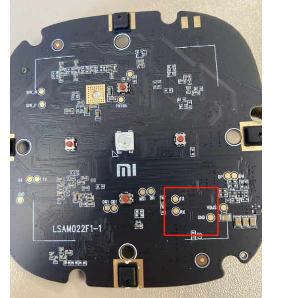
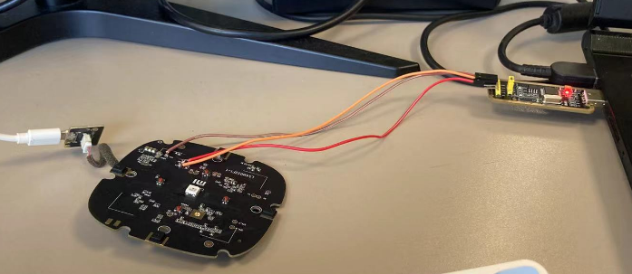
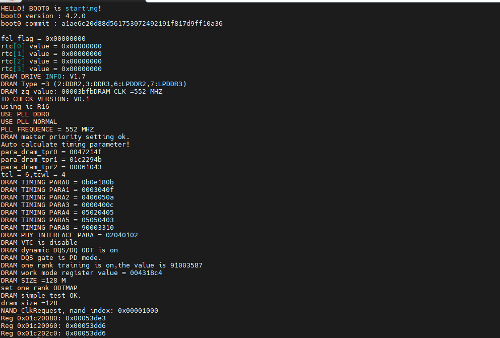

# xiaomi_mini

拆机可见https://www.ednchina.com/news/20180403mini.html



拆开后可见tx，rx,gnd


成功连接shell


进入shell发现需要账号密码，尝试登录后，发现登陆密码改为了DSA签名算法，使用私钥加密SN+随机字符串作为登陆密码, 输入后公钥解密, 验证。这种加密方式本身还是很难被攻破的。

但是按照之前搞redmi音响，这里系统中应该是有两套系统的。旧系统可能用的是之前的密码生成算法，而网上已经有如何生成密码的脚本了。

所以我们进入uboot，启动旧版系统试试。


挣了半天，发现uboot进不去。（不知道怎么弄），应该是把ttl关了，网上的方法是  
```
通过TTL进入路由器uboot命令行
小米路由器第一次启动时，会往uboot 配置（nvram）里写入 uart_en=0 ，这样导致uboot引导后，不接受ttl输入，只能查看，从而没法从ttl刷机了。
解决方法：
如果小米路由器还能正常使用，给小米路由器通电，进入路由器管理界面，选择恢复出厂设置。
SecureCRT应该可以看到数据了，在uboot引导时候，不停按键盘 4 键（即进入uboot 命令行），如下：

Please choose the operation: 
   1: Load system code to SDRAM via TFTP. 
   2: Load system code then write to Flash via TFTP. 
   3: Boot system code via Flash (default).
   4: Entr boot command line interface.
   7: Load Boot Loader code then write to Flash via Serial. 
   9: Load Boot Loader code then write to Flash via TFTP. 


如果不成功，则看到引导原厂固件时候，会有提示擦除nvram（erase nvram)，这时候果断拔电，再插上，就能成功进入 uboot命令行了
如果还不成功，就重复以上恢复出厂设置的操作。

让uart ttl口一直有效
进入uboot命令行以后，输入：
setenv uart_en 1
saveenv

```

但是我这里依然没有成功，下次再弄 

 