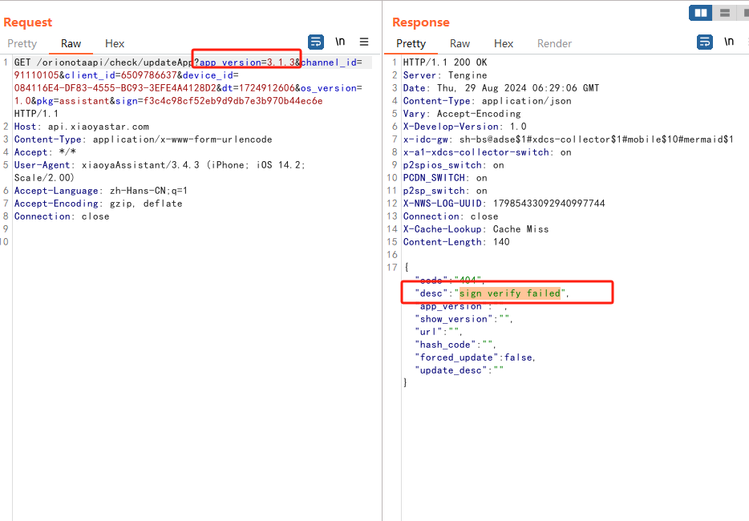
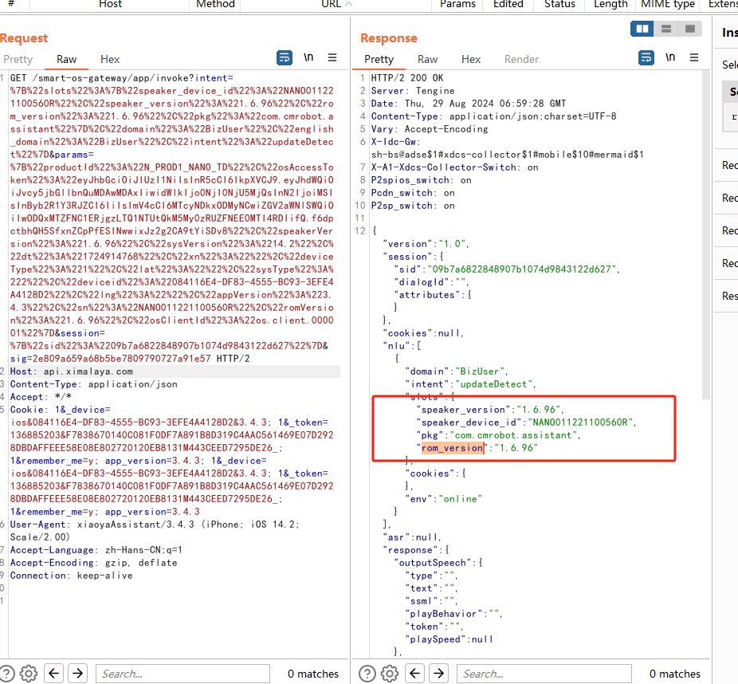
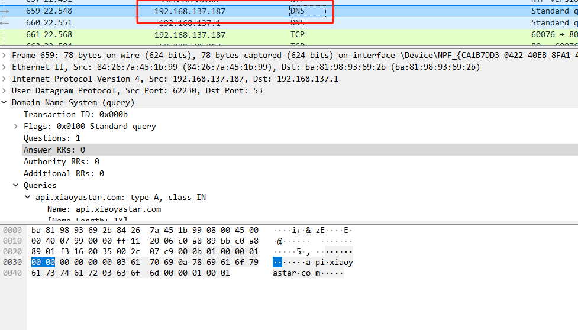
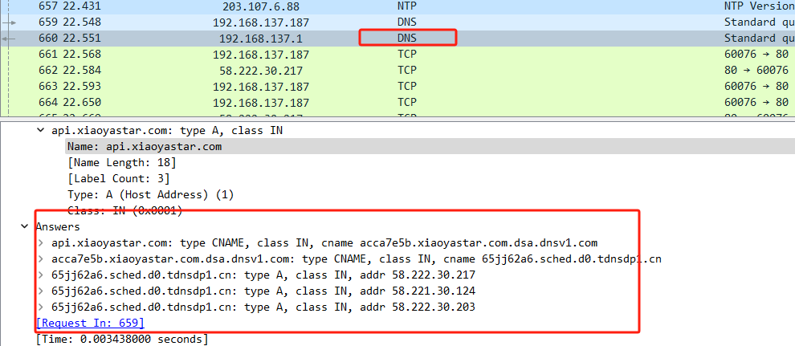
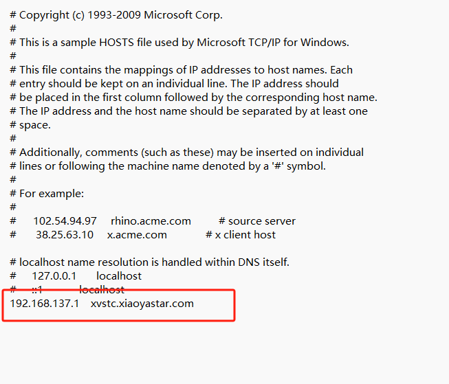
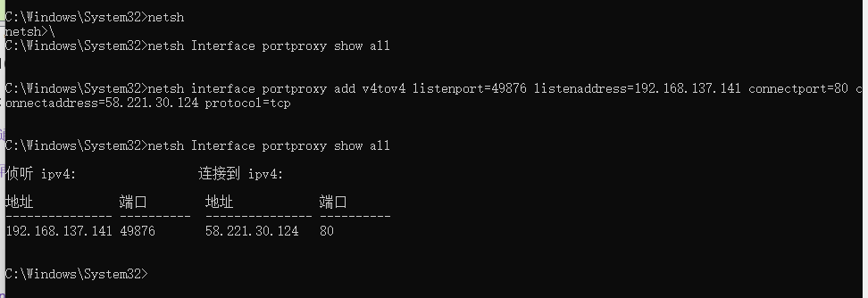

# 喜马拉雅音响


# uart调试


硬件口上有uart口，但是连接上后，无法输入，所以这里只能想其他办法了。


# 固件提取

## jadx
```
Jadx 是一个流行的命令行工具，用于反编译 Android 应用程序包（APK）文件。它能够将 APK 文件中的 Dalvik 字节码（DEX 文件）转换为更易于阅读和理解的 Java 源代码。

使用 Jadx 反编译一个 APK 文件后，它会生成一个包含多个目录和文件的文件夹结构。以下是典型的 Jadx 反编译后的目录结构：

[应用包名]：这是反编译后生成的根目录，通常以 APK 文件的包名命名。

[应用包名]/src：这个目录包含了反编译后的 Java 源代码文件。每个 Java 类通常被保存为一个单独的 .java 文件。

[应用包名]/res：这个目录包含了应用程序的资源文件，如布局（XML）、图片、字符串和其他资源。这些资源文件通常保持与原始 APK 中相同的结构。

[应用包名]/assets：如果 APK 中包含任何额外的资产文件，它们会被放置在这个目录中。

[应用包名]/libs：这个目录包含了应用程序使用的第三方库文件，通常是 .jar 或 .so 文件。

[应用包名]/smali：这个目录包含了反编译后的 Smali 代码。Smali 是一种低级 Android 代码表示，通常用于深入分析或修改应用程序的内部逻辑。

[应用包名]/apklite：如果使用了 Jadx 的 apklite 功能，这个目录会包含一个简化版的 APK 文件，它只包含应用程序的代码和资源，不包含任何第三方库。

[应用包名]/output.json：这是一个 JSON 文件，包含了 Jadx 反编译过程中的一些输出信息，如警告和错误。

[应用包名]/summary.txt：这是一个文本文件，提供了关于反编译过程的总结信息，包括成功反编译的类数量、资源数量等。

[应用包名]/jadx.log：这是 Jadx 反编译过程中的日志文件，包含了详细的操作记录。
```


## fiddler

设置如下：
```
1. 点击打开：Options → HTTPS，默认已勾选 Capture HTTPS CONNECTs 。

2. 勾选：Decrypt HTTPS traffic ；
  下拉列表选择：...from all processes；
  勾选：Ignore server certificate errors（unsafe）。

3. 点击 OK 保存设置。

```


保存

如果还有问题需要安装根证书，然后信任整数，但是我这里已经可以抓取流量了。

设置好 fidder 的 options 之后，会发现 fidder 安全证书安装在 “个人” 证书下，未验证安全性，证书提示需要安装在根证书下。
打开 fidder ，浏览器访问 https://www.baidu.com 网址时，提示 “你的连接不是私密连接”
我们需要访问代理服务器，下载证书，下载后，安装证书，然后信任。


然后这里就可以抓取https流量了。

---
抓更新包


这里显示已经是最新版本了，不需要更新。

我把app_version修改为低版本，显示sign verify failed,这里显然他是用sign的值做了校验的。




所以我现在只能在程序发包，生成sign之前，hook，修改app_version的值，然后重新发包。

打开apk，查看下
我们就搜索字符speaker_version，rom_version来定位，因为它1.6.96就是我手机页面显示的语音os版本
看的时候我们只看com.sdk.中的


这里对字符串romVersion 设置值，整个程序只有两次，那么我只需要把这里都hook掉，就可以实现发包前修改版本了。


```
   package com.sdk.orion.utils;


    public static void saveRomVersion(String str) {
        AppMethodBeat.i(11787);
        romVersion = str;
        SPUtil.saveString("romVersion", romVersion);
        AppMethodBeat.o(11787);
    }

public static void saveRomVersion(String str)：这是一个公共静态方法，参数 str 是一个字符串，表示要保存的 ROM 版本号。

ButterKnife.i(11787);：这行代码可能是使用了 ButterKnife 库的某个功能，用于性能监控或调试。ButterKnife.i(11787); 可能是开始一个监控块，其中 11787 是一个特定的事件或操作的标识符。

romVersion = str;：这行代码将传入的字符串 str 赋值给一个静态变量 romVersion。这个变量用于在类内部存储 ROM 版本号。

SPUtil.saveString("romVersion", romVersion);：这行代码调用 SPUtil 类的 saveString 方法，将 romVersion 变量的值保存到 SharedPreferences 中。"romVersion" 是保存数据时使用的键（key），用于后续检索这个值。

SharedPreferences 是 Android 提供的一个轻量级的存储机制，用于存储少量的数据，如用户设置、配置信息等。它允许应用程序保存和检索键值对（key-value pairs）的数据。


ButterKnife.o(11787);：这行代码可能是结束一个监控块，其中 11787 是与开始监控块相同的标识符。
```


```
    package com.xiaoyastar.ting.android.framework.smartdevice.constants;


    public static void saveRomVersion(String str) {
        AppMethodBeat.i(48440);
        romVersion = str;
        MmkvCommonUtil.getInstance(BaseApplication.mAppInstance).saveString("romVersion", romVersion);
       
        AppMethodBeat.o(48440);
    }
     #这行代码调用 MmkvCommonUtil 类的 saveString 方法，将 romVersion 变量的值保存到一个持久化存储中。MmkvCommonUtil 可能是一个自定义的工具类，用于操作 MMKV（一种基于 mmap 的 key-value 存储组件），提供比 SharedPreferences 更高效的数据存储解决方案。

```


---

# 安卓hook

```
package com.example.xposedmodule; // 定义模块所在的包名

import de.robv.android.xposed.IXposedHookLoadPackage; // 导入Xposed框架的接口
import de.robv.android.xposed.callbacks.XC_LoadPackage.LoadPackageParam; // 导入加载包参数类
import static de.robv.android.xposed.XposedHelpers.findAndHookMethod; // 导入用于查找和hook方法的静态工具方法

public class MyHook implements IXposedHookLoadPackage { // 实现IXposedHookLoadPackage接口的类
    @Override
    public void handleLoadPackage(final LoadPackageParam lpparam) throws Throwable { // 实现接口中的方法，处理每个加载的包
        // 检查是否是需要hook的第一个目标包
        if (lpparam.packageName.equals("com.xiaoyastar.ting.android.framework.smartdevice.constants")) {
            hookSaveRomVersion(lpparam.classLoader); // 调用hook方法
        }
        // 检查是否是需要hook的第二个目标包
        if (lpparam.packageName.equals("com.sdk.orion.utils")) {
            hookSaveRomVersion(lpparam.classLoader); // 调用hook方法
        }
    }

    private void hookSaveRomVersion(ClassLoader classLoader) { // 定义hook逻辑的私有方法
        findAndHookMethod("com.xiaoyastar.ting.android.framework.smartdevice.constants.SPUtil", classLoader, "saveString", 
                           String.class, String.class, new XC_MethodHook() {
            @Override
            protected void beforeHookedMethod(MethodHookParam param) throws Throwable {
                // 强制将romVersion设置为"1.6.95"
                param.args[1] = "1.6.95";
            }
        });

        findAndHookMethod("com.sdk.orion.utils.SPUtil", classLoader, "saveString", 
                           String.class, String.class, new XC_MethodHook() {
            @Override
            protected void beforeHookedMethod(MethodHookParam param) throws Throwable {
                // 强制将romVersion设置为"1.6.95"
                param.args[1] = "1.6.95";
            }
        });
    }
}
```


---

# 中间人


在建立https之前，请求解析了域名api.xiaoyastar.com



之后网关告诉设备对应的ip地址



因为我的windows机器就是网关，ip地址为192.168.137.1

我修改了host文件的值，[hosts](file:///C:/Windows/System32/drivers/etc/hosts)




这样小雅音响在dns解析域名api.xiaoyastar.com的ip地址时，会先在网关，也就是我们的windows中hosts文件中解析到 ip地址为192.168.137.1


这里看到小雅音响198.168.137.187已经把192.168.137.1当作了域名api.xiaoyastar.com的解析地址，一直再发ack请求。

要保持通信，我们需要：
```
1.将小雅音响的请求，通过我们的windows转发到域名api.xiaoyastar.com的真实解析地址

2.拿到真实返回包后，再通过我们的windows转发给小雅音响。
```


转发流量
```
1。管理员身份打开cmd
2.netsh interface portproxy show all
 查看端口转发规则
 


```

api.xiaoyastar.com域名地址58.221.30.124:80

windows 192.168.137.1

小雅：192.168.137.141:49876

```
192.168.137.141:49876转给58.221.30.124:80
netsh interface portproxy add v4tov4 listenport=49876 listenaddress=192.168.137.141 connectport=80 connectaddress=58.221.30.124 protocol=tcp


netsh interface portproxy delete
netsh interface portproxy delete v4tov4 listenport=49876 listenaddress=192.168.137.141
```


