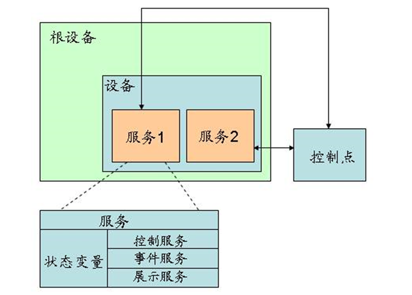
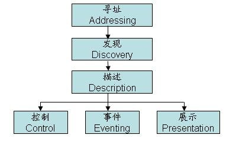
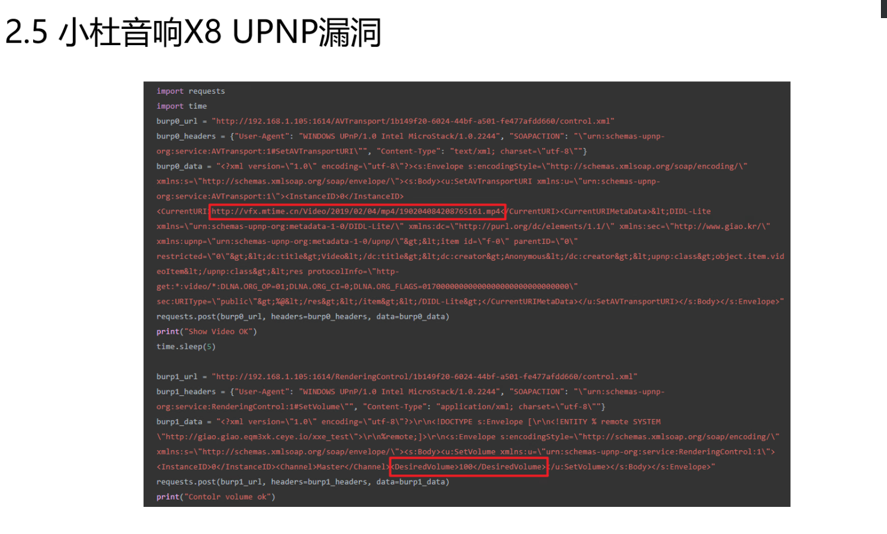
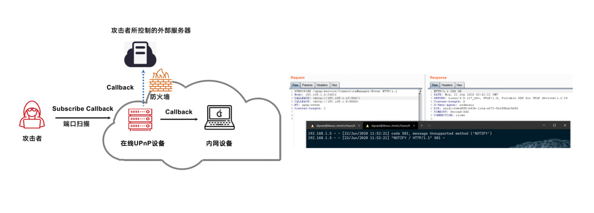

# upnp  端口：1900


# 1简介
UPnP（Universal Plug and Play，通用即插即用）是一种网络协议，允许设备在不进行复杂配置的情况下相互发现并协同工作。UPnP 协议主要用于家庭网络环境中，例如，当你将新的打印机或智能设备连接到家庭网络时，UPnP 允许这些设备自动配置网络设置，并与网络上的其他设备进行通信。

UPnP 协议的关键特点包括：

1. **自动发现**：设备可以通过发送广播消息来通知网络上的其他设备它们的存在，其他设备可以接收这些消息并识别新设备。

2. **控制点**：在UPnP网络中，控制点是一个可以发送指令给其他设备的设备，它通常是一个用户界面，允许用户控制网络中的设备。

3. **服务描述**：每个UPnP设备都有一个服务描述，这是一个XML文档，描述了设备的功能和它提供的服务。

4. **设备描述**：类似于服务描述，设备描述也是一个XML文档，但它描述的是设备本身，包括制造商信息、型号等。

5. **端口映射**：UPnP允许设备请求路由器在特定的外部端口上转发流量到内部网络的特定设备和端口。这对于需要从互联网访问内部网络服务的应用程序非常有用。

6. **安全性**：UPnP协议包括一些安全特性，例如设备认证和加密通信，以保护网络不受未授权访问。

UPnP 协议广泛应用于各种设备，包括但不限于路由器、打印机、媒体服务器、智能家电等。然而，由于安全问题，一些设备和网络管理员可能会选择禁用UPnP功能。


# 2UPnP的结构规范

## 2.1UPnP的基本组件
服务、设备和控制点是UPnP网络的基本组件，它们之间的关系图如下图所示：




设备（Device）：
UPnP网络中定义的设备具有很广泛的含义，各种各样的家电、电脑外设、智能设备、无线设备、个人电脑等等都可以称之为设备。一台UPnP设备可以是多个服务的载体或多个子设备的嵌套。
服务（Service）：
在UPnP网络中，最小的控制单元就是服务。服务描述的是指设备在不同情况下的动作和设备的状态。例如，时钟服务可以表述为时间变化值、当前的时间值以及设置时间和读取时间两个活动，通过这些动作，就可以控制服务。
控制点（Control Point）：
在UPnP网络中，控制点指的是可以发现并控制其他设备的控制设备。在UPnP网络中，设备可以和控制点合并，为同一台设备，同时具有设备的功能和控制点的功能，即可以作为设备提供服务，也可以作为控制点发现和控制其他设备。

## 2.2协议栈
UPnP协议结构最底层的TCP/IP协议是UPnP协议结构的基础。IP层用于数据的发送与接收。对于需要可靠传送的信息，使用TCP进行传送，反之则使用UDP。


# 3工作流程

工作流程如下：


首先控制点和设备都先获取IP地址后才能进行下一步的工作；
控制点首先要寻找整个网络上的UPnP设备，同时网络上的设备也要宣告自身的存在；
控制点要取得设备的描述，包括这些设备提供什么样的服务；
控制点发出动作信息给设备；
控制点监听设备的状态，当状态改变时作出相应的处理动作

3.1 寻址（Addressing）
UPnP网络的基础是TCP/IP，这就决定了每一个UPnP组件必须有IP地址。一台UPnP设备寻址的一般过程是：首先向DHCP服务器发送DHCP Discover的消息，如果在指定的时间内，设备没有收到DHCP Offer回应消息，设备必须使用AUTO-IP完成IP地址的获取。当然也可以使用静态配置的IP地址。

3.2 发现（Discovery）
连接到网络上的设备确定了IP地址之后，就会进入发现操作阶段。设备发现是UPnP实现的第一步。设备发现是由简单发现协议SSDP来完成的。当一台设备加入到网络中，发现过程允许设备向网络上的控制节点告知它提供的服务，当一个控制点加入到网络中，设备发现过程允许控制点寻找网络上感兴趣的设备


3.3 描述（Description）
UPnP的第二步是设备描述。在控制点发现一台设备后，控制点对该设备可能仅仅知道设备或者服务的UPnP类型，设备的UUID和设备描述的URL地址，还需要知道更多的信息。控制点可以从发现消息中得到设备描述的URL，通过URL取回设备描述的信息。

3.4 控制（Control）
在接收设备和服务描述之后，控制点可以向这些服务发出动作，同时控制点也可以轮询服务的当前状态。控制点将动作发送到设备服务，在动作完成或者失败后，服务返回相应的结果或者错误信息。

3.5 事件（Even ting）
如上文的描述部分所述，一个即插即用服务描述包括服务响应的动作列表和运行时描述服务状态的变量列表。如果一个或多个状态被事件触发，服务将会在这些状态发生变化时发布更新，控制点可以订阅以获得此信息。在事件机制中，发布者指事件的来源（通常为设备服务），订阅者指事件目的地（通常为控制点）。

3.6 展示（Presentation）
在控制点发现设备和取得设备描述之后，展示也就开始了。如果设备拥有进行展示的URL，那么控制点就可以通过此URL取得一个页面，在浏览器中加载该页面，并根据页面功能，支持用户控制设备或浏览设备状态。每一项完成的程度取决于展示页面和设备的具体功能。


例子：

## 1.发现

```
M-SEARCH * HTTP/1.1
HOST: 239.255.255.250:1900
ST: urn:schemas-upnp-org:device:InternetGatewayDevice:1
MAN: "ssdp:discover"
MX: 2

```


```
HTTP/1.1 200 OK
CACHE-CONTROL: max-age=100
DATE: Fri, 10 Jul 2020 12:14:55 GMT
EXT:
LOCATION: http://192.168.1.1:1900/igd.xml
SERVER: vxWorks/5.5 UPnP/1.0 TL-WR842N/9.0
ST: urn:schemas-upnp-org:device:InternetGatewayDevice:1
USN: uuid:upnp-InternetGatewayDevice-A1B6D8B894C1::urn:schemas-upnp-org:device:InternetGatewayDevice:1

```

请求部分：
M-SEARCH * HTTP/1.1：这是一个UPnP的M-SEARCH请求，用于发现服务。
HOST: 239.255.255.250:1900：指定了UPnP设备使用的多播地址和端口。
ST: urn:schemas-upnp-org:device:InternetGatewayDevice:1：指定了搜索目标的类型，这里是互联网网关设备。
MAN: "ssdp:discover"：指定了操作类型，这里是发现操作。
MX: 2：指定了最大等待时间，这里是2秒。
响应部分：
HTTP/1.1 200 OK：表示请求成功，设备已经找到了。
CACHE-CONTROL: max-age=100：指定了响应的缓存控制，这里表示缓存时间为100秒。
DATE: Fri, 10 Jul 2020 12:14:55 GMT：响应的时间戳。
EXT:：扩展字段，通常用于包含额外的响应信息。
**LOCATION: http://192.168.1.1:1900/igd.xml**：提供了设备描述文件的URL，这里是互联网网关设备的描述文件。
SERVER: vxWorks/5.5 UPnP/1.0 TL-WR842N/9.0：提供了服务器的软件信息，包括操作系统、UPnP版本和设备型号。
ST: urn:schemas-upnp-org:device:InternetGatewayDevice:1：再次确认了服务类型，与请求中的ST一致。
USN: uuid:upnp-InternetGatewayDevice-A1B6D8B894C1::urn:schemas-upnp-org:device:InternetGatewayDevice:1：提供了设备的统一服务名称（USN），这是一个唯一的标识符，用于识别设备和服务。

如果我想要搜索telnet服务，应该发包
```
M-SEARCH * HTTP/1.1
HOST: 239.255.255.250:1900
ST: urn:schemas-upnp-org:service:Telnet:1
MAN: "ssdp:discover"
MX: 5
```

239.255.255.250：这是一个IPv4地址，用于UPnP协议的多播。多播地址允许一个数据包同时发送给网络中的多个设备。UPnP设备监听这个特定的多播地址来接收M-SEARCH请求。

1900：这是多播地址使用的端口号。UPnP协议规定使用端口1900作为其通信的默认端口。

指定HOST的原因有以下几点：

多播通信：通过指定多播地址和端口，M-SEARCH请求能够被发送到局域网内所有监听在该多播地址和端口上的UPnP设备。

UPnP与路由器：在家庭或小型办公网络中，UPnP设备（如智能电视、打印机、媒体服务器等）会向路由器所在的网络发送M-SEARCH请求。如果路由器支持UPnP，它可能会将这些请求转发到连接的其他设备。


发送发现请求后，在LOCATION: http://192.168.1.1:1900/igd.xml中，有描述服务的文档 。

---

## 2.描述
```
GET /igd.xml HTTP/1.1
Host: 192.168.1.1:1900
Connection: Close
User-Agent: Ubuntu/20.04, UPnP/1.1, MiniUPnPc/2.1

```
GET /igd.xml HTTP/1.1：这行表示您正在请求igd.xml文件，使用的是HTTP GET方法和HTTP/1.1协议版本。
Host: 192.168.1.1:1900：这行指定了您要请求的服务器的IP地址和端口号。这里是路由器的IP地址和UPnP服务的端口号。
Connection: Close：这行表示完成文件传输后关闭TCP连接。
User-Agent: Ubuntu/20.04, UPnP/1.1, MiniUPnPc/2.1：这行提供了发出请求的客户端软件的信息，包括操作系统版本、UPnP协议版本和使用的UPnP客户端库。


---

```
HTTP/1.1 200 OK
Content-Type: text/xml;charset=UTF-8
Content-Length: 2649
Connection: close
Cache-control: no-cache

```

HTTP/1.1 200 OK：这行表示服务器成功处理了您的请求，并返回了文件。
Content-Type: text/xml;charset=UTF-8：这行指定了返回内容的类型是XML格式，使用UTF-8字符编码。
Content-Length: 2649：这行表示返回的XML文件大小是2649字节。
Connection: close：这行表示服务器在发送完响应后将关闭连接。
Cache-control: no-cache：这行指示不要缓存这个响应，每次请求都应从服务器获取最新内容。


---


```
<?xml version="1.0"?>
<root xmlns="urn:schemas-upnp-org:device-1-0">
<specVersion>
<major>1</major>
<minor>0</minor>
</specVersion>
<device>
<deviceType>urn:schemas-upnp-org:device:InternetGatewayDevice:1</deviceType>
<presentationURL>http://192.168.1.1:80</presentationURL>
<friendlyName>Wireless N Router TL-WR842N</friendlyName>
<manufacturer>TP-LINK</manufacturer>
<manufacturerURL>http://www.tp-link.com.cn</manufacturerURL>
<modelDescription>TL-WR842N 9.0</modelDescription>
<modelName>TL-WR842N</modelName>
<modelNumber>9.0</modelNumber>
<UDN>uuid:upnp-InternetGatewayDevice-A1B6D8B894C1</UDN>
<UPC>123456789001</UPC>
<serviceList>
<service>
<serviceType>urn:schemas-upnp-org:service:Layer3Forwarding:1</serviceType>
<serviceId>urn:upnp-org:serviceId:L3Forwarding1</serviceId>
<controlURL>/l3f</controlURL>
<eventSubURL>/l3f</eventSubURL>
<SCPDURL>/l3f.xml</SCPDURL>
</service>
</serviceList>
<deviceList>
<device>
<deviceType>urn:schemas-upnp-org:device:WANDevice:1</deviceType>
<friendlyName>WAN Device</friendlyName>
<manufacturer>TP-LINK</manufacturer>
<manufacturerURL>http://www.tp-link.com.cn</manufacturerURL>
<modelDescription>WAN Device</modelDescription>
<modelName>WAN Device</modelName>
<modelNumber>1.0</modelNumber>
<modelURL></modelURL>
<serialNumber>12345678900001</serialNumber>
<UDN>uuid:upnp-WANDevice-A1B6D8B894C1</UDN>
<UPC>123456789001</UPC>
<serviceList>
<service>
<serviceType>urn:schemas-upnp-org:service:WANCommonInterfaceConfig:1</serviceType>
<serviceId>urn:upnp-org:serviceId:WANCommonInterfaceConfig</serviceId>
<controlURL>/ifc</controlURL>
<eventSubURL>/ifc</eventSubURL>
<SCPDURL>/ifc.xml</SCPDURL>
</service>
</serviceList>
<deviceList>
<device>
<deviceType>urn:schemas-upnp-org:device:WANConnectionDevice:1</deviceType>
<friendlyName>WAN Connection Device</friendlyName>
<manufacturer>TP-LINK</manufacturer>
<manufacturerURL>http://www.tp-link.com.cn</manufacturerURL>
<modelDescription>WAN Connection Device</modelDescription>
<modelName>WAN Connection Device</modelName>
<modelNumber>1</modelNumber>
<modelURL></modelURL>
<serialNumber>12345678900001</serialNumber>
<UDN>uuid:upnp-WANConnectionDevice-A1B6D8B894C1</UDN>
<UPC>123456789001</UPC>
<serviceList>
<service>
<serviceType>urn:schemas-upnp-org:service:WANIPConnection:1</serviceType>
<serviceId>urn:upnp-org:serviceId:WANIPConnection</serviceId>
<controlURL>/ipc</controlURL>
<eventSubURL>/ipc</eventSubURL>
<SCPDURL>/ipc.xml</SCPDURL>
</service>

</serviceList>
</device>
</deviceList>
</device>
</deviceList>
</device>
</root>

```

XML内容部分：
XML响应包含了设备的描述信息，其中包括：

specVersion：指定了UPnP规范的版本。
device：包含了设备的详细信息，如类型、用户友好名称、制造商、模型描述、型号、UDN（Unique Device Name，唯一设备名称）等。
presentationURL：提供了一个URL，通常是一个网页，用于用户界面的展示。
serviceList：列出了设备提供的服务，每个服务包括服务类型、服务ID、控制URL、事件订阅URL和SCPD（Service Control Protocol Description）URL。
deviceList：列出了设备包含的子设备，每个子设备也有类似的描述信息。


---

## 控制

一旦一个控制点发现了一个设备并且检索到他的描述文档,他可能需要控制该设备包含的一个或多个服务。简单对象访问协议(SOAP:Simple Object Access Protocol)允许一个访问点查询或改变服务状态表中的元素。SOAP使用基于TCP传输HTTP的POST和M-POST命令。
SOAP使用XML来说明采取的活动

```
POST /ipc HTTP/1.1
Host: 192.168.1.1:1900
User-Agent: Ubuntu/20.04, UPnP/1.1, MiniUPnPc/2.1
Content-Length: 271
Content-Type: text/xml
SOAPAction: "urn:schemas-upnp-org:service:WANIPConnection:1#GetStatusInfo"
Connection: Close
Cache-Control: no-cache
Pragma: no-cache

<?xml version="1.0"?>
<s:Envelopexmlns:s="http://schemas.xmlsoap.org/soap/envelope/&#34; 
                   s:encodingStyle="http://schemas.xmlsoap.org/soap/encoding/&#34;&gt; 
    <s:Body>
        <u:GetStatusInfo xmlns:u="urn:schemas-upnp-org:service:WANIPConnection:1"></u:GetStatusInfo>
    </s:Body>
</s:Envelope>
```
POST /ipc HTTP/1.1：这行表示您正在向/ipc路径发送一个POST请求，这是WANIPConnection服务的控制URL。
Host: 192.168.1.1:1900：这行指定了您要请求的服务器的IP地址和端口号。
User-Agent：提供了发出请求的客户端软件的信息。
Content-Length：指定了请求体的长度。
Content-Type：指定了请求体的类型是XML。
SOAPAction：指定了要调用的SOAP操作，这里是GetStatusInfo方法。
Connection、Cache-Control、Pragma：这些头部用于控制连接和缓存行为。
请求体是一个SOAP信封，包含要调用的方法GetStatusInfo，这个方法属于urn:schemas-upnp-org:service:WANIPConnection:1命名空间。


```
HTTP/1.1 200 OK
Content-Type: text/xml;charset=UTF-8
Content-Length: 428
Connection: close
Cache-control: no-cache
Server: vxWorks/5.5 UPnP/1.0 TL-WR842N/9.0

<?xml version="1.0"?>
<s:Envelope xmlns:s="http://schemas.xmlsoap.org/soap/envelope/" s:encodingStyle="http://schemas.xmlsoap.org/soap/encoding/">
    <s:Body>
        <u:GetStatusInfoResponse xmlns:u="urn:schemas-upnp-org:service:WANIPConnection:1">											<NewConnectionStatus>2148414816</NewConnectionStatus>
            <NewUptime>89894l</NewUptime>
            <NewLastConnectionError>ERROR_NONE</NewLastConnectionError>
        </u:GetStatusInfoResponse>
    </s:Body>
</s:Envelope>

```
响应部分：
HTTP/1.1 200 OK：这行表示服务器成功处理了您的请求，并返回了响应。
Content-Type、Content-Length、Connection、Cache-control、Server：这些头部提供了响应的类型、长度、连接行为、缓存控制和服务器信息。
响应体也是一个SOAP信封，包含GetStatusInfoResponse方法的响应，其中包含以下信息：

NewConnectionStatus：表示当前的连接状态。这个值通常是一个数字代码，需要参考服务规范来解释。
NewUptime：表示设备或连接的运行时间，单位通常是秒。这里的值89894l可能是一个错误，因为它看起来像是一个数字后面跟了一个字母l。
NewLastConnectionError：表示上次连接错误的状态。ERROR_NONE表示没有错误。





# upnp callstranger 漏洞 



---

# upnp抓包 


摄像头192.168.2.118


wireshake


从上往下，依次为
```
物理层
数据链路层或以太层
网络层
应用层
数据包
```
wireshark抓取ssdp协议

udp.port == 1900 && ip.dst == 239.255.255.250

ip.dst为多播地址，udp.port == 1900为udp默认端口

# 发现包
```
Simple Service Discovery Protocol
    M-SEARCH * HTTP/1.1\r\n
    HOST: 239.255.255.250:1900\r\n
    MAN: "ssdp:discover"\r\n
    MX: 1\r\n
    ST: urn:dial-multiscreen-org:service:dial:1\r\n
    USER-AGENT: Chromium/120.0.6099.71 Linux\r\n
    \r\n

```

这个数据包是一个 SSDP（简单服务发现协议）的 M-SEARCH 请求。SSDP 是一种基于网络的服务发现协议，它允许客户端在局域网上搜索服务。以下是该请求的详细解释：

M-SEARCH * HTTP/1.1：这表明这是一个 M-SEARCH 请求，* 表示搜索所有服务，HTTP/1.1 是协议版本。

HOST: 239.255.255.250:1900：指定了 SSDP 请求发送到的多播地址和端口。239.255.255.250 是 SSDP 的预定义多播地址，1900 是 SSDP 的标准端口。

MAN: "ssdp:discover"：这是 M-SEARCH 请求的必需头部，表示该请求是用于服务发现的。

MX: 1：这个头部指定了最大等待时间（以秒为单位），服务端在这个时间之后必须响应请求。

ST: urn:dial-multiscreen-org:service:dial:1：ST（Search Target）头部指定了客户端正在搜索的服务类型。在这个例子中，它正在搜索符合 DIAL（Discovery and Launch）协议的服务，DIAL 是一种允许设备发现和启动其他设备上应用程序的技术。

USER-AGENT: Chromium/120.0.6099.71 Linux：这个头部提供了发起请求的客户端应用程序的信息，这里显示的是 Chromium 浏览器的一个特定版本，运行在 Linux 系统上。

最后的 \r\n\r\n 表示 HTTP 请求头部的结束，之后是空行，如果有必要，请求的正文可以跟在这一行之后。


---


# upnp-callstranger 


下载链接：[CallStranger](https://github.com/yunuscadirci/CallStranger)

需要修改源码CallStranger.py  ,
脚本会从原来的网站去拿callstranger.php。但是现在那个网站挂了。
我们搭建自己的服务器，把callstranger.php放上去。


每次扫描前，需要重启服务器。我这里用的是phpstudy搭建，每次调用callstranger之前，记得重启phpstudy服务器。

用法
```
扫描能访问网段下，开启upnp服务的漏洞。
python3 CallStranger.py


扫描单个设备
python3 CallDirect.py http://DeviceDocumentPath
python3 CallDirect.py http://192.168.2.120:1330/
```
