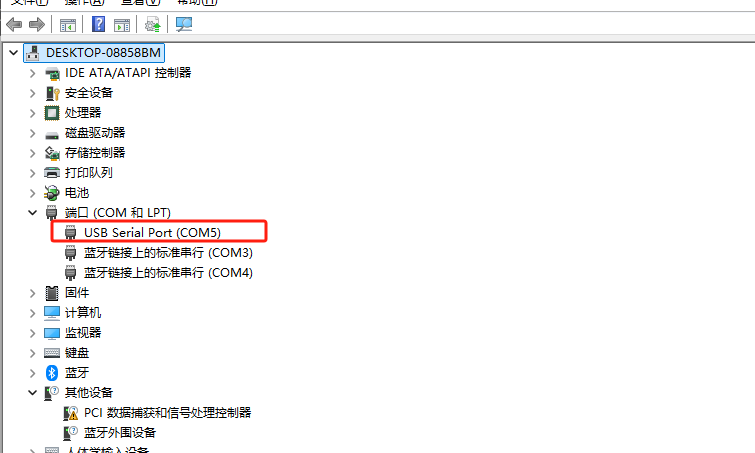
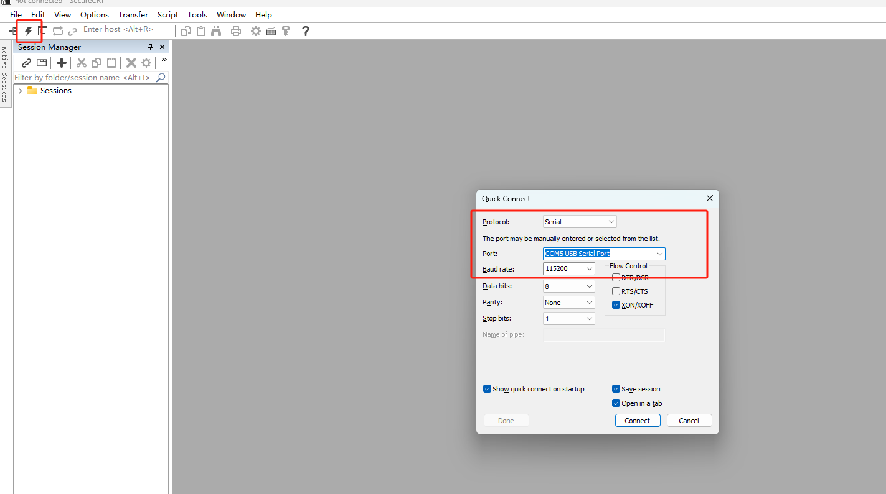
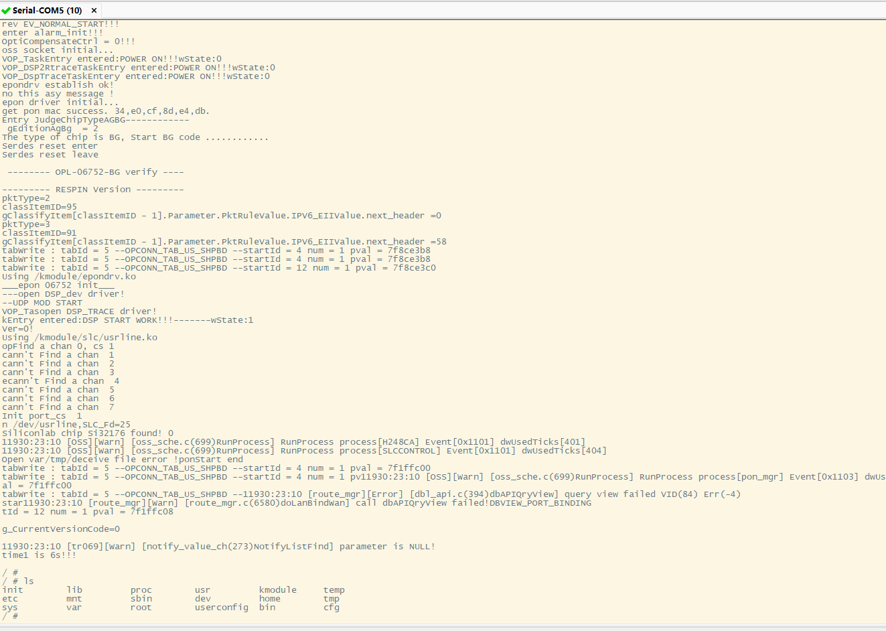
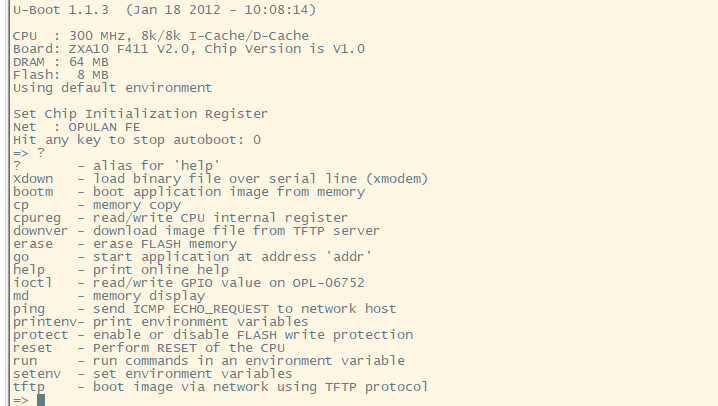

# uart调试+固件提取

# 1.确定引脚位置

```
步骤：
1.设备接电，万用表蜂鸣模式下，测试gnd,一直响的是gnd

2.万用表调到20v，黑笔连接gnd,红笔连接其他引脚，电压如果有一个唯一的稳定在3.3V的，那该位置就是vcc.

3.万用表调到20v，黑笔连接gnd,红笔连接其他引脚，如果断开电源后，重接电源，电压不断变化的是tx.

```

# 2.连接uboot和shell

硬件连接：
ft232和我们的设备连接，连接三根线
gnd----gnd
tx--------rx
rx--------tx


安装驱动和secureCRT
 
连接过程:



确定端口连接类型

点击闪电图标连接，选择协议为serial
port选择我们对应的端口类型
baud rate 选择常用的几个，这里我们的波特率为115200
点击连接。

点击连接后，需要给设备重新下电上电一次，才能识别。


如果什么操作都不做，他会直接进去shell。


我们可以在启动过程中ctrl+c  ,进入它的uboot命令界面。

或者进去shell后，重新上电，然后ctrl+c 。




---


# uboot  固件提取


这里没有直接显示闪存结构的函数，我们只能一个一个查看，找firmware的起始位置。


首先这里闪存是8M,
8M的内存地址大小为：

8M = 8,000,000字节

由于每个字节的地址占用4个字节（32位），因此8M的内存地址大小为：

8,000,000字节 / 4字节/地址 = 2,000,000地址

如果从0x0000开始表示，这意味着地址范围为：

0x0000 0000 - 0x7FFF FFFF

因此，8M的内存地址大小为0x8000000。


启动时，显示文文件内存分布
```
0x00000000-0x00800000 : "whole flash"
0x00000000-0x00020000 : "bootloader"
0x007f0000-0x00800000 : "env"
0x00020000-0x003d0000 : "kernel_ramfs0"
0x00780000-0x007e0000 : "userconfig"
0x007e0000-0x007f0000 : "parameter tags"
0x003d0000-0x00780000 : "kernel_ramfs1"
```


根据您的printenv命令输出，我们可以看到以下信息：


确认好uboot将img放在内存中哪个位置 .在uboot启动kernal的进程中，输出了kernal在内存中入口点的位置，那么kernal后面，应该就是文件系统，他们应该是相邻的。
 

md.py
```
import serial
import time
import re

def dump_memory_test(start_address, end_address, chunk_size, serial_port, baud_rate, output_file):
    with serial.Serial(serial_port, baud_rate, timeout=2) as ser:
        with open(output_file, 'wb') as f:
            current_address = start_address
            while current_address < end_address:
                command = f"md {current_address:X} {chunk_size // 4:X}\n".encode('utf-8')
                ser.write(command)
                time.sleep(0.1)

                raw_output = b''
                while True:
                    line = ser.readline().decode('utf-8').strip()
                    if line == '':
                        break

                    match = re.search(r'^[0-9a-fA-F]{8}: ([0-9a-fA-F]{8} [0-9a-fA-F]{8} [0-9a-fA-F]{8} [0-9a-fA-F]{8})', line)
                    if match:
                        hex_data = match.group(1).replace(' ', '')
                        raw_output += bytes.fromhex(hex_data)

                if raw_output:
                    f.write(raw_output)
                    print(f"读取地址: 0x{current_address:X}, 数据保存至 {output_file}")

                current_address += chunk_size

if __name__ == '__main__':
    start_address = int(input("请输入起始地址（16进制）："), 16)
    end_address = int(input("请输入结束地址（16进制）："), 16)
    chunk_size = int(input("请输入块大小（字节）："))
    serial_port = input("请输入串口号（例如COM3）：")
    baud_rate = int(input("请输入波特率（例如115200）："))
    output_file = input("请输入输出文件名（例如md.bin）：")

    dump_memory_test(start_address, end_address, chunk_size, serial_port, baud_rate, output_file)
```

这是我和朋友写的脚本，注意这里的start_address地址，是uboot加载kernal时候的打印地址。end_address地址根据bin文件大小，自己设定。  
chunk_size这里尤其需要注意，因为很多uboot中md这种命令是有长度限制的，设置太大会造成读取错误。

用这种方法提取了中兴的光猫固件，程序跑了三个半小时，好在解密出来没问题。
