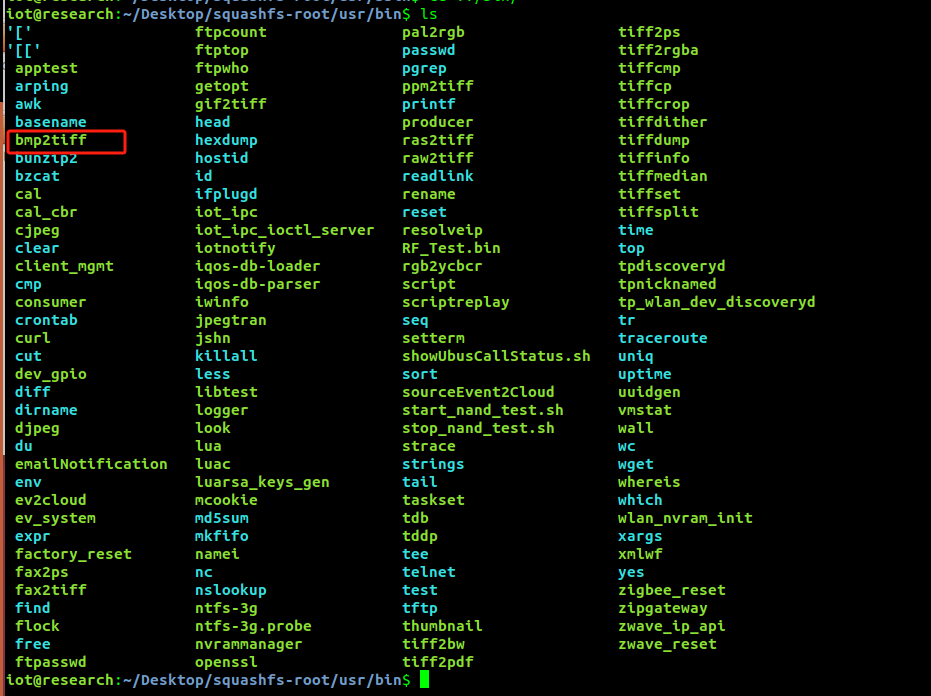

# afl++

    AFL利用遗传算法，不断生成测试用例，并通过动态插桩技术监控程序的行为，特别是程序的代码覆盖情况。当新的输入能触发新的代码路径时，这个输入会被保存以供进一步的测试。该过程可以形成一个反馈循环，不断优化测试用例以探索更多程序状态。

    
# alf++原理
    网上有很多文章，可以自行查看。https://xz.aliyun.com/t/15530?time__1311=Gqjxn7itiQGQoGNDQ0PBIIcDIOmpKdDcWoD#toc-10
        


# 实验
安装和启动环境
```

docker pull aflplusplus/aflplusplus
docker run -ti aflplusplus/aflplusplus
```


# 1有源码的fuzz

1.源码编译插桩:使用 afl++ 自带的插桩编译器：afl-gcc（还有很多其他的插桩编译器现以这个举例）
```
[AFL++ 405757f4e3c5] ~/work/test2 # afl-gcc ./test2.c -o ./stackoverflow
afl-cc++4.22a by Michal Zalewski, Laszlo Szekeres, Marc Heuse - mode: GCC-GCC
[!] WARNING: You are using outdated instrumentation, install LLVM and/or gcc-plugin and use afl-clang-fast/afl-clang-lto/afl-gcc-fast instead!
./test2.c: In function 'main':
./test2.c:17:5: warning: ignoring return value of 'fgets' declared with attribute 'warn_unused_result' [-Wunused-result]
17 |     fgets(user_input, sizeof(user_input), stdin);
   |     ^~~~~~~~~~~~~~~~~~~~~~~~~~~~~~~~~~~~~~~~~~~~
afl-as++4.22a by Michal Zalewski
[+] Instrumented 10 locations (64-bit, non-hardened mode, ratio 100%).

```

2.准备语料库:作为程序输入的原始材料,必须有才可以运行,原始材料越好漏洞发现的越快
```
[AFL++ 405757f4e3c5] ~/work/test2 # echo "abcd" >> ./input/seed1
```


3.开启模糊测试:指定必要的目标文件夹就可以开启模糊测试了,也可能发生其他情况根据提示解决
```
[AFL++ 405757f4e3c5] ~/work/test2 # afl-fuzz -i input/ -o output/ ./stackoverflow
```

afl-fuzz: 这是 AFL++ 的核心工具，用于执行模糊测试。AFL++ 是一个强大的模糊测试工具，它通过自动化生成输入数据来测试目标程序，从而发现潜在的安全漏洞或程序崩溃。
-i input/: 这个选项指定了 AFL++ 用来开始模糊测试的初始输入种子文件的目录。在这里，input/ 是包含初始输入数据的目录。AFL++ 会基于这些初始输入生成变异后的测试数据。
-o output/: 这个选项指定了 AFL++ 将输出模糊测试结果的目录。output/ 目录将包含测试过程中生成的各种数据，比如发现的崩溃或挂起的输入、统计信息等。
./stackoverflow: 这是要测试的目标程序。在这个例子中，./stackoverflow 是你要使用 AFL++ 进行模糊测试的可执行文件。AFL++ 会向这个程序提供变异后的输入，观察它的行为（例如，是否会崩溃或触发其他异常行为）。

 
4.验证挖掘出来的漏洞


5.
崩溃的输入样本会被保存在output目录下的crashes目录
```
[AFL++ 405757f4e3c5] ~/work/test2 # ls./output/default/crashes/
README.txt  id:000000,sig:06,src:000003,time:2086,execs:1700,op:havoc,rep:2
```
可以查看id:000000,sig:06,src:000003,time:2086,execs:1700,op:havoc,rep:2中的数据，进行复现，看是如何导致程序崩溃的。

6.复现，gdb调试
```
[AFL++ 405757f4e3c5] ~/work/test2 #./stackoverflow <./output/default/crashes/id\,time\:2086\,execs\:1700\,op\:havoc\,rep\:2 
*** buffer overflow detected ***: terminated
Aborted
```


# 2.无源码，基于qemu的fuzz

```
我们希望使用afl-qemu，那还需要进行以下操作：

cd qemu_mode
./build_qemu_support.sh
```


## AFL++测试TP-Link SR20路由器固件

固件的下载地址如下： https://static.tp-link.com/2018/201806/20180611/SR20(US)_V1_180518.zip

提取固件
```
$ binwalk -Me tpra_sr20v1_us-up-ver1-2-1-P522_20180518-rel77140_2018-05-21_08.42.04.bin
```
这里就拿bmp2tiff 这个比较常见的程序来进行fuzz


将要fuzz的文件系统放入docker（afl++）中
```
docker cp ../../../squashfs-root/ 57bddd7b5ada:/home/test/
```


```
QEMU_LD_PREFIX=./squashfs-root/ /AFLplusplus/afl-fuzz -Q -i squashfs-root/bmp-input/ -o squashfs-root/bmp-output/ -- ./squashfs-root/usr/bin/bmp2tiff @@ /dev/null # root权限下
# -Q：适用qemu模式
# -i：输入文件夹
# -o：输出文件夹
# @@：表示将用来替换的样本
# /dev/null：忽略错误信息
```


```
QEMU_LD_PREFIX=./tmp/test/squashfs-root/ /AFLplusplus/afl-fuzz -Q -i /tmp/test/in/ -o /tmp/test/out/ -- ./tmp/test/squashfs-root/usr/bin/bmp2tiff @@

```